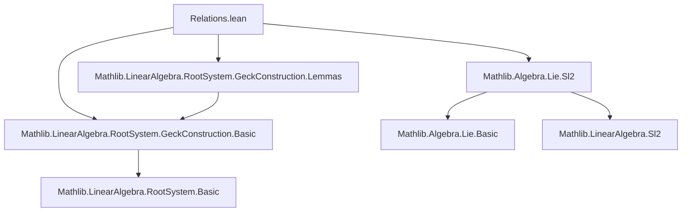

### Technical Brief: Relations in Geck’s Construction of a Lie Algebra from a Root System

---

#### **1. Key Definitions & Theorems**

| Name | Type / Signature | Purpose |
|------|------------------|---------|
| `lie_h_e` | `⁅h j, e i⁆ = b.cartanMatrix i j • e i` | Proves that the Cartan element `h j` acts on `e i` via the Cartan matrix entry — a key relation in an $\mathfrak{sl}_2$-triple structure. |
| `lie_h_f` | `⁅h j, f i⁆ = -b.cartanMatrix i j • f i` | Dual to `lie_h_e`, showing the action of `h j` on `f i`. |
| `lie_e_f_same` | `⁅e i, f i⁆ = h i` | Establishes the standard $\mathfrak{sl}_2$ commutation relation for the same root index. |
| `isSl2Triple` | `IsSl2Triple (h i) (e i) (f i)` | Concludes that $(h_i, e_i, f_i)$ forms an $\mathfrak{sl}_2$-triple in the Geck construction. |
| `lie_e_f_ne` | `⁅e i, f j⁆ = 0` (for $i \ne j$) | Shows that the mixed brackets vanish — a crucial relation encoding orthogonality of distinct root directions. |
| `lie_e_f_ne_aux₀`, `lie_e_f_ne_aux₁`, `lie_e_f_ne_aux₂` | Auxiliary lemmas | Used to prove `lie_e_f_ne` by coordinate-wise vanishing. |
| `lie_e_f_same_aux` | `⁅e i, f i⁆ (Sum.inr k) (Sum.inr k) = h i (Sum.inr k) (Sum.inr k)` | Intermediate step in proving `lie_e_f_same`, handling diagonal entries on the `inr` component. |

---

#### **2. Naming Conventions**

- **Prefixes**:
  - `lie_`: Indicates a Lie bracket identity.
  - `is_`: Predicate-style (e.g., `isSl2Triple`).
  - `aux`: Auxiliary lemmas used in proofs of main results.
- **Suffixes**:
  - `_same`: Relations when indices are equal (`i = j`).
  - `_ne`: Relations when indices differ (`i ≠ j`).
- **Function names**:
  - `h`, `e`, `f`: Standard notation for the three elements of an $\mathfrak{sl}_2$-triple.
  - `cartanMatrix`, `chainBotCoeff`, `chainTopCoeff`: Root-system-specific data.

---

#### **3. Tactic Stack**

Frequently used tactics in this file:

| Tactic | Role |
|--------|------|
| `ext` | Extensionality for matrices/endomorphisms. |
| `simp` / `simp only` | Simplification using `attribute [local simp]` declarations (e.g., `Ring.lie_def`, `Matrix.*_apply`). |
| `aesop` | Automated case analysis and contradiction handling (especially in `Finset.sum_ite_of_false`). |
| `ring` | Polynomial simplification over commutative rings. |
| `rw` | Rewriting using lemmas, definitions, and equivalences. |
| `rcases` / `obtain` | Case analysis on disjunctions or existential quantifiers. |
| `grind` | Custom tactic (likely from `Mathlib.Tactic`) for grinding through algebraic equalities. |
| `abel` | Abelian group/ring simplification (used in `lie_h_f`). |
| `norm_cast` | Normalizes coercions (e.g., from `ℕ` to `R`). |

---

#### **4. Proof Logic**

The logical flow across the main lemmas follows a pattern:

1. **Coordinate-wise extensionality** (`ext (k | k) (l | l)`) to reduce matrix identities to scalar equations.
2. **Case analysis** on index equalities (`eq_or_ne`) and membership in root sets (`range P.root`).
3. **Use of structural properties**:
   - Crystallographic condition (`P.IsCrystallographic`)
   - Reducedness (`P.IsReduced`)
   - Irreducibility (`P.IsIrreducible`) for `lie_e_f_ne`
4. **Auxiliary lemmas** to isolate and simplify subexpressions (e.g., vanishing of certain sums).
5. **Exploitation of symmetry and duality** via the involution `ω b` (e.g., in `lie_h_f`).
6. **Chain coefficient identities** (e.g., `chainBotCoeff_mul_chainTopCoeff`) for handling nontrivial combinatorics.

---

#### **5. Imports & Dependencies**

| Module | Purpose |
|--------|---------|
| `Mathlib.LinearAlgebra.RootSystem.GeckConstruction.Basic` | Core definitions of Geck’s construction (module, endomorphisms `e`, `f`, `h`). |
| `Mathlib.LinearAlgebra.RootSystem.GeckConstruction.Lemmas` | Preliminary lemmas about the construction. |
| `Mathlib.Algebra.Lie.Sl2` | Definitions and properties of $\mathfrak{sl}_2$-triples (`IsSl2Triple`). |

---

#### **6. Mermaid Diagrams**

##### **Dependency Graph (Module-Level)**



##### **Overview of Theory Flow**

```mermaid
flowchart LR
  RootPairing[P : RootPairing ι R M N] --> IsCrystallographic[P.IsCrystallographic]
  IsCrystallographic --> GeckConstruction[GeckConstruction P]
  GeckConstruction --> e[e i]
  GeckConstruction --> f[f i]
  GeckConstruction --> h[h i]
  e & f & h --> lie_h_e[⁅h j, e i⁆ = ...]
  e & f & h --> lie_h_f[⁅h j, f i⁆ = ...]
  e & f --> lie_e_f_same[⁅e i, f i⁆ = h i]
  e & f --> lie_e_f_ne[⁅e i, f j⁆ = 0]
  lie_h_e & lie_h_f & lie_e_f_same --> isSl2Triple[IsSl2Triple (h i) (e i) (f i)]
```

---

#### **7. Summary**

This file formalizes the foundational commutation relations in Geck’s Lie algebra construction over a root system. It verifies that the canonical elements $(h_i, e_i, f_i)$ satisfy the defining relations of $\mathfrak{sl}_2$-triples and that distinct root directions commute appropriately. The proofs rely heavily on:
- The crystallographic and reduced assumptions,
- Detailed combinatorics of root chains (`chainBotCoeff`, `chainTopCoeff`),
- Matrix-level calculations in the block-matrix realization of the construction.

These results are essential for embedding the constructed Lie algebra into a Kac–Moody algebra or for further classification results.
