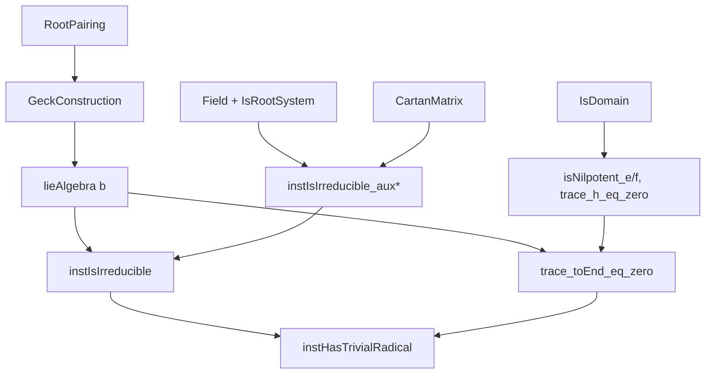
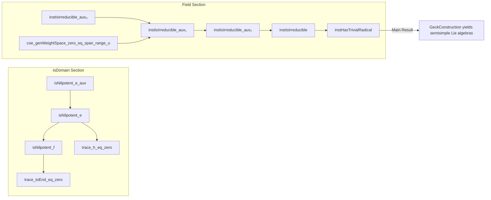

**Technical Brief: `Semisimple.lean` — Geck’s Construction Yields Semisimple Lie Algebras**

---

### **1. Key Definitions & Theorems**

| Name | Type / Signature | Purpose |
|------|------------------|---------|
| `RootPairing.GeckConstruction.lieAlgebra` | `lieAlgebra b` | Lie algebra constructed from a root pairing `b` (via Geck’s construction). |
| `e i`, `f i`, `h i` | `lieAlgebra b` | Standard Chevalley generators (nilpotent/semisimple elements) associated to simple roots. |
| `trace_toEnd_eq_zero` | `∀ x : lieAlgebra b, trace(toEnd x) = 0` | Shows all elements act with trace zero on the defining module — key for semisimplicity. |
| `instIsIrreducible` | `LieModule.IsIrreducible K (lieAlgebra b) (b.support ⊕ ι → K)` | The defining representation is irreducible (under mild assumptions: `IsRootSystem`, `IsReduced`, `IsIrreducible`, `Nonempty ι`). |
| `instHasTrivialRadical` | `LieAlgebra.HasTrivialRadical K (lieAlgebra b)` | The Lie algebra has trivial radical ⇒ it is semisimple (uses `instIsIrreducible` + `trace_toEnd_eq_zero`). |
| `isNilpotent_e`, `isNilpotent_f` | `IsNilpotent (e i)`, `IsNilpotent (f i)` | Proves nilpotency of Chevalley generators — used in trace arguments. |
| `trace_h_eq_zero` | `(h i).trace = 0` | Diagonal generators are trace-free. |
| `coe_genWeightSpace_zero_eq_span_range_u` | `genWeightSpace 0 = span (range u)` | Identifies the zero-weight space with the span of the `u`-vectors (Cartan generators). |
| `instIsIrreducible_aux₀`, `instIsIrreducible_aux₁`, `instIsIrreducible_aux₂` | Auxiliary lemmas | Build up irreducibility by analyzing weight spaces and action of Chevalley generators. |

---

### **2. Naming Conventions**

- **Prefixes**:
  - `isNilpotent_`: asserts nilpotency of an element.
  - `trace_`: asserts trace-zero property.
  - `instIsIrreducible_aux*`: auxiliary lemmas for irreducibility.
  - `coe_*`: coercion lemmas between submodule types.
- **Suffixes**:
  - `_eq_zero`: target is zero (e.g., trace, pairing).
  - `_eq_*`: equality with a canonical object (e.g., `span`, `diagonal`).
  - `_aux`: intermediate technical lemmas.
- **Variables**:
  - `i`, `j`, `k`, `l`: indices in `ι` or `b.support`.
  - `χ`: weight functional.
  - `U`, `V`: Lie submodules.
  - `v b i`, `u i`: canonical vectors in the defining module.
  - `ω b`: Chevalley involution.

---

### **3. Tactic Stack**

| Tactic | Usage Frequency | Purpose |
|--------|-----------------|---------|
| `simp` / `simp_rw` | Very High | Simplify using `@[simp]` lemmas (e.g., `Ring.lie_def`, `Matrix.*_apply`, `diagonal_apply`). |
| `aesop` | Medium | Automated reasoning for simple goals (e.g., `Pi.single_apply`, linear algebra). |
| `rw` / `apply` | High | Rewriting using lemmas, especially `pow_succ`, `mulVec_*`, `lie_*`, `smul_*`. |
| `induction` | Medium | Structural induction on `n` (nilpotency index), `b.induction_add`, `b.induction_on_cartanMatrix`. |
| `rcases` / `obtain` | High | Extract witnesses from existential hypotheses (e.g., `⟨k, x, hk₁, -⟩`). |
| `ext` | High | Extensionality for functions/matrices/vectors. |
| `contrapose!` | Medium | Flip implications to prove by contradiction. |
| `norm_cast` | Low-Medium | Handle coercion of integers to field scalars. |
| `tauto` | Low | Tactic for propositional logic. |
| `linarith` / `lia` | Medium | Linear arithmetic over ℤ/ℚ (e.g., chain coefficients). |

---

### **4. Proof Logic**

The proof follows a **layered strategy**:

1. **Nilpotency & Trace Properties** (`IsDomain` section):
   - Prove `e i`, `f i` are nilpotent via matrix column analysis (`isNilpotent_e`, `isNilpotent_f`).
   - Use structural properties of root pairings (crystallographic, reduced) and torsion-freeness.
   - Show `h i` is trace-free (`trace_h_eq_zero`) using symmetry of the pairing and involution `σ : ι ≃ ι`.

2. **Weight Space Analysis** (`Field` section):
   - Identify zero-weight space (`coe_genWeightSpace_zero_eq_span_range_u`) as span of `u`-vectors.
   - Prove irreducibility in two steps:
     - `instIsIrreducible_aux₀`: Any nonzero weight space intersects the span of `v b i`.
     - `instIsIrreducible_aux₁`: If a submodule is not zero-weight, it contains some `v b i`.
     - `instIsIrreducible_aux₂`: Containing any `v b i` implies the submodule is the whole space (via Chevalley generators and Cartan matrix induction).

3. **Semisimplicity**:
   - Use `instIsIrreducible` + `trace_toEnd_eq_zero` + `LieAlgebra.hasTrivialRadical_of_isIrreducible_of_isFaithful` to conclude `lieAlgebra b` is semisimple.

**Induction Tools**:
- `b.induction_on_cartanMatrix`: Induction on Cartan matrix entries (used in `instIsIrreducible_aux₂`).
- `b.induction_add`: Structural induction on root system generation (used to propagate membership through Chevalley generators).

---

### **5. Imports & Dependencies**

| Module | Role |
|--------|------|
| `Mathlib.Algebra.Lie.Matrix` | Matrix Lie algebra, `toEnd`, trace, nilpotent matrices. |
| `Mathlib.Algebra.Lie.Semisimple.Lemmas` | General lemmas on semisimplicity, radical, irreducibility. |
| `Mathlib.Algebra.Lie.Weights.Linear` | Weight spaces, generalized weight spaces, Cartan subalgebras. |
| `Mathlib.LinearAlgebra.RootSystem.GeckConstruction.Basic` | Geck construction of Lie algebra from root pairing. |
| `Mathlib.RingTheory.Finiteness.Nilpotent` | Nilpotent elements/modules. |

---

### **6. Mermaid Diagrams**

#### **Dependency Graph (High-Level)**

#### **Overview of File Structure**

---

### **7. Summary**

This file formalizes a major result from Geck’s 2017 paper: **the Lie algebra constructed from a reduced, crystallographic, irreducible root system via Geck’s construction is semisimple**. The proof is highly structured, leveraging:
- Matrix-theoretic nilpotency and trace arguments (in `IsDomain`),
- Weight space decomposition and Chevalley generator actions (in `Field`),
- Induction on Cartan matrices and root system axioms.

The formalization is rigorous and aligns with Lean’s modern Lie theory library (`Mathlib.Algebra.Lie.*`), using advanced tactics (`aesop`, `induction`, `rcases`) and deep algebraic structure (root pairings, Cartan matrices, weight spaces).
