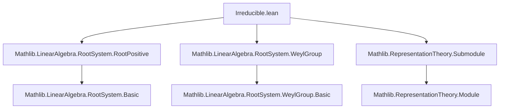
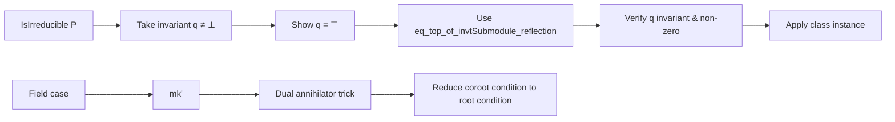

### Technical Brief: `Irreducible.lean`

---

#### **1. Key Definitions & Theorems**

| Name | Type / Signature | Purpose |
|------|------------------|---------|
| `invtRootSubmodule` | `def invtRootSubmodule : Sublattice (Submodule R M)` | Defines the *sublattice* of submodules of `M` invariant under all reflections `P.reflection i`. |
| `mem_invtRootSubmodule_iff` | `∀ q, q ∈ P.invtRootSubmodule ↔ ∀ i, q ∈ invtSubmodule (P.reflection i)` | Characterizes membership in `invtRootSubmodule`. |
| `invtRootSubmodule.top_mem`, `bot_mem` | `⊤`, `⊥ ∈ P.invtRootSubmodule` | Shows the lattice is bounded. |
| `invtRootSubmodule.eq_bot_iff` | `q = ⊥ ↔ ∀ i, P.root i ∉ q` (over a field `K`) | Links triviality of an invariant submodule to non-containment of roots. |
| `invtRootSubmodule.eq_top_iff` | `q = ⊤ ↔ range P.root ⊆ q` | Links maximality to containing all roots. |
| `isSimpleModule_weylGroupRootRep_iff` | `IsSimpleModule R[P.weylGroup] P.weylGroupRootRep.asModule ↔ ...` | **Main equivalence**: irreducibility of the Weyl group representation ⇔ no proper non-zero invariant submodules. |
| `IsIrreducible` | `class IsIrreducible : Prop` | Typeclass encoding *irreducibility* of a root pairing: nontriviality + no proper invariant submodules for roots *and* coroots. |
| `IsIrreducible.mk'` | `lemma` | Constructor for irreducibility over fields: root conditions imply coroot conditions via dual annihilators. |
| `isSimpleModule_weylGroupRootRep` | `lemma` | Immediate corollary: `IsIrreducible P ⇒ IsSimpleModule R[P.weylGroup] P.weylGroupRootRep.asModule`. |
| `instance [Nonempty ι] [NeZero (2 : R)] [P.IsIrreducible] : P.IsRootSystem` | `instance` | Shows irreducible nonempty root pairings over suitable rings are root systems. |
| `span_orbit_eq_top` | `lemma` | In irreducible case, the Weyl group orbit of any root spans the whole space. |
| `exists_form_eq_form_and_form_ne_zero` | `lemma` | For any invariant bilinear form `B`, there exists a root `k` with same norm as `j` and non-zero pairing with `i`. |
| `span_root_image_eq_top_of_forall_orthogonal` | `lemma` | If a subset of roots generates a submodule whose orthogonal complement is trivial, it spans `M`. |
| `eq_top_of_mem_invtSubmodule_of_forall_eq_univ` | `lemma` | A technical criterion for a submodule to be full: if any subset of roots generating it forces the subset to be all of `ι`, then the submodule is `⊤`. |

---

#### **2. Naming Conventions**

- **Prefixes**:
  - `invt_`: invariant under reflections/coreflections (e.g., `invtRootSubmodule`, `invtSubmodule`).
  - `is_`: properties (e.g., `isSimpleModule`, `IsIrreducible`).
  - `span_`: generated submodules (e.g., `span_orbit_eq_top`, `span_root_eq_top`).
- **Suffixes**:
  - `_iff`: characterizations (e.g., `eq_bot_iff`, `isSimpleModule_weylGroupRootRep_iff`).
  - `_mem_`: membership criteria (e.g., `mem_invtRootSubmodule_iff`).
  - `_of_`: implications or restrictions (e.g., `eq_top_of_invtSubmodule_reflection`, `mk'` for alternative constructor).
- **Functional style**: `eq_top_of_invtSubmodule_reflection` = “if `q` is invariant under all reflections and non-zero, then `q = ⊤`”.

---

#### **3. Tactic Stack**

Frequent tactics used in proofs:

| Tactic | Usage |
|--------|-------|
| `simp` | Simplifying goals using lemmas like `mem_invtRootSubmodule_iff`, `coe_bot`, `coe_top`. |
| `rw` | Rewriting using equivalences (`iff` lemmas), especially `eq_bot_iff`, `eq_top_iff`. |
| `exact` / `assumption` | Closing goals with immediate hypotheses. |
| `intro` / `rintro` | Introducing variables and hypotheses. |
| `by_contra` / `contrapose!` | Proof by contradiction, especially in `eq_bot_iff` and `mk'`. |
| `induction` | Structural induction on Weyl group elements (via `weylGroup.induction`). |
| `apply` / `refine` | Applying lemmas with holes (e.g., `refine IsIrreducible.eq_top_of_invtSubmodule_reflection _ _ _`). |
| `have` / `suffices` | Introducing intermediate claims. |
| `simpa` | Simplifying and discharging goals using a lemma. |
| `tauto` | Closing tautological goals involving lattice operations. |
| `linear_combination` / `ring` | Not explicitly used here, but `simp` + `rw` suffice for module-theoretic equalities. |

---

#### **4. Proof Logic**

- **Inductive structure on Weyl group**: Proofs about Weyl group invariance often proceed by induction on the Weyl group element, using:
  - Base case: `reflection i` (by hypothesis).
  - Identity: trivial.
  - Multiplication: invariance preserved under composition (`invtSubmodule.comp`).
- **Duality arguments**: Over fields, coroot conditions are derived from root conditions via:
  - Dual annihilators (`dualAnnihilator`).
  - Perfect pairing (`toPerfPair`).
  - `mk'` lemma shows symmetry of irreducibility conditions.
- **Spanning arguments**: To prove `q = ⊤`, show:
  - `q` is invariant (`∀ i, q ∈ invtSubmodule (P.reflection i)`).
  - `q ≠ ⊥` (e.g., contains a root).
  - Apply `IsIrreducible.eq_top_of_invtSubmodule_reflection`.
- **Orbit-spanning**: `span_orbit_eq_top` uses invariance of the span of an orbit and nontriviality to conclude it’s `⊤`.
- **Contrapositive + contradiction**: Used heavily in `eq_bot_iff`, `mk'`, and `eq_top_of_mem_invtSubmodule_of_forall_eq_univ`.

---

#### **5. Imports**

| Module | Purpose |
|--------|---------|
| `Mathlib.LinearAlgebra.RootSystem.RootPositive` | Positive roots, basic root system setup. |
| `Mathlib.LinearAlgebra.RootSystem.WeylGroup` | Weyl group, reflections, action on root space. |
| `Mathlib.RepresentationTheory.Submodule` | Invariant submodules, `invtSubmodule`, module actions. |

Additional open scopes:
- `MonoidAlgebra` (for Weyl group algebra structure).
- `Function`, `Set`, `Submodule`, `LinearMap`, `MulAction`, `Module.End`.

---

#### **6. Mermaid Diagrams**

##### **Dependency Graph (Module-Level)**



##### **Overview of Theory Flow**

```mermaid
flowchart LR
  A[RootPairing P] --> B[invtRootSubmodule lattice]
  B --> C{Is it simple?}
  C -->|Yes| D[IsSimpleModule R[P.weylGroup] ...]
  C -->|No| E[Proper invariant submodule]
  
  A --> F[IsIrreducible P]
  F -->|def| G[Nontrivial M, N]
  F -->|def| H[No proper invariant submodules]
  
  H --> I[span_orbit_eq_top]
  H --> J[IsRootSystem (if nonempty & 2 ≠ 0)]
  
  D --> K[Applications: classification, forms, etc.]
```

##### **Proof Strategy Flow (Key Lemma)**



---

#### **7. Summary**

This file formalizes the notion of *irreducibility* for root pairings, connecting:
- Lattice-theoretic properties of invariant submodules (`invtRootSubmodule`),
- Representation-theoretic irreducibility of the Weyl group action,
- Structural consequences (e.g., being a root system, orbit-spanning).

It establishes a clean bridge between algebraic (module-theoretic), geometric (root/orbit geometry), and representation-theoretic perspectives — foundational for classification and further development (e.g., Dynkin diagrams, Cartan matrices).
