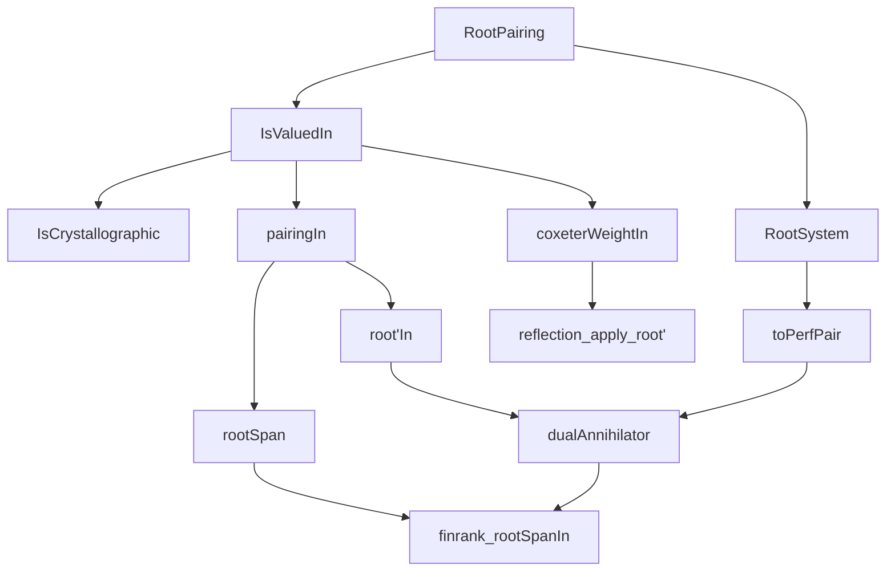
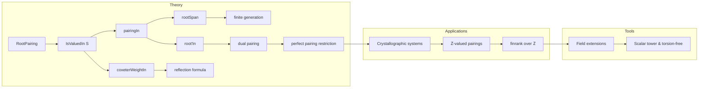

### Technical Brief: `IsValuedIn.lean`

---

#### **1. Key Definitions & Theorems**

| Name | Type / Signature | Purpose |
|------|------------------|---------|
| `IsValuedIn` | `class IsValuedIn (S : Type*) [CommRing S] [Algebra S R] : Prop` | Defines when a root pairing over an $R$-algebra takes values in a subring $S \subseteq R$. |
| `IsCrystallographic` | `abbrev IsCrystallographic := P.IsValuedIn ℤ` | Special case where $S = \mathbb{Z}$; used for crystallographic root systems. |
| `pairingIn` | `def pairingIn [P.IsValuedIn S] (i j : ι) : S` | The $S$-valued pairing, uniquely defined if $S \to R$ is injective. |
| `coxeterWeightIn` | `def coxeterWeightIn (S : Type*) [...] (i j : ι) : S` | $S$-valued variant of the Coxeter weight: $p_{ij}p_{ji}$. |
| `rootSpan`, `corootSpan` | `abbrev rootSpan [Module S M] := span S (range P.root)` | $S$-submodules generated by roots/coroots. |
| `root'In`, `coroot'In` | `def root'In [...] (i : ι) : Dual S (P.corootSpan S)` | $S$-linear functionals induced by evaluation maps on spans. |
| `algebraMap_pairingIn` | `lemma algebraMap_pairingIn [...] : algebraMap S R (P.pairingIn S i j) = P.pairing i j` | Connects $S$-valued pairing to original $R$-valued pairing. |
| `pairingIn_eq_zero_iff` | `lemma pairingIn_eq_zero_iff [...] : P.pairingIn S i j = 0 ↔ P.pairingIn S j i = 0` | Symmetry of vanishing in torsion-free settings. |
| `reflection_apply_root'` | `lemma reflection_apply_root' [...] : P.reflection i (P.root j) = P.root j - (P.pairingIn S j i) • P.root i` | Reflection formula in terms of $S$-valued pairing. |
| `finrank_rootSpanIn` | `lemma finrank_rootSpanIn [...] : finrank K (Q.rootSpan K) = finrank L M` | Relates ranks over base and extension fields. |

---

#### **2. Naming Conventions**

- **Prefixes**:
  - `isValuedIn_`, `isCrystallographic`: predicates on root pairings.
  - `pairingIn_`, `coxeterWeightIn_`: $S$-valued variants.
  - `rootSpan_`, `corootSpan_`: constructions on spans over $S$.
  - `root'In_`, `coroot'In_`: dual maps on spans.

- **Suffixes**:
  - `_in`: indicates restriction of coefficients to a subring $S$.
  - `_mem`: element of a span (e.g., `rootSpanMem`).
  - `_eq_zero_iff`, `_same`, `_self_left/right`: symmetry or special-case lemmas.

- **General pattern**:  
  `X_in` = $S$-valued version of `X`, where `X` is defined over $R$.  
  `X_mem` = canonical element of a span.

---

#### **3. Tactic Stack**

Frequently used tactics in proofs:

| Tactic | Usage |
|--------|-------|
| `simp` | Simplifying goals using lemmas like `algebraMap_pairingIn`, `pairingIn_same`, etc. |
| `apply FaithfulSMul.algebraMap_injective` | Proving equality in $S$ by mapping to $R$. |
| `rw [← algebraMap_pairingIn]` | Lifting equalities from $R$ to $S$. |
| `induction ... using Submodule.span_induction` | Induction over spans (e.g., `mem_of_mem_span`). |
| `simpa using ...` | Simplifying using a hypothesis or lemma. |
| `ext` | Extensionality for submodules/functions. |
| `ring`, `linear_algebra` tactics | Implicitly used in module/ring manipulations. |
| `exact`, `exact?` | For straightforward conclusions. |

---

#### **4. Proof Logic**

- **Structure of proofs**:
  - **Induction on submodules**: Many lemmas about spans use `Submodule.span_induction`.
  - **FaithfulSMul-based uniqueness**: When proving equalities in $S$, lift to $R$ and use injectivity of `algebraMap`.
  - **Transitivity of algebra maps**: Used in `IsValuedIn.trans` and `algebraMap_pairingIn'`.
  - **Duality via perfect pairings**: `toPerfPair`, `dualAnnihilator`, `dualCoannihilator` used to relate spans and annihilators.
  - **Field extension arguments**: In `finrank_*` lemmas, reduce to field case via scalar extension and torsion-freeness.

- **Common pattern**:
  ```lean
  apply FaithfulSMul.algebraMap_injective S R
  rw [← algebraMap_pairingIn]
  exact [target lemma in R]
  ```

---

#### **5. Imports**

| Module | Purpose |
|--------|---------|
| `Mathlib.Algebra.Algebra.Rat` | Rational numbers as a field and algebra. |
| `Mathlib.Algebra.Module.Submodule.Invariant` | Invariant submodules under endomorphisms. |
| `Mathlib.LinearAlgebra.PerfectPairing.Restrict` | Restriction of perfect pairings to submodules. |
| `Mathlib.LinearAlgebra.RootSystem.Defs` | Definitions of root systems and pairings. |
| `Mathlib.LinearAlgebra.FreeModule.PID` | Free modules over PID (used for finite generation). |
| `Mathlib.LinearAlgebra.Span.TensorProduct` | Span constructions (used in `span_root'_eq_top`). |
| `Mathlib.RingTheory.Flat.TorsionFree` | Torsion-free modules (used in `pairingIn_eq_zero_iff`). |

---

#### **8. Mermaid Diagrams**

##### **Dependency Graph (High-Level)**



##### **Overview of File Structure**



---

#### **6. Domain-Specific AI Agent Notes**

- **Key domain**: Root system theory over general rings, especially crystallographic root systems.
- **Core abstraction**: `IsValuedIn S` enables coefficient restriction while preserving algebraic structure.
- **Critical lemmas for automation**:
  - `algebraMap_pairingIn`, `pairingIn_same`, `reflection_apply_root'`
  - `finrank_rootSpanIn`, `finrank_rootSpanIn_int`
  - `pairingIn_eq_zero_iff` (symmetry in torsion-free setting)
- **Automation opportunities**:
  - Pattern matching on `pairingIn` vs `pairing`.
  - Automatic use of `FaithfulSMul.algebraMap_injective` when lifting equalities.
  - Simplifying spans via `Submodule.span_induction`.

--- 

Let me know if you'd like a formalized tactic automation strategy or a Lean 4 tactic plugin sketch based on this metadata.
