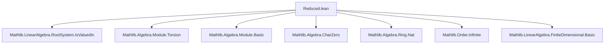
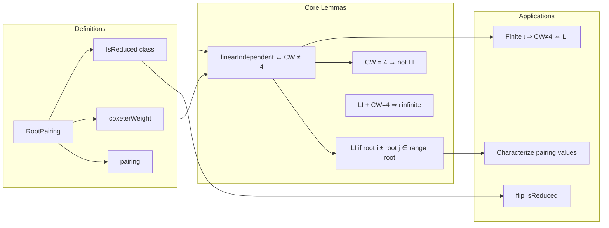

**Technical Brief: `Reduced.lean` — Reduced Root Pairings in Lean 4**

---

### 1. KEY DEFINITIONS & THEOREMS

| Name | Type / Signature | Purpose |
|------|------------------|---------|
| `RootPairing.IsReduced` | `class IsReduced : Prop` | A root pairing is *reduced* if any linearly dependent pair of roots are equal up to sign. Formally: `∀ i j, ¬LinIndep ![root i, root j] → root i = root j ∨ root i = -root j`. |
| `RootPairing.linearIndependent_iff_coxeterWeight_ne_four` | `LinearIndependent R ![P.root i, P.root j] ↔ P.coxeterWeight i j ≠ 4` | For finite reduced root pairings over torsion-free domains, linear independence of two roots is equivalent to their Coxeter weight not being 4. |
| `RootPairing.linearIndependent_iff_coxeterWeightIn_ne_four` | Same as above, but using `coxeterWeightIn` (valued in a subring `S`). | Enables working with root pairings valued in smaller rings (e.g., ℤ → ℝ). |
| `RootPairing.coxeterWeight_eq_four_iff_not_linearIndependent` | `P.coxeterWeight i j = 4 ↔ ¬LinIndep ![root i, root j]` | Contrapositive of the above; used to detect dependence via Coxeter weight = 4. |
| `RootPairing.pairing_two_two_iff` | `P.pairing i j = 2 ∧ P.pairing j i = 2 ↔ i = j` | Characterizes diagonal roots (i.e., simple roots) via pairing values. |
| `RootPairing.pairing_neg_two_neg_two_iff` | `P.pairing i j = -2 ∧ P.pairing j i = -2 ↔ root i = -root j` | Detects opposite roots via pairing values. |
| `RootPairing.pairing_one_four_iff` | `P.pairing i j = 1 ∧ P.pairing j i = 4 ↔ root j = 2 • root i` | Detects proportional roots with ratio 2 (e.g., long/short roots in non-simply laced types). |
| `RootPairing.infinite_of_linearIndependent_coxeterWeight_four` | `LinIndep ![root i, root j] ∧ coxeterWeight i j = 4 → Infinite ι` | Key structural lemma: a linearly independent pair with Coxeter weight 4 forces infinitely many roots. |
| `RootPairing.pairing_smul_root_eq_of_not_linearIndependent` | `¬LinIndep ![root i, root j] → pairing j i • root i = 2 • root j` | When two roots are dependent, one is a scalar multiple of the other, with scalar determined by the pairing. |
| `RootPairing.instFlipIsReduced` | `[P.IsReduced] → [IsTorsionFree N] → P.flip.IsReduced` | Symmetry: flipping roots/coroots preserves reducedness under torsion-freeness. |

---

### 2. NAMING CONVENTIONS

- **Predicates**: `isReduced`, `linearIndependent`, `infinite`, `finite`, `ne_zero`, `notMem_range`, `eq_four`, `ne_four`, `two_two`, `neg_two_neg_two`, `one_four`, `neg_one_neg_four`.
- **Prefixes**:
  - `is_`: class predicates (`IsReduced`, `IsValuedIn`)
  - `linearIndependent_`: lemmas about linear independence
  - `pairing_`, `pairingIn_`: pairing-related equivalences
  - `coxeterWeight_`, `coxeterWeightIn_`: Coxeter weight properties
- **Suffixes**:
  - `_iff`: biconditional lemmas
  - `_ne_four`, `_eq_four`: conditions on Coxeter weight
  - `_iff'`: variant of `_iff` with slightly different quantifier structure
  - `_injective`, `_surjective`, `_mem_range`: membership/range properties
- **Special**:
  - `instFlip_`: instance lemmas (e.g., `instFlipIsReduced`)
  - `of_`: constructing instances (e.g., `of_isTorsionFree`, `of_isPerfPair`)

---

### 3. TACTIC STACK

Frequently used tactics in this file:

| Tactic | Purpose |
|--------|---------|
| `rw [isReduced_iff]` | Rewriting using `mk_iff`-generated equivalence |
| `simp_all`, `simp only [...]` | Simplification with custom lemmas and local hypotheses |
| `contrapose!` | Turn implication into contrapositive, simplify negated goals |
| `rcases eq_or_ne i j with rfl \| h'` | Case split on equality of indices |
| `have : ... := ...; replace : ...` | Intermediate lemma construction |
| `exact`, `apply`, `exact?` | Goal completion via known facts |
| `norm_num`, `lia`, `ring` | Arithmetic simplification (especially for integers/scalars) |
| `push_neg at h` | Push negations inward in hypotheses |
| `rwa [...] at h` | Rewrite and then apply to hypothesis |
| `convert`, `congr_arg`, `congr_argn` | Congruence reasoning for equalities involving functions |
| `simpa using ...` | Simplify goal using a proof term |
| `exact?` | Automated search for exact proof terms (used in `mk_iff`) |

---

### 4. PROOF LOGIC

The logical flow across most lemmas follows this pattern:

1. **Case analysis** on equality of indices (`i = j` or `i ≠ j`) and root equality (`root i = ± root j`).
2. **Use reducedness** (`IsReduced.eq_or_eq_neg`) to reduce dependence to sign equality.
3. **Translate dependence** into scalar relations via `pairing_smul_root_eq_of_not_linearIndependent`.
4. **Relate scalar relations to Coxeter weight** using `coxeterWeight = pairing i j * pairing j i`.
5. **Use torsion-freeness / characteristic zero** to cancel scalars (e.g., `smul_left_injective`).
6. **Leverage algebraic properties** (e.g., `algebraMap_injective`) to lift equivalences from `R` to subring `S`.

Typical proof skeleton for `linearIndependent_iff_coxeterWeight_ne_four`:

- **→ direction**: Assume lin. indep. Suppose `coxeterWeight = 4`. Then by `infinite_of_linearIndependent_coxeterWeight_four`, `ι` is infinite — contradiction (since `ι` is finite).
- **← direction**: Assume `coxeterWeight ≠ 4`. Suppose lin. dep. Then `coxeterWeight = 4` by `pairing_smul_root_eq_of_not_linearIndependent` + algebraic manipulation — contradiction.

---

### 5. IMPORTS & DEPENDENCIES

**Primary imports**:
- `Mathlib.LinearAlgebra.RootSystem.IsValuedIn`: Defines `RootPairing.IsValuedIn`, subring-valued pairings.

**Key underlying structures used**:
- `CommRing`, `AddCommGroup`, `Module`, `Algebra`
- `IsTorsionFree`, `IsAddTorsionFree`, `IsDomain`, `CharZero`
- `LinearIndependent`, `Finite`, `Infinite`, `Embedding`, `Range`, `Image`
- `FaithfulSMul`, `IsSMulRegular`

**Core theory context**:
- Root systems, root/coroot pairings, reflections, Coxeter groups.
- The file assumes a `RootPairing` structure with `root : ι → M`, `coroot : ι → N`, and pairings `pairing i j : R`.

---

### 6. MERMAID DIAGRAMS

#### Dependency Graph (Module-Level)

#### Overview of Theory Flow

---

### 7. SUMMARY

This file formalizes foundational properties of *reduced* root pairings — a key structural condition ensuring that dependent roots differ only by sign. It establishes a precise correspondence between linear independence of roots and the value of their Coxeter weight (≠ 4), crucial for classifying root systems (e.g., distinguishing simply-laced vs non-simply-laced types). The file also provides detailed characterizations of pairing values (e.g., `2`, `-2`, `1`, `4`) in terms of root proportionalities, and handles both the base-ring and subring-valued cases (`pairing` vs `pairingIn`). The proofs rely heavily on torsion-freeness, characteristic zero, and algebraic cancellation properties.

--- 

Let me know if you'd like a formalized dependency graph (e.g., `.dot` format) or a summary of how this fits into the broader `Mathlib.RootSystem` hierarchy.
