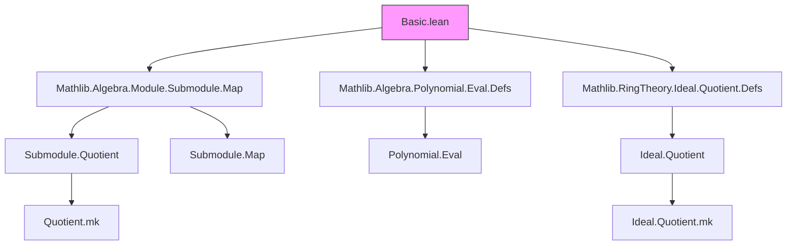
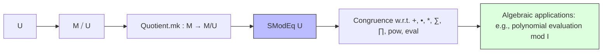

### Technical Brief: `Basic.lean` — Modular Equivalence for Submodules

---

#### **1. Key Definitions & Theorems**

| Name | Type / Signature | Purpose |
|------|------------------|---------|
| `SModEq` | `def SModEq (x y : M) : Prop := (Quotient.mk x = Quotient.mk y)` | Predicate for *submodule modular equivalence*: two elements are equivalent modulo a submodule $U$ iff their images in the quotient module $M/U$ are equal. |
| `notation x ≡ y [SMOD N]` | — | Shorthand for `SModEq N x y`. |
| `SModEq.def` | `x ≡ y [SMOD U] ↔ Quotient.mk x = Quotient.mk y` | Equivalence definition (tautological, used for rewriting). |
| `SModEq.sub_mem` | `x ≡ y [SMOD U] ↔ x - y ∈ U` | Core characterization: equivalence modulo $U$ iff difference lies in $U$. |
| `SModEq.top` | `x ≡ y [SMOD ⊤]` | Trivial equivalence: everything is equivalent modulo the top submodule (whole module). |
| `SModEq.bot` | `x ≡ y [SMOD ⊥] ↔ x = y` | Minimal equivalence: modulo the bottom submodule (zero submodule) is equality. |
| `SModEq.mono` | `U₁ ≤ U₂ → x ≡ y [SMOD U₁] → x ≡ y [SMOD U₂]` | Monotonicity: coarser submodule ⇒ more equivalences. |
| `SModEq.of_toAddSubgroup_le` | `U.toAddSubgroup ≤ V.toAddSubgroup → x ≡ y [SMOD U] → x ≡ y [SMOD V]` | Extends monotonicity across scalar rings (via additive subgroups). |
| `SModEq.refl`, `SModEq.rfl`, `instRefl` | `x ≡ x [SMOD U]` | Reflexivity (instances for `Std.Refl`). |
| `SModEq.symm`, `SModEq.comm` | `x ≡ y [SMOD U] ↔ y ≡ x [SMOD U]` | Symmetry and commutativity of equivalence. |
| `SModEq.trans`, `instTrans` | `x ≡ y ∧ y ≡ z → x ≡ z` | Transitivity (and `Trans` instance). |
| `SModEq.add`, `SModEq.sum` | Preserves addition and finite sums under equivalence. | Congruence for module addition. |
| `SModEq.smul`, `nsmul`, `zsmul` | Preserves scalar multiplication (over $\mathbb{N}, \mathbb{Z}, R$). | Congruence for module action. |
| `SModEq.mul`, `SModEq.prod`, `SModEq.pow` | For ideals $I \subseteq A$, preserves multiplication, products, powers. | Congruence for ring multiplication (when $M = A$ is a ring). |
| `SModEq.neg`, `SModEq.sub` | Preserves negation and subtraction. | Congruence for additive inverses and subtraction. |
| `SModEq.zero` | `x ≡ 0 [SMOD U] ↔ x ∈ U` | Characterization of zero-equivalence. |
| `sub_smodEq_zero` | `x - y ≡ 0 [SMOD U] ↔ x ≡ y [SMOD U]` | Reformulation of equivalence via zero. |
| `SModEq.map` | `x ≡ y [SMOD U] ⇒ f x ≡ f y [SMOD U.map f]` | Functoriality under module maps. |
| `SModEq.comap` | `f x ≡ f y [SMOD V] ⇒ x ≡ y [SMOD V.comap f]` | Pullback of equivalence along module maps. |
| `SModEq.eval` | `x ≡ y [SMOD I] ⇒ f.eval x ≡ f.eval y [SMOD I]` | Polynomial evaluation respects modular equivalence (key for algebraic applications). |

---

#### **2. Naming Conventions**

- **Prefixes**:
  - `SModEq.`: All theorems live in the `SModEq` namespace.
  - `inst`: For typeclass instances (`instRefl`, `instTrans`).
  - `_root_`: For top-level lemmas defined outside the namespace (`sub_smodEq_zero`).
- **Suffixes**:
  - `mem`: For membership characterizations (`sub_mem`, `zero`).
  - `def`: For definitional equivalences (`SModEq.def`).
  - `top`, `bot`: For extremal submodules.
  - `mono`, `gcongr`: For monotonicity and congruence properties.
- **Notation**:
  - `x ≡ y [SMOD N]` — infix binary relation.

---

#### **3. Tactic Stack**

- **Core tactics**:
  - `rw`, `simp`, `simp_rw`, `grw` (global rewrite)
  - `induction` (with `Finset.cons_induction`)
  - `exact`, `reflexivity`, `symmetry`, `transitivity`
  - `simpa`, `convert`, `apply`
- **Specialized**:
  - `cases` (implicit via `rw` on `Submodule.Quotient.eq`)
  - `classical` (for finite sum/product inductions)
  - `gcongr` (for congruence lemmas over structures like `+`, `•`, `*`, `∑`, `∏`, `pow`, `eval`)

---

#### **4. Proof Logic**

- **Structure**:
  - Most proofs reduce to properties of the quotient module $M/U$ via `Submodule.Quotient.eq`.
  - Congruence properties (`add`, `smul`, `mul`, etc.) use:
    - `simp_rw` with `Quotient.mk_*` lemmas (`mk_add`, `mk_smul`, `mk_mul`, `mk_pow`, `mk_sum`, `mk_prod`, `mk_eval`).
    - `gcongr` for automated congruence closure.
  - Inductive proofs for sums/products use `Finset.cons_induction`.
  - Monotonicity and pullback (`map`, `comap`) rely on `map_sub` and module map properties.
  - Polynomial `eval` uses `Polynomial.eval_eq_sum` + `gcongr`.

- **Typical flow**:
  1. Unfold `SModEq.def` or use `sub_mem`.
  2. Rewrite using `Quotient.mk_*` lemmas.
  3. Apply hypothesis via `rw`/`simp`.
  4. Conclude via `refl`, `symm`, `trans`, or `mem_*`.

---

#### **5. Imports & Scope**

- **Core dependencies**:
  ```lean
  Mathlib.Algebra.Module.Submodule.Map
  Mathlib.Algebra.Polynomial.Eval.Defs
  Mathlib.RingTheory.Ideal.Quotient.Defs
  ```
- **Scope**:
  - General module theory over rings (`Ring R`, `Module R M`).
  - Bimodule setting (`[Module R M] [Module S M]`) for `of_toAddSubgroup_le`.
  - Commutative ring case (`CommRing A`) for ring multiplication (`mul`, `pow`, `eval`).
  - Ideal theory via `Ideal A` (as submodules of `A` over itself).

---

#### **6. Mermaid Diagrams**

##### **Dependency Graph (Module-Level)**



##### **Overview of Theory Flow**



---

#### **7. Theory Summary**

This module formalizes **modular equivalence modulo a submodule**, a foundational concept in module and ring theory. It establishes:

- Equivalence relation structure (`refl`, `symm`, `trans`).
- Algebraic compatibility (congruence for all module/ring operations).
- Functorial behavior under maps (`map`, `comap`).
- Key connections to quotient modules and ideal theory.

It serves as a building block for:
- Ideal quotient rings (`Ideal.Quotient`).
- Polynomial algebra modulo ideals (e.g., `eval` lemma).
- Homological algebra (e.g., induced maps on quotients).

The design emphasizes **reusability** via typeclasses (`Std.Refl`, `Trans`) and **automation** via `gcongr`/`grw`.

--- 

Let me know if you'd like a formalized dependency graph for a downstream theory (e.g., `Ideal.Quotient` or `Polynomial.ModEq`).
