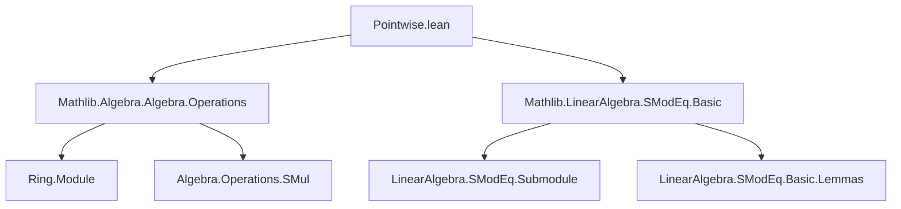

**Technical Brief: `Pointwise.lean` (SModEq Module)**  
*Domain: Formalized Commutative Algebra — Modular Equivalence on Modules*

---

### 1. **Key Definitions & Theorems**

| Name | Type / Signature | Purpose |
|------|------------------|---------|
| `SModEq` | `M → M → Submodule R M → Prop` | Binary relation: $x \equiv y \pmod{U}$ iff $x - y \in U$ |
| `SModEq.smul'` | `x ≡ y [SMOD U] → c ∈ I → c • x ≡ c • y [SMOD (I • U)]` | Scalar multiplication respects modular equivalence when the scalar lies in an ideal $I$, and the submodule is scaled by $I$ |
| `SModEq.sub_mem` | `x ≡ y [SMOD U] ↔ x - y ∈ U` | Definition equivalence: modular equivalence ↔ difference lies in submodule |

> Note: `SMOD` is notation for `SModEq`, and `I • U` denotes the submodule product: $\{ \sum_i a_i • u_i \mid a_i \in I, u_i \in U \}$.

---

### 2. **Naming Conventions**

- **Prefixes**:  
  - `smul'` — variant of `smul`, indicated by prime (`'`) to distinguish from standard `smul` (which assumes $c \in R$, not $c \in I$).
- **Suffixes**:  
  - `[SMOD U]` — infix notation for `SModEq U`, following Lean’s `[]`-notation for binary relations.
- **Structure**:  
  - Theorems use descriptive names (`smul'`, `sub_mem`) and follow Mathlib’s convention of using `'` for variants.

---

### 3. **Tactic Stack**

- `rw` — used twice: to unfold `SModEq.sub_mem` in hypothesis and goal.
- `← smul_sub` — rewrites subtraction of scalars: $c • x - c • y = c • (x - y)$.
- `exact smul_mem_smul hc hxy` — applies lemma `smul_mem_smul` to conclude membership in $I • U$.

> Minimal tactic usage: proof is short and structural, relying on algebraic lemmas (`smul_sub`, `smul_mem_smul`) and rewriting.

---

### 4. **Proof Logic**

1. **Unfold definition**: Convert modular equivalence to membership in submodule via `SModEq.sub_mem`.
2. **Rewrite difference**: Use `← smul_sub` to express $c • x - c • y = c • (x - y)$.
3. **Apply membership lemma**: Use `smul_mem_smul`, which states:  
   $c \in I,\; z \in U \implies c • z \in I • U$.  
   Here, $z = x - y \in U$ by hypothesis $hxy$.

> Logical flow: *definition → algebraic manipulation → module-theoretic closure*.

---

### 5. **Imports**

| Import | Role |
|--------|------|
| `Mathlib.Algebra.Algebra.Operations` | Provides basic scalar multiplication operations (`•`, `smul`, etc.) and ring/module infrastructure |
| `Mathlib.LinearAlgebra.SModEq.Basic` | Defines `SModEq`, `sub_mem`, and foundational lemmas (e.g., `smul_mem_smul`) |

> These imports anchor the file in module theory over rings, with no need for commutativity assumptions beyond what’s implicit in `Ideal` and `Submodule`.

---

### 6. **Mermaid Diagrams**

#### **Dependency Graph**


#### **Overview of File Structure**
```mermaid
flowchart LR
  subgraph "Context"
    R[Ring R] --> I[Ideal R]
    M[AddCommGroup M] --> M'[Module R M]
    M' --> U[Submodule R M]
  end

  subgraph "Relation"
    x[x : M] --> SModEq[x ≡ y [SMOD U]]
    y[y : M] --> SModEq
  end

  subgraph "Theorems"
    smul'[smul' : x ≡ y [SMOD U] ⇒ c•x ≡ c•y [SMOD I•U]]
  end

  SModEq -->|uses| smul'
  smul' -->|relies on| sub_mem & smul_sub & smul_mem_smul
```

---

### 7. **Theoretical Significance**

- This lemma formalizes a *pointwise* compatibility of scalar multiplication with modular equivalence when scalars are restricted to an ideal.
- It generalizes the standard `smul` lemma (which assumes $c \in R$ and $U$ unchanged) to the *relative* setting $I \subseteq R$, $U \subseteq M$, yielding the scaled submodule $I • U$.
- Useful in constructions involving quotient modules, completion, or filtered modules (e.g., $I$-adic topology).

--- 

Let me know if you'd like the next file in the series (e.g., `Pointwise_Add.lean`) or a formalization of the $I$-adic filtration lemmas.
