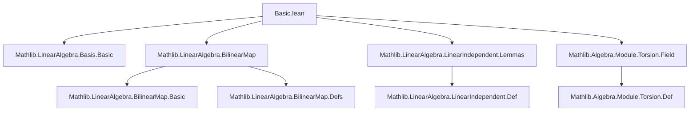
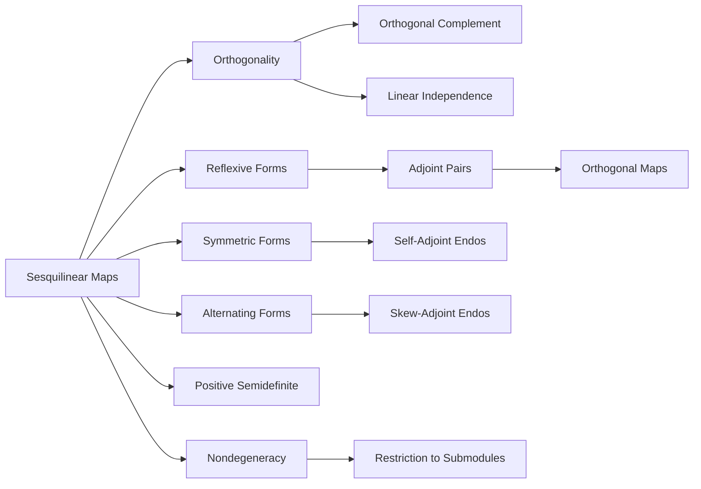

Here's a structured technical brief based on the provided `Basic.lean` file:

---

### **1. Key Definitions & Theorems**

| Name | Type / Structure | Purpose |
|------|------------------|---------|
| `IsOrtho B x y` | `Prop` | States that vectors `x`, `y` are orthogonal w.r.t. sesquilinear map `B`: $B(x, y) = 0$. |
| `IsOrthoᵢ B v` | `Prop` | A family `v : n → M₁` is pairwise orthogonal w.r.t. `B`: $\forall i \ne j,\ B(v_i, v_j) = 0$. |
| `IsRefl B` | `Prop` | Reflexivity: $B(x, y) = 0 \Rightarrow B(y, x) = 0$. |
| `IsSymm B` | `Structure` | Symmetry: $\exists I,\ I(B(x, y)) = B(y, x)$. For bilinear forms, $I = \mathrm{id}$. |
| `IsAlt B` | `Prop` | Alternating: $\forall x,\ B(x, x) = 0$. |
| `IsNonneg B` | `Structure` | Nonnegativity: $\forall x,\ 0 \le B(x, x)$. |
| `IsPosSemidef B` | `Structure` | Positive semidefiniteness: symmetric + nonnegative. |
| `SeparatingLeft B`, `SeparatingRight B`, `Nondegenerate B` | `Prop` | Left/right nondegeneracy: trivial kernel for left/right slices. |
| `orthogonalBilin N B` | `Submodule R₁ M₁` | Left orthogonal complement of submodule `N` w.r.t. `B`. |
| `IsAdjointPair f g` | `Prop` | $f, g$ are adjoint: $B'(f(x), y) = B(x, g(y))$. |
| `IsOrthogonal f` | `Prop` | $f$ preserves bilinear form: $B(f(x), f(y)) = B(x, y)$. |
| `IsSelfAdjoint f`, `IsSkewAdjoint f` | `Prop` | $f$ is self- or skew-adjoint: $B(f(x), y) = B(x, f(y))$ or $B(f(x), y) = -B(x, f(y))$. |
| `isPairSelfAdjointSubmodule`, `selfAdjointSubmodule`, `skewAdjointSubmodule` | `Submodule` | Submodules of (skew-)self-adjoint endomorphisms. |

#### Key Theorems:
- `linearIndependent_of_isOrthoᵢ`: Orthogonal families with nonzero norms are linearly independent.
- `isAlt_iff_eq_neg_flip`: Over a ring with no zero divisors and char 0, alternating ⇔ $B = -B^\mathrm{flip}$.
- `isCompl_span_singleton_orthogonal`: If $B(x,x) \ne 0$, then $\mathrm{span}\{x\} \oplus (\mathrm{span}\{x\})^\perp = V$.
- `IsRefl.nondegenerate_iff_separatingLeft/Right`: For reflexive forms, nondegeneracy ⇔ left/right separating.
- `nondegenerate_restrict_of_disjoint_orthogonal`: Restriction to a submodule $W$ is nondegenerate if $W \cap W^\perp = \{0\}$.

---

### **2. Naming Conventions**

- **Prefixes**:
  - `isOrtho`: Orthogonality (`IsOrtho`, `IsOrthoᵢ`)
  - `isRefl`, `isSymm`, `isAlt`, `isNonneg`, `isPosSemidef`: Structural properties of forms/maps.
  - `separatingLeft`, `separatingRight`, `nondegenerate`: Nondegeneracy conditions.
  - `orthogonalBilin`: Orthogonal complement construction.
  - `isAdjointPair`, `IsOrthogonal`, `IsSelfAdjoint`, `IsSkewAdjoint`: Adjointness-related.
- **Suffixes**:
  - `_def`: Definition equivalence (`isOrtho_def`, `isSymm_def`, etc.)
  - `_iff`: Characterization equivalences (`separatingLeft_iff_ker_eq_bot`, `isSymm_iff_eq_flip`)
  - `_congr`, `_flip`: Behavior under equivalence/flip (`nondegenerate_congr_iff`, `flip_separatingLeft`)
  - `_submodule`: Submodule constructions (`selfAdjointSubmodule`, `skewAdjointSubmodule`)

---

### **3. Tactic Stack**

Frequently used tactics:
- `simp_rw`, `simp only`, `simp`: Simplification with rewrite rules and definitions.
- `rw`: Rewriting using equivalences or lemmas.
- `exact`, `intro`, `constructor`, `cases`, `rcases`: Basic proof structure.
- `ext`: Extensionality for functions/modules.
- `apply`, `have`, `suffices`: Forward/backward reasoning.
- `aesop`: Automated reasoning for simple goals (not explicitly used here, but implied by structure).
- `ring`, `linarith`: For algebraic manipulations (used implicitly in proofs).
- `convert`, `congr`: For congruence-based rewriting (e.g., `nondegenerate_congr`).

---

### **4. Proof Logic**

- **Inductive/structural reasoning**: Most proofs proceed by unfolding definitions (`dsimp only [...]`) and applying properties of sesquilinear maps (e.g., `map_zero`, `map_add`, `map_smulₛₗ`).
- **Case analysis**: On hypotheses like `a ≠ 0`, `B x x ≠ 0`, or `i ≠ j`.
- **Equational reasoning**: Heavy use of `rw`, `simp_rw`, and `congr` to manipulate expressions involving `B`, `flip`, `comp`, `compl₂`, etc.
- **Module-theoretic arguments**: Use of `Submodule`, `ker`, `orthogonalBilin`, `span`, `disjoint`, `isCompl`.
- **Field-specific arguments**: Use of `smul_eq_zero`, `mul_eq_zero`, `linearIndependent_iff'`, `span_singleton_sup_orthogonal_eq_top`.
- **Reflexivity/symmetry/alternating**: Often used to reduce one side of an equation to another (e.g., `ortho_comm`, `neg`, `eq_iff`).

---

### **5. Imports & Dependencies**

**Primary imports**:
- `Mathlib.LinearAlgebra.Basis.Basic`
- `Mathlib.LinearAlgebra.BilinearMap`
- `Mathlib.LinearAlgebra.LinearIndependent.Lemmas`
- `Mathlib.Algebra.Module.Torsion.Field`

**Key dependencies**:
- `LinearMap`, `BilinearMap`, `Submodule`, `Module`, `AddMonoid`, `Ring`, `Field`, `CommRing`, `CommSemiring`.
- `LinearEquiv`, `LinearMap.ker`, `LinearMap.flip`, `LinearMap.domRestrict₁₂`, `LinearMap.comp`, `LinearMap.compl₂`, etc.

---

### **6. Mermaid Diagrams**

#### **Dependency Graph (Module-Level)**

#### **Overview of Theory Flow**

---

Let me know if you'd like a formalized summary in Lean syntax or a focus on a specific section (e.g., orthogonal complements, adjoint pairs).
