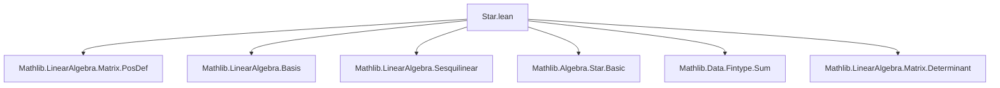

**Technical Brief: `Star.lean` — Sesquilinear Forms over a Star Ring**

---

### 1. **Key Definitions & Theorems**

| Name | Type / Signature | Purpose |
|------|------------------|---------|
| `isSymm` | `B : M →ₗ⋆[R] M →ₗ[R] R → Prop` | `B` is *symmetric* if $ \forall x\,y,\ \overline{B(x, y)} = B(y, x) $, where `star` is the involution on `R`. |
| `IsHermitian` | `A : Matrix n n R → Prop` | A matrix $A$ is Hermitian if $ \overline{A_{ij}} = A_{ji} $ for all $i, j$. |
| `isPosSemidef` | `B : M →ₗ⋆[R] M →ₗ[R] R → Prop` | $B$ is positive semidefinite if $ \forall x,\ B(x, x) \ge 0 $ (in the ordered ring `R`). |
| `posSemidef` | `A : Matrix n n R → Prop` | $A$ is positive semidefinite if $ \forall x,\ x^\top A x \ge 0 $. |
| `toMatrix₂` | `Basis n R M → Basis n R M → (M →ₗ⋆[R] M →ₗ[R] R) → Matrix n n R` | Represents a sesquilinear form as a matrix w.r.t. a basis. |
| `LinearMap.isSymm_iff_basis` | `B.IsSymm ↔ ∀ i j, star (B (b i) (b j)) = B (b j) (b i)` | Symmetry of `B` is equivalent to Hermitian symmetry on basis elements. |
| `LinearMap.isSymm_iff_isHermitian_toMatrix` | `B.IsSymm ↔ (toMatrix₂ b b B).IsHermitian` | Symmetry of `B` ↔ Hermitian property of its matrix representation. |
| `star_dotProduct_toMatrix₂_mulVec` | `star x ⬝ᵥ (toMatrix₂ b b B).mulVec y = B (b⁻¹ x) (b⁻¹ y)` | Connects matrix action with sesquilinear form via dot product and `star`. |
| `apply_eq_star_dotProduct_toMatrix₂_mulVec` | `B x y = star (repr x) ⬝ᵥ (toMatrix₂ b b B).mulVec (repr y)` | Evaluates `B(x, y)` via matrix multiplication and coordinate representation. |
| `LinearMap.isPosSemidef_iff_posSemidef_toMatrix` | `B.IsPosSemidef ↔ (toMatrix₂ b b B).PosSemidef` | Positive semidefiniteness of `B` ↔ of its matrix (under symmetry assumption). |

---

### 2. **Naming Conventions**

- **Prefixes**:
  - `is_`: Predicate on forms/matrices (`isSymm`, `isPosSemidef`, `isHermitian`).
  - `star_`: Operations involving the `star` involution (`star_dotProduct`, `starRingEnd_apply`).
  - `toMatrix₂`: Conversion from sesquilinear form to matrix (bilinear in basis arguments).
- **Suffixes**:
  - `_iff_`: Equivalence lemmas (`isSymm_iff_basis`, `isPosSemidef_iff_posSemidef_toMatrix`).
  - `_mulVec`, `_dotProduct`: Matrix-vector / dot product interactions.
- **Variables**:
  - `B`: Sesquilinear form.
  - `b`: Basis.
  - `x, y`: Vectors (either in `M` or coordinate space `n → R`).

---

### 3. **Tactic Stack**

- `simp only [...]`: Extensive simplification using linear algebra and `star`-ring properties.
- `rw [...]`: Rewriting using lemmas like `map_sum`, `map_smulₛₗ`, `star_star`, `Finset.sum_comm`.
- `refine` + `Finset.sum_congr`: To handle double sums over finite sets.
- `apply and_congr`: To split equivalences into two implications.
- `obtain ⟨..., hx⟩ := ...`: Existential elimination via `Submodule.mem_span_iff_exists_finset_subset`.
- `aesop` is *not* used — proofs are mostly manual and structured.

---

### 4. **Proof Logic**

- **Structure**:
  1. **Basis-based reduction**: Prove properties on basis elements, then extend by linearity (via finite sums and span).
  2. **Equivalence proofs** (`↔`):
     - `mp`: Use `h.eq _ _` (from `IsSymm` definition) to get componentwise condition.
     - `mpr`: Expand arbitrary vectors in basis, reduce to finite sums, apply componentwise hypothesis.
  3. **Matrix ↔ Form correspondence**:
     - Use `toMatrix₂` definition and coordinate maps (`repr`, `equivFun`).
     - Leverage `dotProduct_toMatrix₂_mulVec` and its `star`-twisted variant.
  4. **Positivity**:
     - Reduce to coordinate vectors via `repr`.
     - Use equivalence of quadratic forms: $B(x,x) = \overline{[x]_b}^\top A [x]_b$.

---

### 5. **Imports & Dependencies**

- **Core**:
  - `Mathlib.LinearAlgebra.Matrix.PosDef`: Provides `Matrix.IsHermitian`, `PosSemidef`, dot product, `mulVec`.
- **Assumptions**:
  - `CommSemiring R`, `StarRing R`, `AddCommMonoid M`, `Module R M`, `Fintype n`, `DecidableEq n`.
  - For positivity: `CommRing R`, `PartialOrder R`.

---

### 6. **Mermaid Diagrams**

#### **Dependency Graph (Module-Level)**



#### **Overview of Theory Flow**

```mermaid
flowchart LR
  subgraph Setup
    R[CommSemiring R + StarRing R]
    M[AddCommMonoid M + Module R M]
    B[Sesquilinear Form B : M →ₗ⋆[R] M →ₗ[R] R]
  end

  subgraph Basis
    b[Basis n R M]
    repr[b.repr : M → n → R]
    equivFun[b.equivFun : n → M]
  end

  subgraph Matrix
    A[toMatrix₂ b b B : Matrix n n R]
    IsHermitian[IsHermitian A]
    PosSemidef[PosSemidef A]
  end

  subgraph Equivalences
    S1[isSymm_iff_basis]
    S2[isSymm_iff_isHermitian_toMatrix]
    P1[isPosSemidef_iff_posSemidef_toMatrix]
  end

  B --> S1
  b --> S1
  S1 --> S2
  A --> S2
  S2 --> P1
  A --> P1
  B --> P1
```

---

### 7. **Summary**

This module formalizes the correspondence between *Hermitian* and *positive semidefinite* sesquilinear forms over a star ring and their matrix representations. It leverages basis expansions, finite sum manipulations, and the `star` involution to bridge abstract form properties with concrete matrix properties. The results are foundational for further work on inner product spaces, adjoints, and spectral theory in the `StarRing` setting.
