**Technical Brief: `TensorProduct.lean`**

---

### 1. KEY DEFINITIONS & THEOREMS

| Name | Type / Signature | Purpose |
|------|------------------|---------|
| `tensorToSpan` | `A ⊗[R] p →ₗ[A] span A (p : Set M)` | Natural $A$-linear map from the tensor product of $A$ with an $R$-submodule $p$ to the $A$-span of $p$. |
| `tensorToSpan_apply_tmul` | `p.tensorToSpan A (a ⊗ₜ x) = a • (x : M)` | Describes action of `tensorToSpan` on simple tensors. |
| `surjective_tensorToSpan` | `Surjective (p.tensorToSpan A)` | Proves `tensorToSpan` is surjective under mild assumptions. |
| `injective_tensorToSpan` | `Injective (p.tensorToSpan A)` | Proves injectivity under the additional assumptions that $A$ is a **flat** and **epi** $R$-algebra. |
| `tensorEquivSpan` | `A ⊗[R] p ≃ₗ[A] span A (p : Set M)` | Equivalence of $A$-modules when $A$ is a flat epi $R$-algebra; constructed via `ofBijective`. |
| `tensorEquivSpan_apply_tmul` | `p.tensorEquivSpan A (a ⊗ₜ x) = a • (x : M)` | Action of the equivalence on simple tensors. |
| `tensorSpanEquivSpan` | `A ⊗[R] span R s ≃ₗ[A] span A s` | Variant for arbitrary subsets $s \subseteq M$, using `span_span_of_tower`. |
| `coe_tensorSpanEquivSpan_apply_tmul` | `tensorSpanEquivSpan R A s (a ⊗ₜ x) = a • (x : M)` | Coercion and action of the subset-based equivalence. |
| `finrank_span_eq_finrank` | `finrank A (span A (p : Set M)) = finrank R p` | Equality of finite ranks under flat epi assumptions and freeness/finiteness over $R$. |
| `finrank_span_eq_finrank_span` | `finrank A (span A s) = finrank R (span R s)` | Extension to arbitrary finite subsets $s$, assuming $R$ is a PID, domain, and $M$ torsion-free. |

---

### 2. NAMING CONVENTIONS

- **Prefixes**:
  - `tensorToSpan`, `tensorEquivSpan`, `tensorSpanEquivSpan`: indicate construction via tensor product.
  - `injective_`, `surjective_`: standard for properties of maps.
  - `coe_`: for coercion-related lemmas (e.g., `coe_tensorSpanEquivSpan_apply_tmul`).
- **Suffixes**:
  - `_apply_tmul`: lemmas about application on simple tensors $a \otimes x$.
  - `_of_tower`, `_of_tower`: refer to scalar tower laws (`IsScalarTower`).
  - `_span`: refers to span constructions (`span A s`, `span R s`).
- **Variable naming**:
  - `p`: typically a submodule over $R$.
  - `s`: subset of module $M$.
  - `ι`: index type for bases.
  - `b₁`, `b₂`: bases used in rank arguments.

---

### 3. TACTIC STACK

Frequently used tactics in proofs:

| Tactic | Usage |
|--------|-------|
| `intro`, `ext`, `rw`, `simp`, `simpa` | Basic rewriting and simplification. |
| `rcases subsingleton_or_nontrivial R` | Case analysis on ring triviality. |
| `let ... := ...` | Local definitions for intermediate maps. |
| `have hf : Injective f := ...`, `have hg : Injective g := ...` | Intermediate lemma introduction. |
| `exact hf.comp hg` | Composition of injective maps. |
| `ofBijective ... ⟨..., ...⟩` | Construct equivalence from bijectivity. |
| `ofEq _ _ ...` | Equivalence via propositional equality. |
| `rw [finrank_eq_card_basis ...]` | Rank computation via basis cardinality. |
| `baseChange`, `map` | Basis transformation under scalar extension. |

---

### 4. PROOF LOGIC

**General proof strategy**:

1. **Define natural map**: Construct `tensorToSpan` using `AlgebraTensorModule.lift`.
2. **Prove surjectivity**:
   - Use `Finsupp.mem_span_iff_linearCombination` to express elements of `span A (p : Set M)` as linear combinations.
   - Lift coefficients and elements to the tensor product.
3. **Prove injectivity** (under flat + epi assumptions):
   - Factor `tensorToSpan` as composition $f \circ g$, where:
     - $g = (p.inclusionSpan A).lTensor A$ is injective (preserves injectivity under tensor with flat module).
     - $f$ is injective by `Algebra.injective_lift_lsmul`.
   - Conclude injectivity via composition.
4. **Equivalence**:
   - Combine injectivity + surjectivity to get `ofBijective`.
5. **Rank equality**:
   - Choose a basis for $p$ over $R$ (`Free.chooseBasis`).
   - Extend scalars via `baseChange`, then map via `tensorEquivSpan`.
   - Use `finrank_eq_card_basis` to equate ranks.

---

### 5. IMPORTS (Primary Dependencies)

| Module | Role |
|--------|------|
| `Mathlib.Algebra.Algebra.Epi` | `Algebra.IsEpi`, used for flat epimorphisms. |
| `Mathlib.LinearAlgebra.Dimension.StrongRankCondition` | `StrongRankCondition`, used implicitly for rank comparisons. |
| `Mathlib.LinearAlgebra.Finsupp.LinearCombination` | `Finsupp.mem_span_iff_linearCombination`, key for surjectivity proof. |
| `Mathlib.LinearAlgebra.Span.Basic` | `span`, inclusion maps, `span_span_of_tower`. |
| `Mathlib.RingTheory.Flat.Basic` | `Module.Flat`, flatness assumption. |
| `Mathlib.Combinatorics.Matroid.Init` | Possibly for `StrongRankCondition` or related combinatorial lemmas. |
| `Mathlib.Data.Nat.Totient` | Possibly for auxiliary number-theoretic lemmas (not directly used here). |
| `Mathlib.Data.Sym.Sym2` | Possibly for symmetry in tensor product (not directly used). |
| `Mathlib.LinearAlgebra.FreeModule.PID` | `Free`, `chooseBasis`, used in rank argument. |
| `Mathlib.LinearAlgebra.FreeModule.StrongRankCondition` | Ensures finite free modules behave well. |
| `Mathlib.Tactic.NormNum.GCD` | Possibly for normalization in PID arguments. |
| `Mathlib.Tactic.Positivity` | For positivity goals (not directly used here). |

---

### 6. MERMAID DIAGRAMS

#### Dependency Graph (Top-Level)

```mermaid
graph TD
  A[Module TensorProduct] --> B[Mathlib.Algebra.Algebra.Epi]
  A --> C[Mathlib.LinearAlgebra.Dimension.StrongRankCondition]
  A --> D[Mathlib.LinearAlgebra.Finsupp.LinearCombination]
  A --> E[Mathlib.LinearAlgebra.Span.Basic]
  A --> F[Mathlib.RingTheory.Flat.Basic]
  A --> G[Mathlib.Combinatorics.Matroid.Init]
  A --> H[Mathlib.Data.Nat.Totient]
  A --> I[Mathlib.Data.Sym.Sym2]
  A --> J[Mathlib.LinearAlgebra.FreeModule.PID]
  A --> K[Mathlib.LinearAlgebra.FreeModule.StrongRankCondition]
  A --> L[Mathlib.Tactic.NormNum.GCD]
  A --> M[Mathlib.Tactic.Positivity]
```



#### Overview of Theory Flow

```mermaid
flowchart LR
  R[CommSemiring R] --> A[Algebra R A]
  A --> M[Module A M]
  p[Submodule R M] --> tensorToSpan[A ⊗[R] p →ₗ[A] span A p]
  tensorToSpan --> surj[Surjective]
  tensorToSpan --> inj[Injective (if Flat + Epi)]
  surj & inj --> equiv[tensorEquivSpan]
  equiv --> rank[finrank equality]
  spanR[span R s] --> tensorSpanEquivSpan[A ⊗[R] span R s ≃ₗ[A] span A s]
  rank --> PID[PID + Domain + TorsionFree ⇒ rank equality for subsets]
```

---

### 7. DOMAIN & SCOPE

- **Domain**: Commutative algebra, module theory, tensor products over rings.
- **Scope**: Interaction between scalar extension (via algebra $A$) and linear span operations.
- **Key Theorem**: Under flatness and epimorphism, scalar extension commutes with span:  
  $$
  A \otimes_R p \;\cong_A\; \operatorname{span}_A(p)
  $$
  and ranks are preserved.

--- 

Let me know if you'd like a formalized summary in Lean syntax or a high-level theorem statement.
