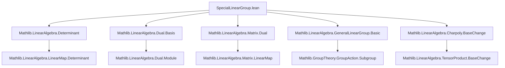

**Technical Brief: `SpecialLinearGroup.lean`**

---

### 1. KEY DEFINITIONS & THEOREMS

| Name | Type / Signature | Purpose |
|------|------------------|---------|
| `SpecialLinearGroup R V` | `abbrev` | Subtype of linear equivalences `V ≃ₗ[R] V` with determinant 1. |
| `det_eq_one` | `u : SpecialLinearGroup R V ⊢ u.det = 1` | Extracts determinant condition from subtype. |
| `instance Group` | `Group (SpecialLinearGroup R V)` | Equips `SpecialLinearGroup` with group structure via coercion lemmas. |
| `toLinearEquiv` | `→* V ≃ₗ[R] V` | Canonical monoid homomorphism embedding `SL(V)` into `GL(V)`. |
| `toGeneralLinearGroup` | `→* LinearMap.GeneralLinearGroup R V` | Canonical group homomorphism into general linear group. |
| `dualMap` (`Aᵀ`) | `[Free V] [Finite V] ⇒ A ↦ A.dualMap` | Transpose (dual) action on dual module; preserves determinant 1. |
| `baseChange` | `[Algebra R S] ⇒ SL_R(V) →* SL_S(S ⊗_R V)` | Base change functoriality for special linear groups. |
| `congr_linearEquiv e` | `V ≃ₗ W ⇒ SL(V) ≃* SL(W)` | Isomorphism of special linear groups induced by module isomorphism. |
| `toLin'_equiv` | `SL(n, R) ≃* SL(R^n)` | Canonical multiplicative equivalence between matrix and module special linear groups. |
| `toLin_equiv b` | `SL(n, R) ≃* SL(V)` (for basis `b : n ≃ R^V`) | Extension of `toLin'_equiv` to arbitrary finite free module via basis. |
| `mem_center_iff` | `g ∈ Z(SL(V)) ↔ ∃ r, r^d = 1 ∧ g = r • id` | Characterization of center in terms of scalar matrices (roots of unity). |
| `centerEquivRootsOfUnity` | `Z(SL(V)) ≃* μ_{max(d,1)}(R)` | Isomorphism between center and roots of unity of order ≤ dim(V). |
| `center_eq_bot_of_finrank_le_one` | `finrank ≤ 1 ⇒ Z(SL(V)) = ⊥` | Trivial center in low rank. |

---

### 2. NAMING CONVENTIONS

- **Prefixes**:
  - `to*`: canonical maps (e.g., `toLinearEquiv`, `toGeneralLinearGroup`, `toLin_equiv`)
  - `congr_*`: induced isomorphisms from module isomorphisms (`congr_linearEquiv`)
  - `center_*`: center-related constructions (`centerEquivRootsOfUnity`, `mem_center_iff`)
  - `dualMap`, `baseChange`: structural operations (dual, base change)
- **Suffixes**:
  - `_equiv`: multiplicative equivalences (`toLin'_equiv`, `toLin_equiv`)
  - `_cong*`: congruence/isomorphism lemmas (`centerCongr_toLin_equiv_trans_centerEquivRootsOfUnity_eq`)
- **Notation**:
  - `Aᵀ` for `dualMap A`
  - `↑A` for coercion to linear equivalence (via `CoeFun`)
  - `A x` for action on vector (via coercion)

---

### 3. TACTIC STACK

Frequent tactics used in proofs:

| Tactic | Usage |
|--------|-------|
| `simp` | Simplifying determinant, coercion, and group laws (`coe_mul`, `det_coe`, etc.) |
| `aesop` | Automated reasoning for equality of functions/morphisms (e.g., `congr_linearEquiv` left/right inverses) |
| `rw` | Rewriting using lemmas like `LinearEquiv.det_conj`, `LinearMap.det_dualMap`, `mem_center_iff` |
| `ext` | Extensionality for linear maps, equivalences, functions |
| `nontriviality`, `subsingleton_or_nontrivial` | Handling cases based on triviality/nontriviality of ring/module |
| `infer_instance` | Deriving instances (e.g., `Subsingleton`, `IsUnit`) |
| `nth_rewrite`, `convert`, `congr` | Advanced rewriting and equality proofs |
| `rcases`, `cases'` | Case analysis on `max`, `or`, `exists` |
| `have`, `suffices` | Intermediate lemma introduction |

---

### 4. PROOF LOGIC

**General proof strategy**:

- **Subtype reasoning**: Prove properties by lifting to the ambient `LinearEquiv`, using `u.prop : u.det = 1`.
- **Coercion lemmas**: Most group operations are defined via subtype lifting; proofs reduce to verifying determinant = 1.
- **Basis reduction**: For finite free modules, many results reduce to matrix case via `toLin_equiv b`.
- **Case analysis on rank**:
  - `finrank = 0`: trivial module → `SL(V)` trivial.
  - `finrank = 1`: `SL(V)` trivial (subsingleton).
  - `finrank ≥ 2`: nontrivial center, roots-of-unity parametrization.
- **FaithfulSMul arguments**: Used to deduce scalar equality from action equality on module (e.g., in `centerEquivRootsOfUnity` proofs).
- **Functoriality**: `baseChange`, `congr_linearEquiv` are proven via `Subtype.ext` + determinant identities.

---

### 5. IMPORTS

| Module | Purpose |
|--------|---------|
| `Mathlib.LinearAlgebra.Determinant` | Determinant theory for linear maps |
| `Mathlib.LinearAlgebra.Dual.Basis` | Dual module and basis duality |
| `Mathlib.LinearAlgebra.Matrix.Dual` | Dual of matrices, transpose |
| `Mathlib.LinearAlgebra.GeneralLinearGroup.Basic` | General linear group `GL(V)` |
| `Mathlib.LinearAlgebra.Charpoly.BaseChange` | Base change for linear maps, used in `baseChange` |

---

### 6. DEPENDENCY & THEORY OVERVIEW

#### Mermaid Diagram: Module Dependencies



#### Mermaid Diagram: Theory Flow

```mermaid
graph TD
  SL_def[SpecialLinearGroup R V] --> SL_group[Group instance]
  SL_group --> toGL[toLinearEquiv : SL →* GL]
  SL_group --> toGL_general[toGeneralLinearGroup]
  SL_group --> dualMap[dualMap : SL(V) → SL(V*)]
  SL_group --> baseChange[baseChange : SL_R(V) → SL_S(S⊗V)]
  SL_group --> congr[congr_linearEquiv : SL(V) ≃ SL(W)]
  
  SL_finite[Finite free V] --> toLin_equiv[toLin_equiv : SL(n,R) ≃ SL(V)]
  toLin_equiv --> center_char[mem_center_iff]
  center_char --> center_iso[centerEquivRootsOfUnity : Z(SL(V)) ≃ μ_d]
  center_iso --> center_triv[center_eq_bot_of_finrank_le_one]
  
  toLin_equiv --> center_cong[centerCongr_toLin_equiv_trans_centerEquivRootsOfUnity_eq]
```

#### Summary

This file defines the **special linear group of a module**, generalizing the classical matrix group `SL(n, R)`. It establishes:

- **Group structure** on determinant-1 linear equivalences.
- **Functoriality** under base change and module isomorphism.
- **Basis-independent equivalence** with matrix special linear groups.
- **Center description** via roots of unity, with full classification in low rank.

The development mirrors `Matrix.SpecialLinearGroup`, but abstracts to arbitrary finite free modules, enabling coordinate-free reasoning and better compatibility with module-theoretic constructions (e.g., duals, tensor products).

--- 

*End of Technical Brief.*
