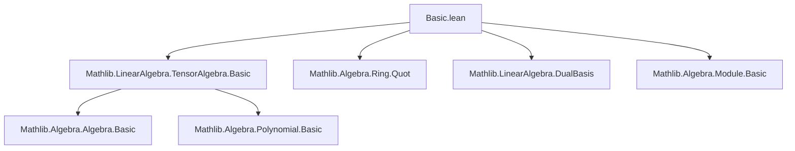

### Technical Brief: Symmetric Algebra Construction in Lean 4

---

#### **1. Key Definitions & Theorems**

| Name | Type / Signature | Purpose |
|------|------------------|---------|
| `TensorAlgebra.SymRel` | `TensorAlgebra R M → TensorAlgebra R M → Prop` | Inductive relation identifying $xy - yx$ for all $x,y \in M$, used to enforce commutativity in the tensor algebra. |
| `SymmetricAlgebra R M` | `Type*` | Quotient of the tensor algebra by `SymRel`, i.e., `RingQuot (SymRel R M)`. Represents the symmetric algebra. |
| `algHom R M` | `TensorAlgebra R M →ₐ[R] SymmetricAlgebra R M` | Canonical surjective algebra homomorphism from tensor to symmetric algebra. |
| `ι R M` | `M →ₗ[R] SymmetricAlgebra R M` | Canonical linear inclusion of $M$ into the symmetric algebra. |
| `SymmetricAlgebra.lift f` | `(M →ₗ[R] A) → (SymmetricAlgebra R M →ₐ[R] A)` | Universal property: lifts any linear map $f : M \to A$ (with $A$ commutative $R$-algebra) to an algebra morphism. |
| `IsSymmetricAlgebra f` | `Prop` | States that the lifted map `SymmetricAlgebra.lift f` is bijective — i.e., $A$ satisfies the universal property of the symmetric algebra. |
| `IsSymmetricAlgebra.equiv h` | `SymmetricAlgebra R M ≃ₐ[R] A` | Isomorphism from symmetric algebra to $A$, assuming $f$ satisfies the universal property. |
| `IsSymmetricAlgebra.lift h g` | `A →ₐ[R] A'` | Lift of $g : M \to A'$ through $f : M \to A$, assuming $f$ is symmetric algebra. |
| `algebraMapInv` | `SymmetricAlgebra R M →ₐ[R] R` | Left-inverse of `algebraMap R (SymmetricAlgebra R M)`, induced by zero map $M \to R$. |
| `algebraMap_leftInverse` | `Function.LeftInverse algebraMapInv (algebraMap ...)` | Shows `algebraMap` is injective. |
| `algebraMap_inj`, `algebraMap_eq_zero_iff`, etc. | `↔`-equivalences | Characterizations of when algebra maps are equal, zero, or one. |
| `instance CommSemiring / CommRing` | `CommSemiring (SymmetricAlgebra R M)` | Proves symmetric algebra is commutative. |

---

#### **2. Naming Conventions**

- **Prefixes**:
  - `algHom_`: algebra homomorphisms (e.g., `algHom`, `algHom_ext`)
  - `lift_`: universal lifts (e.g., `lift`, `lift_ι_apply`, `lift_eq`)
  - `algebraMap_`: properties of the structure map $R \to \mathrm{Sym}(M)$ (e.g., `algebraMap_leftInverse`, `algebraMap_inj`)
  - `equiv_`: isomorphisms from `IsSymmetricAlgebra` (e.g., `equiv`, `equiv_symm_apply`)
  - `induction`: elimination principles (e.g., `SymmetricAlgebra.induction`, `IsSymmetricAlgebra.induction`)

- **Suffixes**:
  - `_apply`: action on elements (e.g., `lift_ι_apply`)
  - `_iff`: equivalence statements (e.g., `algebraMap_eq_zero_iff`)
  - `_ext`: extensionality lemmas (e.g., `algHom_ext`)
  - `_surjective`, `_leftInverse`, `_injective`: functional properties

---

#### **3. Tactic Stack**

Frequently used tactics in proofs:
- `induction ... using ...` — structural induction on `TensorAlgebra` or `SymmetricAlgebra`
- `simp [*, ← map_mul, ...]` — simplification using algebra homomorphism properties
- `rw [← map_mul, RingQuot.mkAlgHom_rel ...]` — rewriting using quotient relations
- `ext` — extensionality for functions/morphisms
- `congr` — congruence closure for equality proofs
- `exact`, `refine`, `apply` — standard proof construction
- `ring`, `aesop` — for commutative ring reasoning (implicit in `mul_comm` proof)
- `change ...` — goal manipulation
- `rcases ... with ⟨a, rfl⟩` — destructuring surjectivity

---

#### **4. Proof Logic**

- **Inductive structure**: Proofs over `SymmetricAlgebra R M` use `SymmetricAlgebra.induction`, which reduces to induction on `TensorAlgebra` via `algHom_surjective`.
- **Universal property**: Constructed via `TensorAlgebra.lift` + quotient lifting (`RingQuot.liftAlgHom`), ensuring the relation `SymRel` is respected (via `mul_comm` case).
- **Commutativity proof**: `mul_comm` uses nested induction on both arguments, with base cases handled by `algebraMap` commutativity and `ι`-case using `RingQuot.mkAlgHom_rel` on `SymRel.mul_comm`.
- **Isomorphism extraction**: From `IsSymmetricAlgebra f`, use `Equiv.ofBijective` to get `equiv`, then derive all universal properties (e.g., `lift`, `algHom_ext`) via composition with `equiv` and its inverse.
- **Injectivity of `algebraMap`**: Proven via constructing a left-inverse (`algebraMapInv`) and applying standard lemmas (`Function.LeftInverse.injective`).

---

#### **5. Imports**

- `Mathlib.LinearAlgebra.TensorAlgebra.Basic` — provides tensor algebra, its universal property, and `RingQuot` infrastructure.

---

#### **6. Mermaid Diagrams**

##### **Dependency Graph (Module-Level)**



##### **Theoretical Overview (File-Level)**

```mermaid
flowchart LR
  A[Tensor Algebra T(M)] -->|quotient by SymRel| B[Symmetric Algebra Sym(M)]
  C[M] -->|ι| B
  C -->|f| D[Commutative R-Algebra A]
  B -.->|lift f| D
  B <-->|equiv| A[If IsSymmetricAlgebra f]
  R -->|algebraMap| B
  B -->|algebraMapInv| R
```

##### **Universal Property Diagram**

```mermaid
flowchart LR
  M -->|ι| Sym[M]
  M -->|f| A
  Sym[M] -.->|lift f| A
  A <-->|equiv| Sym[M]  %% only if IsSymmetricAlgebra f
```

---

#### **7. Theory Context**

This file formalizes the **symmetric algebra** as the **free commutative algebra** over a module $M$ over a commutative semiring $R$. It:
- Constructs the symmetric algebra concretely as a quotient of the tensor algebra.
- Proves its universal property: any linear map $M \to A$ to a commutative algebra factors uniquely through $\mathrm{Sym}(M)$.
- Shows that the symmetric algebra is commutative, and that the structure map $R \to \mathrm{Sym}(M)$ is injective (when $R$ is nontrivial).
- Provides a reusable abstraction `IsSymmetricAlgebra` to reason about objects satisfying the universal property abstractly.

It serves as the foundational module for further development of symmetric powers, exterior algebras, and polynomial algebras in Mathlib.

--- 

Let me know if you'd like a formalization of the **graded structure**, **Hilbert–Serre theorem**, or **comparison with polynomial rings** (`SymmetricAlgebra R (R →₀ ℕ)`).
