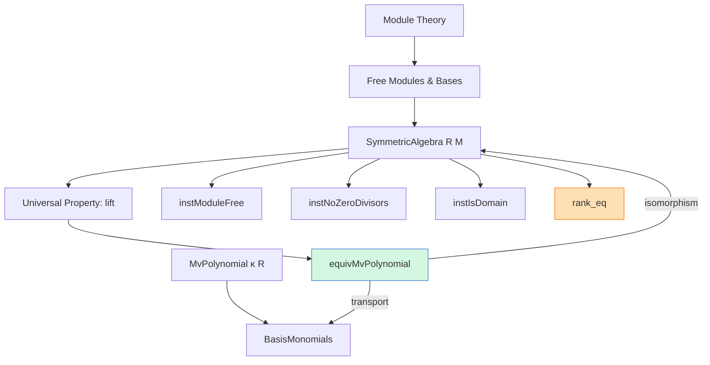

**Technical Brief: Basis for `SymmetricAlgebra R M` (Basis.lean)**  
*Prepared for Domain-Specific AI Agent Training*

---

### 1. KEY DEFINITIONS & THEOREMS

| Name | Type / Signature | Purpose |
|------|------------------|---------|
| `equivMvPolynomial` | `b : Basis κ R M → SymmetricAlgebra R M ≃ₐ[R] MvPolynomial κ R` | Constructs an algebra isomorphism between the symmetric algebra over a free module `M` and multivariate polynomials over the index type of a basis `b`. |
| `equivMvPolynomial_ι_apply` | `∀ b i, equivMvPolynomial b (ι (b i)) = X i` | Specifies how the algebra isomorphism acts on generators (`ι` of basis elements map to indeterminates `X i`). |
| `equivMvPolynomial_symm_X` | `∀ b i, (equivMvPolynomial b).symm (X i) = ι (b i)` | Inverse direction: indeterminates pull back to generators. |
| `Basis.symmetricAlgebra` | `b : Basis κ R M → Basis (κ →₀ ℕ) R (SymmetricAlgebra R M)` | Lifts a basis of `M` to a basis of the symmetric algebra, via monomial basis of `MvPolynomial` and transport along `equivMvPolynomial b`. |
| `instModuleFree` | `[Module.Free R M] → Module.Free R (SymmetricAlgebra R M)` | Proves the symmetric algebra is free when the underlying module is free. |
| `instNoZeroDivisors` | `[NoZeroDivisors R] [Module.Free R M] → NoZeroDivisors (SymmetricAlgebra R M)` | Shows the symmetric algebra inherits no zero-divisors from the base ring. |
| `instIsDomain` | `[IsDomain R] [Module.Free R M] → IsDomain (SymmetricAlgebra R M)` | Concludes the symmetric algebra is an integral domain under the same assumptions. |
| `rank_eq` | `[Nontrivial M] [Module.Free R M] → Module.rank (SymmetricAlgebra R M) = lift (max (rank M) ℵ₀)` | Computes the rank of the symmetric algebra as the maximum of the rank of `M` and ℵ₀, lifted to the universe of `R`. |
| `mvPolynomial` | `IsSymmetricAlgebra (Basis.constr b R (.X))` | Shows the universal property is satisfied via `equivMvPolynomial`. |

---

### 2. NAMING CONVENTIONS

- **Prefixes**:
  - `equivMvPolynomial`: `equiv` + `MvPolynomial` — indicates an equivalence to multivariate polynomials.
  - `symmetricAlgebra`: `symmetricAlgebra` suffix — used for constructions derived from a basis of `M`.
  - `inst*`: typeclass instances (e.g., `instModuleFree`, `instNoZeroDivisors`).
- **Suffixes**:
  - `_apply`: lemmas about application of functions (e.g., `equivMvPolynomial_ι_apply`).
  - `symm`: for inverses (e.g., `equivMvPolynomial_symm_X`).
- **General**:
  - `ι R M` — canonical map from `M` to `SymmetricAlgebra R M`.
  - `X i` — indeterminate in `MvPolynomial`.
  - `basisMonomials` — monomial basis of `MvPolynomial`.

---

### 3. TACTIC STACK

Frequent tactics used in proofs:
- `simp`, `simp_rw`, `by simp` — for simplification and rewriting using `@[simp]` lemmas.
- `aesop` — automated reasoning for simple goals (e.g., in `algHom_ext` proofs).
- `ring` — for commutative semiring/ring identities (implied in `NoZeroDivisors` proofs).
- `exact`, `apply`, `rw`, `convert` — standard proof scripting.
- `have`, `let`, `obtain` — for intermediate constructions (e.g., extracting basis from freeness).
- `lift`, `congr` — for universe lifting and equality reasoning.

---

### 4. PROOF LOGIC

- **Structure**:
  - **Step 1**: Construct `equivMvPolynomial` using `SymmetricAlgebra.lift` and `MvPolynomial.aeval`, then prove it’s invertible via `algHom_ext` and `Basis.ext`.
  - **Step 2**: Use `equivMvPolynomial` to transport known structures (e.g., `MvPolynomial.basisMonomials`) to the symmetric algebra → defines `Basis.symmetricAlgebra`.
  - **Step 3**: Derive freeness and algebraic properties (no zero-divisors, domain) by transporting known results along the equivalence.
  - **Step 4**: Compute rank using:
    - `rank_eq` for linear equivalences,
    - `MvPolynomial.rank_eq_lift`,
    - `Cardinal.mk_finsupp_nat` (monomials ↔ finite support functions `κ →₀ ℕ`).

- **Induction**: Not used directly; proofs rely on universal properties and equivalence-based transport.

---

### 5. IMPORTS

| Module | Purpose |
|--------|---------|
| `Mathlib.LinearAlgebra.SymmetricAlgebra.Basic` | Core definitions: `SymmetricAlgebra`, `ι`, `lift`, universal property. |
| `Mathlib.LinearAlgebra.Dimension.Basic` | Rank, freeness, dimension theory for modules. |
| `Mathlib.RingTheory.MvPolynomial` | Multivariate polynomial ring, its basis (`basisMonomials`), rank, algebra structure. |

---

### 6. DEPENDENCY & OVERVIEW DIAGRAM

**File Overview**:
- Establishes that the symmetric algebra over a free module `M` is isomorphic to multivariate polynomials over a basis of `M`.
- Uses this isomorphism to:
  - Construct an explicit basis (`Basis.symmetricAlgebra`) for the symmetric algebra.
  - Prove freeness, domain properties, and compute rank.
- Mirrors `TensorAlgebra` structure, but for symmetric (commutative) structure.

---

Let me know if you'd like a formalized dependency graph (e.g., for Lean’s `leanproject`), or a summary of how this file fits into the broader `Mathlib` theory of algebras.
