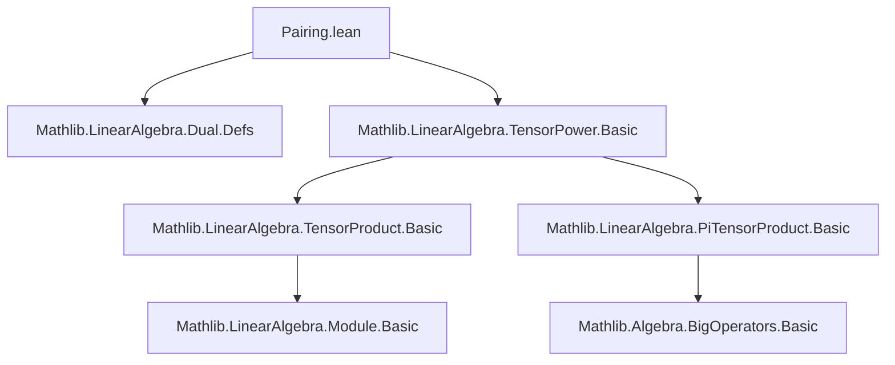

**Technical Brief: `Pairing.lean` — Tensor Power Pairing Construction**

---

### 1. **Key Definitions & Theorems**

| Name | Type / Signature | Purpose |
|------|------------------|---------|
| `multilinearMapToDual` | `MultilinearMap R (fun (_ : Fin n) ↦ Module.Dual R M) (Module.Dual R (⨂[R]^n M))` | Constructs the canonical multilinear map from $n$ copies of the dual module to the dual of the $n$-th tensor power, via universal property of tensor product. |
| `pairingDual` | `⨂[R]^n (Module.Dual R M) →ₗ[R] Module.Dual R (⨂[R]^n M)` | The induced linear map (via `PiTensorProduct.lift`) from the tensor power of the dual to the dual of the tensor power — the *canonical pairing*. |
| `multilinearMapToDual_apply_tprod` | `∀ f v, multilinearMapToDual R M n f (tprod _ v) = ∏ i, f i (v i)` | Evaluates the multilinear map on a simple tensor (product of vectors), giving the product of pairings. |
| `pairingDual_tprod_tprod` | `∀ f v, pairingDual R M n (tprod _ f) (tprod _ v) = ∏ i, f i (v i)` | Evaluates the pairing on simple tensors: matches the expected dual pairing formula. |

---

### 2. **Naming Conventions**

- **Prefixes**:
  - `multilinearMapToDual`: descriptive, indicates construction *to* the dual via multilinear maps.
  - `pairingDual`: emphasizes the *pairing* nature and that it goes *from* tensor power of duals.
- **Suffixes**:
  - `apply_tprod`: indicates evaluation on a `tprod` (simple tensor).
  - `tprod_tprod`: indicates both arguments are simple tensors.

- **Variables**:
  - `f : Fin n → Module.Dual R M`: a family of linear functionals (one per tensor factor).
  - `v : Fin n → M`: a family of vectors (one per tensor factor).
  - `i : Fin n`: index in finite type.

- **Notation**:
  - `tprod _ v`: tensor product of vectors $v(i)$.
  - `tprod _ f`: tensor product of functionals $f(i)$.

---

### 3. **Tactic Stack**

- **Core tactics**:
  - `ext`: extensionality for functions/maps.
  - `simp only [...]`: heavy use of `simp` with explicit lemmas to reduce expressions.
  - `dsimp`: definitional simplification (e.g., unfolding `lift.tprod`, `compLinearMap_apply`).
  - `by_cases ... subst h`: case analysis on equality of indices.
  - `simp only [Function.update_self, Function.update_of_ne]`: key for handling `Function.update`.
  - `simp [definition_name]`: to unfold definitions in goals.

- **No heavy automation** (e.g., no `ring`, `linarith`, `aesop`), indicating this is mostly definitional simplification and structural reasoning.

---

### 4. **Proof Logic**

- **Strategy**:
  1. Define a multilinear map using `MultilinearMap.mk`-style constructor (`{ toFun := ..., map_update_add' := ..., map_update_smul' := ... }`).
  2. Prove well-definedness by verifying multilinearity via `map_update_add'` and `map_update_smul'`.
  3. Use `PiTensorProduct.lift` to lift the multilinear map to a linear map on the tensor power.
  4. Prove evaluation formulas (`apply_tprod`, `tprod_tprod`) by simplifying with `lift.tprod`, `compLinearMap_apply`, and properties of `Function.update`.

- **Key insight**:
  - The pairing is defined *via* the universal property of the *pi-tensor product* (`PiTensorProduct.lift`), which handles the finite tensor power `⨂[R]^n`.
  - The formula $\langle f_1 \otimes \cdots \otimes f_n, v_1 \otimes \cdots \otimes v_n \rangle = \prod_i f_i(v_i)$ is verified directly.

---

### 5. **Imports & Dependencies**

- **Core imports**:
  ```lean
  Mathlib.LinearAlgebra.Dual.Defs
  Mathlib.LinearAlgebra.TensorPower.Basic
  ```
- **Implicit dependencies** (via `TensorProduct`, `PiTensorProduct`, `BigOperators`):
  - `Mathlib.LinearAlgebra.TensorProduct.Basic`
  - `Mathlib.LinearAlgebra.PiTensorProduct.Basic`
  - `Mathlib.Algebra.BigOperators.Basic`
  - `Mathlib.LinearAlgebra.Module.Basic`

- **Algebraic context**:
  - `CommSemiring R`, `AddCommMonoid M`, `Module R M`: ensures tensor powers and duals exist.

---

### 6. **Mermaid Diagrams**

#### **Dependency Graph (Module-Level)**



#### **Overview of Theory Flow**

```mermaid
flowchart LR
  subgraph Setup
    R[CommSemiring R] & M[Module R M]
  end

  subgraph Construction
    MultMult[MultilinearMap R (Fin n → Dual R M) → Dual R (TensorPower R n M)]
    Lift[PiTensorProduct.lift]
  end

  subgraph Result
    Pairing[PairingDual : ⨂ⁿ Dual R M →ₗ Dual R (⨂ⁿ M)]
  end

  Setup --> MultMult
  MultMult --> Lift
  Lift --> Pairing

  Pairing --> Eval1[Pairing on tprod ⊗ tprod = ∏ f i (v i)]
```

---

### 7. **Summary**

This file constructs the canonical linear pairing between the $n$-th tensor power of the dual module and the dual of the $n$-th tensor power, formalizing the familiar formula:
$$
(f_1 \otimes \cdots \otimes f_n)(v_1 \otimes \cdots \otimes v_n) = \prod_{i=1}^n f_i(v_i).
$$
It leverages the universal property of the pi-tensor product to define the pairing, and verifies its behavior on simple tensors. The development is clean, definitional, and avoids heavy automation—typical of foundational linear algebra in Lean.
