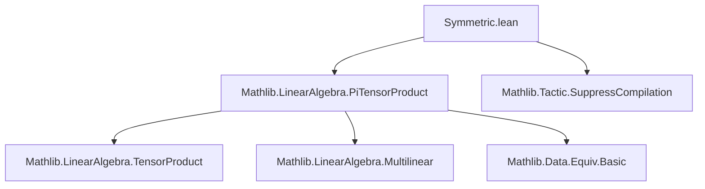

### Technical Brief: `Symmetric.lean`

---

#### **1. Key Definitions & Theorems**

| Name | Type / Signature | Purpose |
|------|------------------|---------|
| `SymmetricPower.Rel` | `Rel : (⨂[R] _, M) → (⨂[R] _, M) → Prop` | Defines the equivalence relation identifying tensors that differ by permutation of indices. Generated by `perm e f : Rel (⨂ₜ f) (⨂ₜ (f ∘ e))`. |
| `SymmetricPower` | `Type (max u v)` | Quotient of the tensor power by `Rel`, i.e., the **symmetric tensor power** over index type `ι`. |
| `Sym[R] ι M` | Notation for `SymmetricPower R ι M` | Standard notation for symmetric tensor power. |
| `Sym[R]^n M` | Notation for `Sym[R] (Fin n) M` | `n`-th symmetric tensor power (indexed by `Fin n`). |
| `mk` | `(⨂[R] _, M) →ₗ[R] Sym[R] ι M` | Canonical linear map from tensor power to symmetric tensor power (projection modulo permutations). |
| `tprod` | `MultilinearMap R (fun _ : ι ↦ M) (Sym[R] ι M)` | Canonical symmetric multilinear map; denoted `⨂ₛ[R] i, f i`. |
| `tprod_equiv` | `(e : Perm ι) → (f : ι → M) → ⨂ₛ i, f (e i) = ⨂ₛ i, f i` | States invariance of `tprod` under permutation of inputs. |
| `module` | `Module R (Sym[R] ι M)` | Symmetric tensor power is an `R`-module. |
| `span_tprod_eq_top` | `Submodule.span (range tprod) = ⊤` | Pure symmetric tensors span the whole space. |

---

#### **2. Naming Conventions**

- **Prefixes**:
  - `SymmetricPower.`: Module-level namespace.
  - `Rel`: Short for *relation*.
  - `mk`: Standard for *map from free object* (here, tensor power → symmetric power).
  - `tprod`: Short for *tensor product*, with `⨂ₜ` for raw tensor, `⨂ₛ` for symmetric version.

- **Suffixes**:
  - `'` (e.g., `smul'`): Auxiliary definition used to construct main object (`smul`).
  - `eq_top`: Indicates surjectivity or spanning property.

- **Notation**:
  - `Sym[R] ι M`, `Sym[R]^n M`: Analogous to `TensorProduct` notation `⨂[R]`.
  - `⨂ₛ[R] i, f i`: Symmetric tensor product notation (like `⨂[R]` but symmetric).

---

#### **3. Tactic Stack**

Frequently used tactics in proofs:

| Tactic | Role |
|--------|------|
| `induction h with` | Structural induction on inductive relation `Rel`. |
| `cases h with | perm e f =>` | Eliminate cases of `Rel` (only generator is `perm`). |
| `convert ...` | Refine equality using definitional equality where possible. |
| `rw [...]` | Rewrite using lemmas like `Function.update_apply_equiv_apply`, `MultilinearMap.map_update_smul`. |
| `simp_rw [...]` | Simplify and rewrite simultaneously (e.g., for functional updates). |
| `apply ...` | Apply lemmas or constructors (e.g., `AddCon.symm`, `AddCon.trans`). |
| `congr_arg _` | Prove equality of terms by congruence (used in module axioms). |
| `AddCon.induction_on` | Induction on quotient elements (to lift properties from representatives). |
| `eq_self` / `rfl` | Trivial equalities. |

---

#### **4. Proof Logic**

- **Inductive structure**: `Rel` is inductively defined with one constructor `perm`, so proofs about `Rel` or its generated congruence `addConGen (Rel ...)` proceed by:
  1. **Induction on the relation** (`induction h`).
  2. **Case analysis** on the generator (`perm e f`).
  3. **Use of functional extensionality / update lemmas** to handle permutation action on functions `ι → M`.
  4. **Lifting to quotient** via `AddCon.lift`, `AddCon.induction_on`, and `Quot.sound`.

- **Module construction**:
  - First prove `smul` respects the relation (`smul` lemma).
  - Then define `smul'` as an additive monoid homomorphism.
  - Finally, define `module` instance by verifying module axioms via induction on representatives.

- **Spanning property**:
  - Uses `range_mk` (surjectivity of `mk`) and `PiTensorProduct.span_tprod_eq_top` (raw tensor power is spanned by pure tensors).
  - Then pulls back via `tprod = mk ∘ tprod_raw`.

---

#### **5. Imports & Dependencies**

| Import | Purpose |
|--------|---------|
| `Mathlib.LinearAlgebra.PiTensorProduct` | Provides `PiTensorProduct`, `tprod`, `MultilinearMap`, and foundational lemmas. |
| `Mathlib.Tactic.SuppressCompilation` | Allows `suppress_compilation` for performance tuning during development. |

---

#### **6. Mermaid Diagrams**

##### **Dependency Graph (Module-Level)**



##### **Overview of File Structure**

```mermaid
graph LR
  A[SymmetricPower.Rel] --> B[SymmetricPower (quotient)]
  B --> C[AddCommMonoid / AddCommGroup instance]
  B --> D[Module R instance]
  A --> E[tprod : MultilinearMap]
  E --> F[⨂ₛ notation]
  D --> G[module axioms]
  E --> H[span_tprod_eq_top]
  G --> H
```

##### **Theoretical Flow**

```mermaid
graph LR
  RawTensor[Raw Tensor Power ⨂[R] M] -->|Quotient by Symmetry| SymTensor[Symmetric Power Sym[R] ι M]
  RawTensor -->|tprod_raw| SymTensor
  SymTensor -->|Spanning| Span[Span of ⨂ₛ]
  SymTensor -->|Module| Module[Module R]
  SymTensor -->|Universal| UProp[Universal Property (TODO)]
  SymTensor -->|Grading| Grading[Graded Algebra (TODO)]
```

---

#### **7. Future Work (from TODO)**

- **Grading**: Define multiplication `Sym^n M × Sym^m M → Sym^{n+m} M`, prove associativity/commutativity, and show `⨆ₙ Sym^n M` is a graded semiring/algebra.
- **Universal Property**: Linear maps `Sym^n M → N` ↔ symmetric multilinear maps `M^n → N`.
- **Polynomial Connection**: Relate `Sym^n (R^(n))` to homogeneous polynomials of degree `n`.

---

#### **8. Notable Lemmas & Properties**

- **Permutation Invariance**: `tprod_equiv` ensures symmetry.
- **Surjectivity**: `range_mk` shows `mk` is surjective ⇒ symmetric tensors are spanned by pure symmetric tensors.
- **Module Structure**: Constructed via `AddCon.lift` and verified via induction.

--- 

This file formalizes the foundational construction of symmetric tensor powers in Lean 4, leveraging quotient types and multilinear algebra. It sets the stage for graded algebra structures and universal properties in subsequent work.
