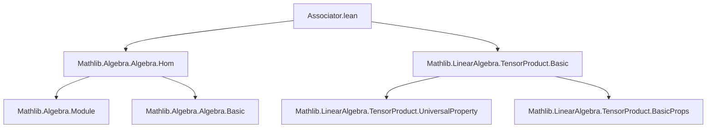
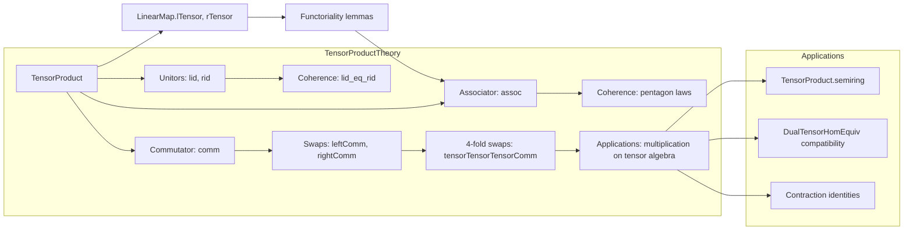

### Technical Brief: `Associator.lean`

---

#### **1. Key Definitions & Theorems**

| Name | Type | Purpose |
|------|------|---------|
| `TensorProduct.lid R M` | `R ⊗[R] M ≃ₗ[R] M` | Left unitor: identifies $R \otimes_R M \cong M$ via $r \otimes m \mapsto r \cdot m$. |
| `TensorProduct.rid R M` | `M ⊗[R] R ≃ₗ[R] M` | Right unitor: identifies $M \otimes_R R \cong M$ via $m \otimes r \mapsto r \cdot m$. |
| `TensorProduct.assoc R M N P` | `M ⊗[R] (N ⊗[R] P) ≃ₗ[R] (M ⊗[R] N) ⊗[R] P` | Associator: rebrackets tensor products; $m \otimes (n \otimes p) \mapsto (m \otimes n) \otimes p$. |
| `TensorProduct.comm R M N` | `M ⊗[R] N ≃ₗ[R] N ⊗[R] M` | Commutor (implied by context, used in `leftComm`, `rightComm`, etc.). |
| `TensorProduct.leftComm R M N P` | `M ⊗[R] (N ⊗[R] P) ≃ₗ[R] N ⊗[R] (M ⊗[R] P)` | Tensor product analog of left commutativity: swaps $M$ past $N$ inside parentheses. |
| `TensorProduct.rightComm R M N P` | `(M ⊗[R] N) ⊗[R] P ≃ₗ[R] (M ⊗[R] P) ⊗[R] N` | Tensor product analog of right commutativity: swaps $N$ past $P$ outside parentheses. |
| `TensorProduct.tensorTensorTensorComm R M N P Q` | `M ⊗[R] N ⊗[R] (P ⊗[R] Q) ≃ₗ[R] M ⊗[R] P ⊗[R] (N ⊗[R] Q)` | Swaps middle two factors in a 4-fold tensor: $(m \otimes n) \otimes (p \otimes q) \mapsto (m \otimes p) \otimes (n \otimes q)$. |
| `TensorProduct.tensorTensorTensorAssoc R M N P Q` | `M ⊗[R] N ⊗[R] (P ⊗[R] Q) ≃ₗ[R] M ⊗[R] (N ⊗[R] P) ⊗[R] Q` | Rebrackets and swaps to move $P$ left: $(m \otimes n) \otimes (p \otimes q) \mapsto m \otimes (n \otimes p) \otimes q$. |
| `lidOfCompatibleSMul R A M` | `A ⊗[R] M ≃ₗ[A] M` | Canonical isomorphism when $R$- and $A$-actions are compatible (used for base change). |

**Key Theorems:**
- `lid_tmul`, `rid_tmul`, `assoc_tmul`: Action on simple tensors.
- `comm_trans_lid`, `comm_trans_rid`: Relations between left/right unitors and commutor.
- `lid_eq_rid`: On $R$, left and right unitors coincide.
- `map_map_comp_assoc_eq`, `map_map_assoc`: Functoriality of associator w.r.t. tensor maps.
- `assoc_tensor`, `assoc_tensor'`, `assoc_tensor''`: Pentagon-like coherence laws for associator.
- `lid_tensor`: Compatibility of left unitor with tensoring.
- `leftComm_def`, `rightComm_def`, `tensorTensorTensorComm_symm`: Structural lemmas for derived equivalences.

---

#### **2. Naming Conventions**

- **Prefixes:**
  - `lid`, `rid`: *left/right identity* (unitors).
  - `assoc`: *associator*.
  - `comm`: *commutor* (swap map).
  - `leftComm`, `rightComm`: *generalized commutators* for nested tensors.
  - `tensorTensorTensor*`: *higher-order rearrangements* (4-fold tensors).
- **Suffixes:**
  - `_tmul`: behavior on simple tensors $m \otimes n$.
  - `_symm`: inverse map.
  - `_def`: definition in terms of basic equivalences.
- **Operators:**
  - `≈≫ₗ`: composition of linear equivalences.
  - `lTensor`, `rTensor`: left/right tensoring of linear maps.
  - `map f g`: tensor of linear maps $f \otimes g$.

---

#### **3. Tactic Stack**

- **Core tactics:** `ext`, `rfl`, `simp`, `simp_rw`, `congr`, `induction`, `intro`, `apply`, `exact`.
- **Specialized:**
  - `LinearMap.ext`: extensionality for linear maps.
  - `TensorProduct.ext`: extensionality for tensor product maps.
  - `ext_fourfold`, `ext_threefold'`, `ext_fourfold''`: higher-arity extensionality lemmas.
  - `LinearEquiv.toLinearMap_injective`, `LinearEquiv.toLinearMap_inj.mp`: injectivity of underlying map.
  - `congrFun`: functional extensionality for `LinearEquiv`.
  - `DFunLike.congr_fun`: for function-like structures.

---

#### **4. Proof Logic**

- **Inductive/structural proofs** dominate:
  - Prove equalities of linear maps/equivalences by `ext` on simple tensors.
  - Use `induction` on tensor elements (via `tensorProduct.induction_on` or manual induction on `add`/`tmul`).
- **Coherence proofs** (e.g., `assoc_tensor`, `lid_tensor`) rely on:
  - Expanding definitions (`simp [def]`).
  - Using `ext` repeatedly to reduce to simple tensors.
  - Applying `LinearEquiv.toLinearMap_injective` to reduce equivalence equality to map equality.
- **Functoriality lemmas** (`map_map_assoc`, etc.) use:
  - `simp_rw` with `map_map_comp_assoc_eq`/`symm`.
  - `DFunLike.congr_fun` to lift pointwise equality to function equality.

---

#### **5. Imports & Dependencies**

- **Core:**
  - `Mathlib.Algebra.Algebra.Hom`: for algebra homomorphisms, `algHom`, `SMulCommClass`, etc.
  - `Mathlib.LinearAlgebra.TensorProduct.Basic`: foundational tensor product theory (`tensor`, `mk`, `lift`, `map`, `lTensor`, `rTensor`, `comm`, etc.).
- **Contextual assumptions:**
  - `CommSemiring R`: base ring for tensor products.
  - `Module R M`, `Module R N`, etc.: modules over $R$.
  - `CompatibleSMul R A M N`: for `lidOfCompatibleSMul`.

---

#### **6. Mermaid Diagrams**

##### **Dependency Graph (Module-Level)**

##### **Conceptual Overview (Theory Flow)**

---

#### **7. Summary**

This file formalizes the **monoidal structure** of $R$-modules under tensor product: unitors (`lid`, `rid`), associator (`assoc`), and derived symmetry maps (`comm`, `leftComm`, `rightComm`, `tensorTensorTensorComm`). It establishes coherence laws (e.g., pentagon identities) and functorial behavior, enabling constructions like tensor algebra multiplications and dual map compositions. The proofs are highly structural, leveraging extensionality principles and simplification over simple tensors. The module serves as a foundational layer for higher algebra in Mathlib (e.g., `TensorProduct.semiring`, `TensorProduct.algebra`).
