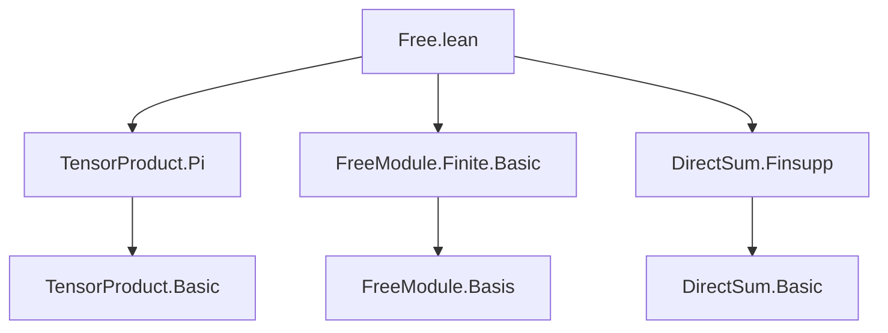

**Technical Brief: `Free.lean` — Tensor Product with Free Modules**

---

### 1. **Key Definitions & Theorems**

| Name | Type | Purpose |
|------|------|---------|
| `Algebra.TensorProduct.equivPiOfFiniteBasis` | `(A ⊗[R] V) ≃ₗ[A] (ι → A)` | Constructs an $A$-linear isomorphism between the base-changed tensor product $A \otimes_R V$ and the space of functions $\iota \to A$, assuming $V$ is *finite free* with basis $b$ indexed by finite $\iota$. |
| `Algebra.TensorProduct.equivFinsuppOfBasis` | `(A ⊗[R] V) ≃ₗ[A] (ι →₀ A)` | Constructs an $A$-linear isomorphism between $A \otimes_R V$ and the space of finitely supported functions $\iota \to_0 A$, for *free* (not necessarily finite) $V$ with basis $b$. |

Both are *noncomputable* isomorphisms, constructed as a composition:
- `equivFun.baseChange` / `repr.baseChange` (change of scalars along $R \to A$ applied to the basis isomorphism $V \simeq_R \iota \to R$ or $\iota \to_0 R$),
- followed by `TensorProduct.piScalarRight` / `TensorProduct.finsuppScalarRight`, which identifies $A \otimes_R (R^\iota) \simeq A^\iota$ (or $A^{(\iota)}$).

The `@[simps! apply symm_apply]` attribute ensures that both the map and its inverse simplify nicely on application and on elements of the form $a \otimes v$.

---

### 2. **Naming Conventions**

- **Prefixes**:
  - `equivPiOfFiniteBasis`: `equiv` + `Pi` (function space), `FiniteBasis` (finite indexing type).
  - `equivFinsuppOfBasis`: `equiv` + `Finsupp` (finitely supported functions), `Basis` (general basis).
- **Suffixes**:
  - `OfBasis` / `OfFiniteBasis`: indicates dependency on a basis.
- **Module/Algebra context**:
  - `baseChange R A _ _`: change of scalars along $R \to A$.
  - `piScalarRight`, `finsuppScalarRight`: canonical isomorphisms for scalar extension of function spaces.

---

### 3. **Tactic Stack**

- `open Classical in`: used to enable classical choice for constructing noncomputable objects.
- `≈≫ₗ`: the `LinearEquiv.trans` operator for linear equivalences (used twice).
- No explicit tactics appear in definitions (proofs are implicit via `≈≫ₗ` and `simps!`).
- The `simps!` attribute triggers `simp`-based simplification of `apply` and `symm_apply`, likely using `aesop`, `simp`, and `ext` under the hood.

---

### 4. **Proof Logic**

- **Strategy**: Construct the isomorphism as a composite of two known linear equivalences:
  1. Extend scalars along $R \to A$ the basis isomorphism $V \simeq_R R^\iota$ (or $R^{(\iota)}$), yielding $A \otimes_R V \simeq_A A \otimes_R (R^\iota)$.
  2. Use the canonical isomorphism $A \otimes_R (R^\iota) \simeq A^\iota$ (or $A^{(\iota)}$), which is `TensorProduct.piScalarRight` / `finsuppScalarRight`.
- **Key lemmas used implicitly**:
  - `baseChange` respects linear equivalences.
  - `piScalarRight` / `finsuppScalarRight` are $A$-linear isomorphisms.
- No induction or case analysis is needed — the proofs are structural and rely on universal properties.

---

### 5. **Imports**

| Import | Purpose |
|--------|---------|
| `Mathlib.LinearAlgebra.TensorProduct.Pi` | Provides `TensorProduct.piScalarRight`, the isomorphism $A \otimes_R (R^\iota) \simeq A^\iota$. |
| `Mathlib.LinearAlgebra.FreeModule.Finite.Basic` | Provides `equivFun`, the basis-induced isomorphism $V \simeq_R R^\iota$ for finite free modules. |
| `Mathlib.LinearAlgebra.DirectSum.Finsupp` | Provides `finsuppScalarRight`, the analogous isomorphism for direct sums / finitely supported functions. |

These imports define the building blocks for scalar extension and basis-induced isomorphisms.

---

### 6. **Dependency & Theory Overview (Mermaid Diagrams)**

#### **Dependency Graph (Module-Level)**



#### **Conceptual Flow (Theory Context)**

```mermaid
flowchart LR
  A[Algebra R A] --> B[Base Change: A ⊗_R -]
  B --> C[V ≃ R^ι (basis)]
  C --> D[A ⊗_R V ≃ A ⊗_R R^ι]
  D --> E[piScalarRight: A ⊗_R R^ι ≃ A^ι]
  E --> F[Final iso: A ⊗_R V ≃ A^ι]

  subgraph "Free case (finite)"
    C1[V ≃ R^(ι)] --> D1
  end

  subgraph "Free case (general)"
    C2[V ≃ R^(ι)_0] --> D2
    D2 --> E2[finsuppScalarRight]
  end
```

#### **Role in Larger Theory**

- This module sits in the *scalar extension* / *base change* hierarchy of linear algebra over rings.
- It connects:
  - **Basis theory** (`FreeModule.Finite.Basic`, `Module.Basis`)
  - **Tensor products** (`TensorProduct.Pi`, `TensorProduct.Basic`)
  - **Direct sums / finitely supported functions** (`DirectSum.Finsupp`)
- Enables concrete computation with tensor products over free modules (e.g., in algebraic geometry or representation theory), where $A \otimes_R V$ often represents extension of scalars of a vector bundle or module.

--- 

Let me know if you'd like the corresponding `simps` lemmas or proofs of `piScalarRight`/`finsuppScalarRight` extracted.
