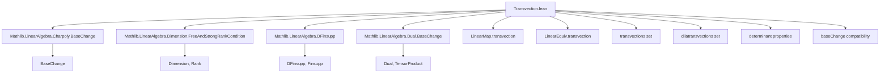
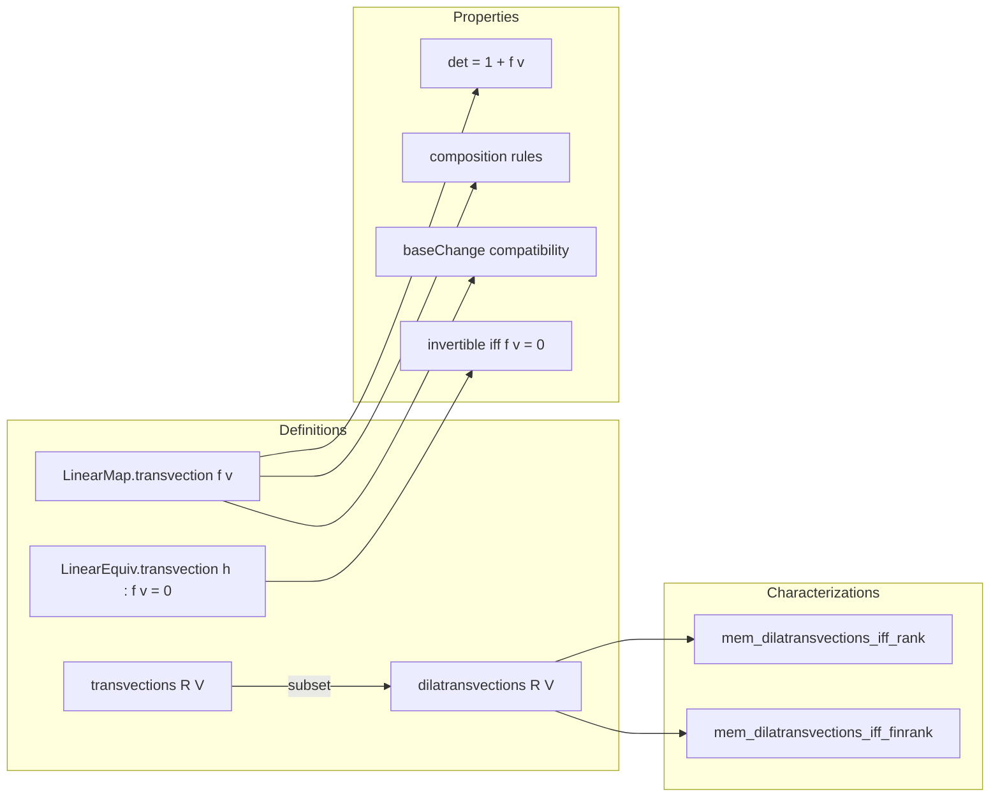

### Technical Brief: Transvections in a Module (Lean 4)

---

#### **1. Key Definitions & Theorems**

| Name | Type / Signature | Purpose |
|------|------------------|---------|
| `LinearMap.transvection f v` | `V →ₗ[R] V` | Linear map $x \mapsto x + f(x) \cdot v$, where $f \in \mathrm{Dual}_R(V), v \in V$. |
| `LinearMap.transvection.det` | `(transvection f v).det = 1 + f v` | Computes determinant of transvection over finite free modules. |
| `LinearEquiv.transvection h` (with `h : f v = 0`) | `V ≃ₗ[R] V` | Invertible transvection (i.e., linear equivalence) when $f(v) = 0$. Inverse is `transvection f (-v)`. |
| `LinearEquiv.transvections R V` | `Set (V ≃ₗ[R] V)` | Set of all transvections (i.e., those with $f(v)=0$). |
| `LinearEquiv.dilatransvections R V` | `Set (V ≃ₗ[R] V)` | Set of all *dilatransvections*: linear equivalences whose underlying linear map is a transvection (no condition on $f(v)$). |
| `LinearEquiv.mem_dilatransvections_iff_rank` | `e ∈ dilatransvections ↔ rank(e - id) ≤ 1` | Over division rings, characterizes dilatransvections by rank condition on $e - \mathrm{id}$. |
| `LinearEquiv.transvection.det_eq_one` | `(transvection h).det = 1` | Determinant of invertible transvection is 1 (since $f(v)=0$). |
| `LinearMap.transvection.baseChange` | `(transvection f v).baseChange A = transvection (f.baseChange A) (1 ⊗ v)` | Compatibility of transvections with base change. |
| `LinearEquiv.transvection.baseChange` | `(transvection h).baseChange = transvection hA` | Base change of invertible transvection remains invertible transvection. |

---

#### **2. Naming Conventions**

- **Prefixes**:
  - `transvection`: for definitions and properties of transvections.
  - `dilatransvection`: for general transvections (not necessarily invertible).
  - `of_left_eq_zero`, `of_right_eq_zero`: special cases where $f = 0$ or $v = 0$.
  - `comp_of_left_eq`, `comp_of_right_eq`: composition rules when one argument vanishes under $f$ or $g$.
  - `symm_eq`, `inv_eq`: symmetry/inverse formulas.

- **Suffixes**:
  - `_apply`: for pointwise versions of equalities (e.g., `comp_of_left_eq_apply`).
  - `_eq`: for equality of maps (e.g., `comp_of_left_eq`).
  - `_mem`: for membership in sets like `transvections`, `dilatransvections`.

- **Notable patterns**:
  - `hfv`, `hv`, `hf`: hypotheses like $f(v) = 0$.
  - `hA`, `h'`: auxiliary hypotheses in base change or determinant proofs.

---

#### **3. Tactic Stack**

Frequently used tactics:

| Tactic | Usage |
|--------|-------|
| `simp` | Simplification of `transvection`, `apply`, `comp`, `baseChange`, `det`, etc. |
| `ext` | Extensionality for linear maps and equivalences. |
| `rw` | Rewriting using lemmas like `transvection.apply`, `comp_of_left_eq_apply`. |
| `aesop` | Automated reasoning for simple goals (e.g., `refl_mem_transvections`). |
| `interval_cases` | For finite-dimensional cases (e.g., `finrank ≤ 1`). |
| `rcases` / `obtain` | Extracting structure (e.g., basis from rank condition). |
| `convert` / `congr_arg₂` | For matrix equality proofs. |
| `have` / `suffices` | Intermediate lemmas, especially in determinant proofs. |
| `induction` (on `w`) | For `IsBaseChange.transvection`, using induction on module elements. |
| `nth_rewrite` + `rw` | For manipulating representations in basis-dependent proofs. |

---

#### **4. Proof Logic**

- **Structure of proofs**:
  - **Base case analysis**: Many proofs split on whether $f(v) = 0$ or not.
  - **Basis-based arguments**: Especially in determinant proofs, a basis is chosen (via `exists_basis_of_pairing_eq_zero`, `exists_basis_of_pairing_ne_zero`, or `finBasis`).
  - **Matrix computation**: Determinant computed via `det_toMatrix`, often reducing to known matrix determinant formulas (`Matrix.det_transvection`, `Matrix.det_diagonal`).
  - **Reduction to fields/domains**: For general rings, reduce to field of fractions or polynomial ring (via `det_ofDomain`, `det_ofField`).
  - **Base change compatibility**: Proved via `ext` + `simp`, using `TensorProduct.tmul_add`, `endHom_comp_apply`, etc.
  - **Set-theoretic properties**: For `transvections`, `dilatransvections`, closure under inversion, multiplication, powers is shown via `Set.pow_right_monotone`, `mem_transvections`, etc.

- **Induction patterns**:
  - `induction w using ibc.inductionOn` for `IsBaseChange.transvection`.
  - `interval_cases h : finrank R V` for low-dimensional cases.

---

#### **5. Imports & Dependencies**

| Module | Purpose |
|--------|---------|
| `Mathlib.LinearAlgebra.Charpoly.BaseChange` | Base change for linear maps, charpoly. |
| `Mathlib.LinearAlgebra.Dimension.FreeAndStrongRankCondition` | Finite-dimensionality, rank conditions. |
| `Mathlib.LinearAlgebra.DFinsupp` | Generalized direct sums, needed for basis representations. |
| `Mathlib.LinearAlgebra.Dual.BaseChange` | Dual base change, `toDual`, etc. |

---

#### **6. Mermaid Diagrams**

##### **Dependency Graph (Module-Level)**

##### **Overview of Theory Flow**

---

#### **7. Notes on Terminology & Mathematical Context**

- **Transvection vs. Dilatransvection**:
  - *Transvection* (in math literature): usually requires $f(v) = 0$.
  - *Dilatransvection*: general $x \mapsto x + f(x) v$, includes “dilations” when $f(v) \ne -1$.
  - *Reflection*: special case when $f(v) = 2$ and $f$ symmetric; related to `Module.preReflection`.

- **Determinant behavior**:
  - General transvection: $\det = 1 + f(v)$.
  - Invertible transvection ($f(v)=0$): $\det = 1$.

- **Rank condition**:
  - Over division rings: $e \in \mathrm{dilatransvections} \iff \mathrm{rank}(e - \mathrm{id}) \le 1$.

- **Base change**:
  - Transvections commute with scalar extension: $(T_f^v)_A = T_{f_A}^{1 \otimes v}$.

---

This file formalizes a foundational part of linear algebra over rings, emphasizing structural properties of transvections and their role in determinant theory, base change, and group-theoretic constructions (e.g., subgroups generated by transvections).
