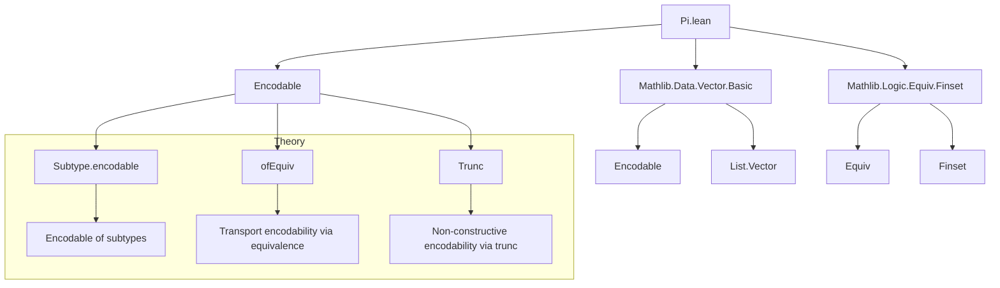

**Technical Brief: Encodability of Pi Types (`Pi.lean`)**

---

### 1. KEY DEFINITIONS & THEOREMS

| Name | Type | Purpose |
|------|------|---------|
| `List.Vector.encodable` | `[Encodable α] → Encodable (List.Vector α n)` | Shows vectors of length `n` over an encodable type are encodable (via `Subtype.encodable`). |
| `List.Vector.countable` | `[Countable α] → Countable (List.Vector α n)` | Shows vectors over a countable type are countable. |
| `finArrow` | `[Encodable α] → Encodable (Fin n → α)` | Encodability of functions from `Fin n` to an encodable type, via equivalence with `Vector α n`. |
| `finPi` | `[∀ i, Encodable (π i)] → Encodable (∀ i, π i)` | Encodability of dependent functions over `Fin n`, via `Equiv.piEquivSubtypeSigma`. |
| `fintypeArrow` | `[DecidableEq α] [Fintype α] [Encodable β] → Trunc (Encodable (α → β))` | Encodability of functions from finite `α` to encodable `β`, non-constructive (wrapped in `Trunc`). |
| `fintypePi` | `[DecidableEq α] [Fintype α] [∀ a, Encodable (π a)] → Trunc (Encodable (∀ a, π a))` | Encodability of dependent functions over finite domain, non-constructive (via `Trunc`). |
| `fintypeArrowOfEncodable` | `[Encodable α] [Fintype α] [Encodable β] → Encodable (α → β)` | Constructive encodability of `α → β` when `α` is finite and encodable (uses `fintypeEquivFin`). |

---

### 2. NAMING CONVENTIONS

- **Prefixes**:
  - `fin`: for domain `Fin n`
  - `fintype`: for finite domain (non-dependent or dependent)
  - `vector`: for `List.Vector`-based representations
- **Suffixes**:
  - `encodable`: for instances returning `Encodable`
  - `countable`: for instances returning `Countable`
- **Function-style naming**:
  - `finArrow`, `fintypeArrow`: function space encodability
  - `finPi`, `fintypePi`: dependent function (Pi) space encodability

---

### 3. TACTIC STACK

- **No explicit tactics** appear in definitions or proofs (all are *instance* or *def* definitions).
- **Proofs are by construction**, using:
  - `Subtype.encodable`, `Subtype.countable`
  - `ofEquiv` with explicit equivalences (`Equiv.vectorEquivFin`, `Equiv.piEquivSubtypeSigma`, `Equiv.arrowCongr`, `Equiv.piEquivSubtypeSigma`)
  - `Trunc.mk`, `map`, `bind` for non-constructive encodability
- **No automation tactics** (`aesop`, `ring`, `simp`, etc.) are used — all reasoning is explicit.

---

### 4. PROOF LOGIC

- **Constructive encodability**:
  - For `Vector α n` and `Fin n → α`, encodability follows from equivalence to a known encodable type (via `ofEquiv`).
  - For `finPi`, uses `piEquivSubtypeSigma` to reduce dependent functions to subtypes of sigma types.
- **Non-constructive encodability** (finite domain):
  - Uses `Fintype.truncEquivFin` or `truncEncodable` to get an equivalence `α ≃ Fin k`, then transports encodability.
  - Wraps result in `Trunc` to preserve computability despite non-uniqueness of encoding.
- **Logical flow**:
  - `α` finite ⇒ `α ≃ Fin k` ⇒ `α → β ≃ Fin k → β` ⇒ encodable if `β` is.
  - For dependent case: `Π a, π a ≃ Σ a, π a`-subtype ⇒ use encodability of sigma + subtype.

---

### 5. IMPORTS

- `Mathlib.Data.Vector.Basic`: provides `List.Vector`, basic vector operations.
- `Mathlib.Logic.Equiv.Finset`: provides `Equiv.vectorEquivFin`, `Equiv.piEquivSubtypeSigma`, `Equiv.arrowCongr`, `fintypeEquivFin`, etc.

---

### 6. DEPENDENCY & OVERVIEW DIAGRAM

---

### 7. OVERVIEW OF FILE

This file establishes **encodability** (and countability) for:
- **Vectors** (`List.Vector α n`)
- **Finite-indexed functions** (`Fin n → α`)
- **Dependent functions over finite domains** (`Fin n → π i`)
- **General function spaces** (`α → β`) and **dependent products** (`Π a, π a`) when `α` is finite.

It distinguishes between:
- **Constructive encodability** (via explicit equivalences, no choice)
- **Non-constructive encodability** (requires choice, wrapped in `Trunc`)

The key equivalences used are:
- `vectorEquivFin`: `Vector α n ≃ Fin n → α`
- `piEquivSubtypeSigma`: `Π i, π i ≃ { x : Σ i, π i // ... }`
- `arrowCongr`: `(α ≃ β) → (γ ≃ δ) ⇒ (β → γ) ≃ (α → δ)`

---

### 8. SUMMARY

This module formalizes foundational results about **computable enumerability** of function and vector spaces, crucial for later developments in computable analysis, formalized combinatorics, and type-theoretic complexity. It leverages Lean’s `Encodable` typeclass and equivalence-based reasoning to avoid choice where possible, and carefully isolates non-constructive steps using `Trunc`.
