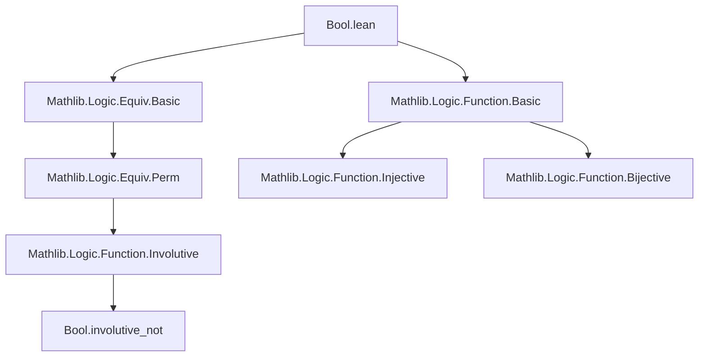
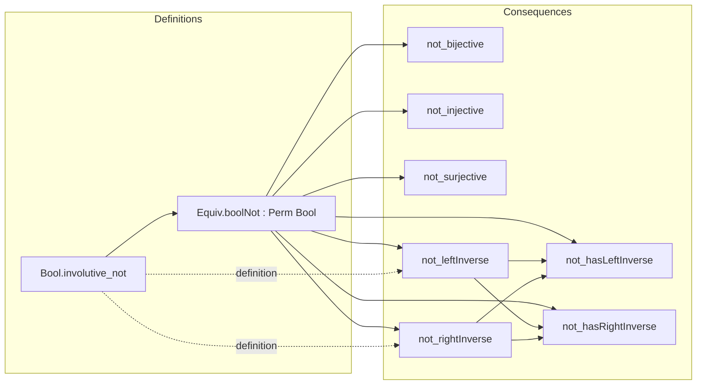

**Technical Brief: `Bool.lean` Module**

---

### 1. **Key Definitions & Theorems**

| Name | Type | Purpose |
|------|------|---------|
| `Equiv.boolNot` | `Equiv.Perm Bool` | Defines boolean negation (`not`) as a permutation (i.e., a self-equivalence) using `Bool.involutive_not.toPerm`. |
| `not_bijective` | `Bijective not` | States that `not` is both injective and surjective. |
| `not_injective` | `Injective not` | Follows from `Equiv.boolNot.injective`. |
| `not_surjective` | `Surjective not` | Follows from `Equiv.boolNot.surjective`. |
| `not_leftInverse` | `LeftInverse not not` | `not ∘ not = id`, i.e., `not (not b) = b` for all `b : Bool`. |
| `not_rightInverse` | `RightInverse not not` | Same as above (since `not` is its own inverse). |
| `not_hasLeftInverse` | `HasLeftInverse not` | Constructs a left inverse pair: witness `not`, proof `not_leftInverse`. |
| `not_hasRightInverse` | `HasRightInverse not` | Constructs a right inverse pair: witness `not`, proof `not_rightInverse`. |

> **Note**: All theorems rely on the fact that `not` is an *involution*: `not (not b) = b`, formalized as `Bool.involutive_not`.

---

### 2. **Naming Conventions**

- **Prefixes**:
  - `not_`: for properties of the `not` function (`not_bijective`, `not_leftInverse`, etc.).
- **Suffixes**:
  - `_bijective`, `_injective`, `_surjective`: standard functional properties.
  - `_leftInverse`, `_rightInverse`, `_hasLeftInverse`, `_hasRightInverse`: inverse-related predicates.
- **`Equiv.boolNot`**: follows `Equiv.[Constructor]` pattern for constructing equivalences/permutations.

---

### 3. **Tactic Stack**

- `@[simps!]`: auto-generates simp lemmas for projections of the structure (`Equiv.boolNot`).
- Implicit use of:
  - ` rfl`, `simp`, `exact`, `apply`, `rw` (via `@[simps!]` and `involutive_not.toPerm`).
  - No explicit tactic scripts are present in the visible snippet — proofs are largely *definitionally* or via `toPerm` coercion.

---

### 4. **Proof Logic**

- **Core idea**: Show `not` is an involution → lift to a permutation (`Equiv.Perm Bool`) → extract standard functional properties (bijectivity, inverses).
- **Flow**:
  1. Use `Bool.involutive_not` (a prior result: `∀ b, not (not b) = b`).
  2. Convert to `Perm Bool` via `.toPerm`.
  3. Derive all functional properties from the fact that equivalences are bijective and invertible.

---

### 5. **Imports**

| Import | Role |
|--------|------|
| `Mathlib.Logic.Equiv.Basic` | Provides `Equiv`, `Equiv.Perm`, `toPerm`, and basic equivalence theory. |
| `Mathlib.Logic.Function.Basic` | Provides `Bijective`, `Injective`, `Surjective`, `LeftInverse`, `RightInverse`, `HasLeftInverse`, `HasRightInverse`. |

> No additional dependencies (e.g., `Bool` itself is in core Lean).

---

### 8. **Mermaid Diagrams**

#### **Dependency Graph (Module-Level)**

#### **Overview of Theoretical Flow**

#### **Conceptual Summary**

- `not : Bool → Bool` is an involution ⇒ it is a bijection ⇒ it is an equivalence (permutation).
- All functional properties follow *canonically* from the equivalence structure.

--- 

✅ **Summary**: This module is a minimal but canonical example of lifting an involutive function to an equivalence, then extracting its functional-theoretic consequences. It demonstrates Lean’s ability to reuse high-level structure (`Equiv.Perm`) to derive low-level logical properties.
