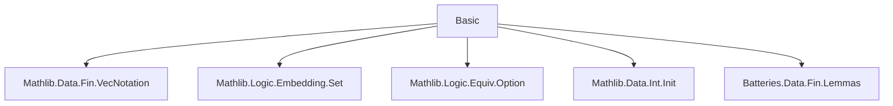

**Technical Brief: `Basic.lean` — Equivalences for `Fin n`**

---

### 1. KEY DEFINITIONS & THEOREMS

| Name | Type / Signature | Purpose |
|------|------------------|---------|
| `Fin.preimage_apply_01_prod` | `(s : Set (α 0)) (t : Set (α 1)) → (fun f ↦ (f 0, f 1)) ⁻¹' s ×ˢ t = Set.pi ...` | Describes preimage of product under evaluation map `Fin 2 → α` as a dependent product. |
| `Fin.preimage_apply_01_prod'` | `(s t : Set α) → ...` | Specialization of above to constant type family. |
| `prodEquivPiFinTwo` | `α × β ≃ ∀ i : Fin 2, ![α, β] i` | Equivalence between binary product and dependent function space over `Fin 2`. |
| `finTwoArrowEquiv` | `(Fin 2 → α) ≃ α × α` | Equivalence between binary function space and product. |
| `finSuccEquiv'` | `Fin (n + 1) ≃ Option (Fin n)` | Removes a specified index `i : Fin (n + 1)` and maps it to `none`; others via `succAbove`. |
| `finSuccEquiv` | `Fin (n + 1) ≃ Option (Fin n)` | Special case of `finSuccEquiv'` at `i = 0`. |
| `finSuccEquivLast` | `Fin (n + 1) ≃ Option (Fin n)` | Sends `Fin.last n` to `none`. |
| `finSuccAboveEquiv` | `Fin n ≃ {x : Fin (n + 1) // x ≠ p}` | Order isomorphism between `Fin n` and complement of `p` in `Fin (n + 1)`. |
| `Equiv.embeddingFinSucc` | `(Fin (n + 1) ↪ ι) ≃ (Σ (e : Fin n ↪ ι), {i // i ∉ range e})` | Classifies embeddings of `Fin (n+1)` by removing one point. |
| `finSumFinEquiv` | `Fin m ⊕ Fin n ≃ Fin (m + n)` | Standard equivalence for sum of finite types. |
| `finSumNatEquiv` | `Fin n ⊕ ℕ ≃ ℕ` | Encodes finite prefix + tail as natural numbers. |
| `finAddFlip` | `Fin (m + n) ≃ Fin (n + m)` | Rotates indices: `k ↦ k + n mod (m+n)`. |
| `finProdFinEquiv` | `Fin m × Fin n ≃ Fin (m * n)` | Lexicographic pairing: `(i, j) ↦ j + n*i`. |
| `Nat.divModEquiv` | `ℕ ≃ ℕ × Fin n` (for `n ≠ 0`) | Division-modulus bijection for naturals. |
| `Int.divModEquiv` | `ℤ ≃ ℤ × Fin n` (for `n ≠ 0`) | Division-modulus bijection for integers. |
| `Fin.castLEquiv` | `n ≤ m ⇒ Fin n ≃ {i : Fin m // i < n}` | Embedding of smaller `Fin` into larger as subtype. |
| `Fin.appendEquiv` | `(Fin m → α) × (Fin n → α) ≃ (Fin (m+n) → α)` | Gluing functions over disjoint domains. |
| `Fin.succFunEquiv` | `(Fin (n+1) → α) ≃ (Fin n → α) × α` | Currying of functions on `Fin (n+1)` as extension by one value. |

---

### 2. NAMING CONVENTIONS

- **Prefixes**:
  - `fin`: Indicates involvement of `Fin n`.
  - `prod`, `sum`, `append`, `succ`: Reflect structure (product, sum, concatenation, successor).
  - `cast`, `divMod`, `predAbove`: Reflect operations (`castLE`, `divMod`, `predAbove`).
- **Suffixes**:
  - `Equiv`: Denotes an equivalence (`≃`).
  - `Equiv'`: Variant of `Equiv`, often parameterized differently (e.g., `finSuccEquiv'`).
  - `last`: Refers to `Fin.last`.
  - `below`, `above`: Relate to relative position w.r.t. a pivot index.
- **Other patterns**:
  - `succAbove`, `castSucc`, `castLT`, `castLE`: Standard `Fin`-related constructors.
  - `isLeft`, `isRight`: For `Sum`-based decidability.

---

### 3. TACTIC STACK

Frequent tactics used in proofs:

| Tactic | Usage |
|--------|-------|
| `simp` / `simp_rw` | Simplification using `@[simp]` lemmas, especially for `finSuccEquiv'`, `finSumFinEquiv`, etc. |
| `rcases` / `cases` | Decomposing sums, `Option`, subtype elements. |
| `rw` | Rewriting using equalities like `Fin.succAbove_of_castSucc_lt`, `Nat.mod_eq_of_lt`. |
| `congr` / `congr_arg` | Proving equality of structured terms (e.g., products, sums). |
| `ac_rfl`, `ring`, `lia` | Arithmetic reasoning (e.g., `Nat.succ_mul`, `mul_add`, `add_sub`). |
| `convert` | Matching goals up to definitional equality (e.g., `finAddFlip_apply_mk_left`). |
| `exact` / `refine` | Completing goals with known terms or holes. |
| `ext` | Extensionality for functions, sets, products. |
| `aesop` | Not used in this file (lean4-only tactic, not imported here). |

---

### 4. PROOF LOGIC

- **Inductive structure**: Proofs often proceed by:
  - **Case analysis** on `Fin` elements (`Fin.cases`, `Fin.addCases`, `Fin.last`).
  - **Index-based reasoning** using `Fin.val_lt_last`, `Fin.castSucc_lt`, `Fin.succAbove`.
  - **Equational reasoning** with arithmetic (`Nat.add_mul_div_left`, `Nat.mod_add_div`, etc.).
- **Equivalence proofs**:
  - Typically show `left_inv` and `right_inv` by simplifying with `@[simp]` lemmas.
  - Use `funext`, `Prod.ext`, `Sum.ext`, `Fin.ext` to reduce to pointwise equality.
- **Order-theoretic reasoning**:
  - `succAbove` and `predAbove` used to relate order structures.
  - Subtype equivalences (`finSuccAboveEquiv`) rely on `Option.subtype` and `finSuccEquiv'`.

---

### 5. IMPORTS

| Module | Purpose |
|--------|---------|
| `Mathlib.Data.Fin.VecNotation` | Syntax for `![a, b]`, `Fin.cons`, etc. |
| `Mathlib.Logic.Embedding.Set` | Embeddings and set-theoretic reasoning. |
| `Mathlib.Logic.Equiv.Option` | Equivalences involving `Option`. |
| `Mathlib.Data.Int.Init` | Basic integer arithmetic and definitions. |
| `Batteries.Data.Fin.Lemmas` | Additional `Fin` lemmas (e.g., `castLT`, `castLE`, `succAbove`). |

---

### 6. DEPENDENCY & THEORY OVERVIEW

#### Mermaid Diagram: Module Dependencies



#### Mermaid Diagram: Theory Flow (High-Level)

```mermaid
graph TD
  Fin n basics --> finSuccEquiv'
  finSuccEquiv' --> finSuccEquiv
  finSuccEquiv' --> finSuccEquivLast
  finSuccEquiv' --> finSuccAboveEquiv
  finSuccEquiv --> embeddingFinSucc
  finSumFinEquiv --> finAddFlip
  finProdFinEquiv --> Nat.divModEquiv
  finProdFinEquiv --> Int.divModEquiv
  Fin.appendEquiv --> Fin.succFunEquiv
  prodEquivPiFinTwo & finTwoArrowEquiv --> piFinTwoEquiv
```

#### Summary

This module formalizes foundational equivalences involving finite types `Fin n`, especially:
- **Product/sum decompositions** (`prodEquivPiFinTwo`, `finSumFinEquiv`, `finProdFinEquiv`)
- **Index removal/insertion** (`finSuccEquiv'`, `finSuccAboveEquiv`, `embeddingFinSucc`)
- **Arithmetic encodings** (`finSumNatEquiv`, `Nat.divModEquiv`, `Int.divModEquiv`)
- **Function space rearrangements** (`Fin.appendEquiv`, `Fin.succFunEquiv`)

These are core building blocks for reasoning about finite sequences, permutations, and combinatorial structures in Lean’s `Mathlib`.

--- 

Let me know if you'd like a formalized dependency graph (e.g., `.dot` format) or a theory roadmap for future extensions (e.g., `ZMod`, `Equiv.Perm`, `Finset`).
