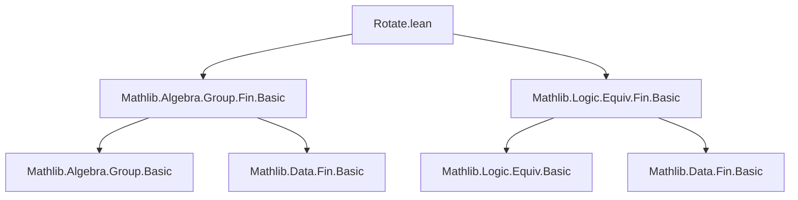
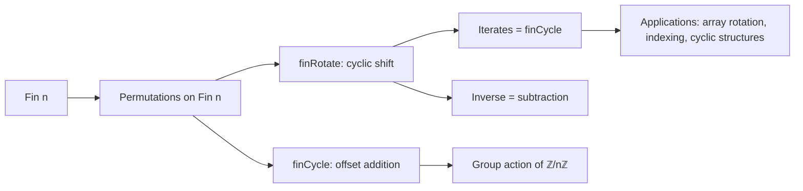

**Technical Brief: `Rotate.lean` — Cyclic Permutations on `Fin n`**

---

### 1. **Key Definitions & Theorems**

| Name | Type | Purpose |
|------|------|---------|
| `finRotate : ∀ n, Equiv.Perm (Fin n)` | `Equiv.Perm (Fin n)` | Defines the *right cyclic shift* permutation on `Fin n`, mapping `i ↦ i + 1 mod n`. |
| `finCycle (k : Fin n) : Equiv.Perm (Fin n)` | `Equiv.Perm (Fin n)` | Defines the permutation `i ↦ i + k mod n`, i.e., adding a fixed offset `k`. |
| `finRotate_zero` | `finRotate 0 = Equiv.refl _` | Base case: empty/zero-sized `Fin 0` has identity permutation. |
| `finRotate_succ` | `finRotate (n + 1) = finAddFlip.trans (finCongr (Nat.add_comm 1 n))` | Recursive definition via `finAddFlip` and congruence. |
| `finRotate_of_lt` | `k < n ⇒ finRotate (n+1) ⟨k, h⟩ = ⟨k+1, ...⟩` | Action of `finRotate` on non-last elements. |
| `finRotate_last` | `finRotate (n+1) (Fin.last n) = 0` | Action on the last element wraps to `0`. |
| `finRotate_succ_apply` | `finRotate (n+1) i = i + 1` | Simplified action: `finRotate` adds 1 (mod `n+1`). |
| `finRotate_apply_zero` | `finRotate n.succ 0 = 1` | Special case: `0 ↦ 1`. |
| `coe_finRotate` | `(finRotate n.succ i : ℕ) = if i = Fin.last n then 0 else i + 1` | Coercion to `ℕ` gives piecewise behavior. |
| `lt_finRotate_iff_ne_last` | `i < finRotate i ↔ i ≠ Fin.last n` | Relates order and rotation. |
| `finRotate_succ_symm_apply` | `(finRotate _).symm i = i - 1` | Inverse of `finRotate` subtracts 1 (mod `n`). |
| `finCycle_eq_finRotate_iterate` | `finCycle k = (finRotate n)^[k.1]` | `finCycle k` is `k.1`-fold iterate of `finRotate`. |
| `Fin.snoc_eq_cons_rotate` | `snoc v a = cons a v ∘ finRotate` | Connects `Fin.snoc`/`Fin.cons` with rotation. |

---

### 2. **Naming Conventions**

- **Prefixes**:
  - `fin*`: All definitions/lemmas pertain to `Fin n`.
  - `coe_*`: Lemmas about coercion to `ℕ`.
  - `lt_*`: Lemmas about strict inequality involving `finRotate`.
- **Suffixes**:
  - `_apply`: Action on elements (`i`).
  - `_symm_apply`: Action of inverse.
  - `_of_lt`, `_last`, `_ne_*`: Case distinctions (e.g., last element, non-last, nonzero).
- **Structure**:
  - `finRotate`, `finCycle`: Core definitions.
  - `finRotate_*`, `finCycle_*`: Derived properties.

---

### 3. **Tactic Stack**

Frequently used tactics in proofs:
- `rw`, `simp`, `dsimp`: Simplify using definitions and lemmas.
- `ext`: Extensionality for functions/permutations.
- `cases n`, `cases i`: Induction or case analysis on natural numbers or `Fin` elements.
- `have h := ...; subst h`: Substitution after equality derivation.
- `by_cases h' : i < n`: Case split on decidable propositions.
- `exact Subsingleton.elim _ _`: Use subsingleton property of `Fin 1`.
- `apply ..._symm_apply_eq.mpr`: Use equivalence of `f x = y ↔ f.symm y = x`.
- `induction k using Fin.induction`: Induction on `Fin` elements.

---

### 4. **Proof Logic**

- **Inductive structure** on `n` (size of `Fin n`) and `k` (offset for `finCycle`).
- **Case analysis** on whether an element is the last (`Fin.last n`) or not.
- **Congruence & equivalence reasoning**:
  - Use `finCongr`, `finAddFlip`, and `Equiv.Perm.trans` to build permutations.
  - Prove equality of permutations by extensionality (`ext i`) and simplifying `apply`.
- **Modular arithmetic reasoning**:
  - Leverage `Fin.add_def`, `Fin.sub_def`, `Fin.val_add_one`, `Fin.val_sub_one`.
  - Use `Nat.mod_eq_of_lt` when `i + 1 < n`.
- **Inverse reasoning**:
  - Prove `f.symm = g` by showing `f (g x) = x` and `g (f x) = x`, or via `symm_apply_eq`.

---

### 5. **Imports**

- `Mathlib.Algebra.Group.Fin.Basic`: Provides `finAddFlip`, `finCongr`, group-theoretic structure on `Fin`.
- `Mathlib.Logic.Equiv.Fin.Basic`: Provides `Equiv.Perm`, `finCongr`, basic permutation machinery on `Fin`.

These imports define foundational tools for permutations on finite types, especially `Fin n`.

---

### 6. **Dependency & Theory Overview**

#### Mermaid Diagram: Module Dependencies

#### Mermaid Diagram: Theoretical Flow

#### Summary

This module formalizes **cyclic permutations** on `Fin n`, establishing:
- A canonical generator (`finRotate`) of the cyclic group of order `n`.
- A family of permutations (`finCycle k`) implementing modular addition.
- Key algebraic and order-theoretic properties (e.g., inverse, action on elements, comparison with successor).
- A bridge between `Fin` operations (`cons`, `snoc`) and permutation action.

It serves as a foundational building block for reasoning about cyclic structures, indexing in circular buffers, and group actions on finite types.

--- 

*End of Technical Brief.*
