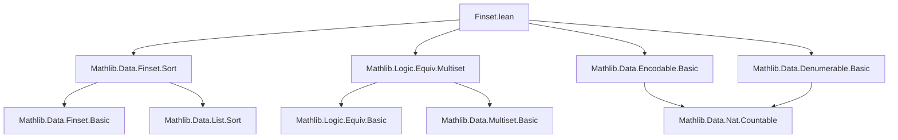

### Technical Brief: `Finset.lean` — Encodable & Denumerable Instances for `Finset`

---

#### **1. Key Definitions & Theorems**

| Name | Type / Signature | Purpose |
|------|------------------|---------|
| `Finset.encodable` | `[Encodable α] → Encodable (Finset α)` | Constructs an encodable instance for `Finset α` using nodup multisets. |
| `sortedUniv` | `[Fintype α] [Encodable α] → List α` | Returns the sorted list of all elements of a finite encodable type. |
| `mem_sortedUniv` | `x ∈ sortedUniv α` | Membership in `sortedUniv` is always true (covers all elements). |
| `length_sortedUniv` | `(sortedUniv α).length = Fintype.card α` | Length of `sortedUniv` equals cardinality. |
| `sortedUniv_nodup` | `(sortedUniv α).Nodup` | `sortedUniv` has no duplicates. |
| `sortedUniv_toFinset` | `(sortedUniv α).toFinset = Finset.univ` | Converting `sortedUniv` to a finset yields the full universe. |
| `fintypeEquivFin` | `α ≃ Fin (Fintype.card α)` | Equivalence between a finite encodable type and `Fin (card α)`. |
| `lower'` | `List ℕ → ℕ → List ℕ` | Computes differences minus one: `lower' [a₁,a₂,...] n = [a₁−n, a₂−a₁−1, ...]`. |
| `raise'` | `List ℕ → ℕ → List ℕ` | Computes partial sums plus increasing offsets: ensures strict increase. |
| `lower_raise'` | `lower' (raise' l n) n = l` | `lower'` undoes `raise'`. |
| `raise_lower'` | `(∀ m ∈ l, n ≤ m) → List.SortedLT l → raise' (lower' l n) n = l` | `raise'` undoes `lower'` on sorted lists bounded below by `n`. |
| `isChain_raise'` | `List.IsChain (· < ·) (raise' l n)` | `raise' l n` is strictly increasing (chain under `<`). |
| `raise'_sorted` | `List.SortedLT (raise' l n)` | `raise'` produces a strictly increasing list. |
| `raise'Finset` | `List ℕ → ℕ → Finset ℕ` | Converts `raise'` output to a finset (nodup guaranteed by strict monotonicity). |
| `Denumerable.finset` | `[Denumerable α] → Denumerable (Finset α)` | Constructs a *denumerable* (countably infinite) instance for `Finset α`. |

---

#### **2. Naming Conventions**

- **Prefixes**:
  - `lower'`, `raise'`: Prime suffix indicates refined/auxiliary versions (vs. older `lower`, `raise`).
  - `sortedUniv`: Combines “sorted” + “univ” (universe).
- **Suffixes**:
  - `'` (prime): Often denotes a refined or auxiliary variant (e.g., `raise'`, `lower'`).
  - `Finset`: Explicitly indicates finset-returning functions (`raise'Finset`).
- **Predicates**:
  - `isChain`, `nodup`, `SortedLT`: Standard list/finset properties.
- **Equivalence/Encoding**:
  - `encode`, `ofNat`, `eqv α`: From `Encodable`/`Denumerable` infrastructure.

---

#### **3. Tactic Stack**

Frequent tactics used in proofs:

| Tactic | Usage |
|--------|-------|
| `simp` | Simplifying with lemmas like `raise_lower'`, `lower_raise'`, `Finset.mem_sort`, etc. |
| `rfl` | Reflexivity for definitional equalities (e.g., base cases of recursion). |
| `cases` + `grind` | Structural induction on lists (`l`) and simplification. |
| `lia` | Linear integer arithmetic (e.g., proving `m < m + 1`). |
| `sortedLT.of_cons` | Reasoning about sorted lists via cons. |
| `congr_arg` | Congruence for equality of types (e.g., `congr_arg _ (length_sortedUniv α)`). |
| `symm.trans` | Chaining equivalences (e.g., in `fintypeEquivFin`). |
| `Finset.eq_of_veq` | Proving finset equality via vector equality. |
| `Multiset.map_coe` | Reasoning about coercion from multiset to finset. |

---

#### **4. Proof Logic**

- **Inductive structure**: Proofs over `List` (e.g., `lower_raise'`, `raise_lower'`, `isChain_raise'`) follow standard list induction:
  - Base case: `[]` → `rfl`.
  - Inductive step: `m :: l` → simplify using definitions, apply IH, and use monotonicity/sortedness hypotheses.

- **Equivalence constructions**:
  - `fintypeEquivFin`: Uses `getEquivOfForallMemList` to build equivalence from sorted list.
  - `Denumerable.finset`: Builds mutual inverse pair:
    - `encode ∘ lower' ∘ map ∘ sort`: encodes a finset as a natural.
    - `map ∘ raise'Finset ∘ ofNat`: decodes a natural to a finset.
    - Proves correctness via `raise_lower'`, `lower_raise'`, and sortedness properties.

- **Key logical flow**:
  1. Show `raise'` produces strictly increasing (hence nodup) lists.
  2. Use `lower'` to compress a strictly increasing list into a canonical form.
  3. Encode/decode via `Encodable` infrastructure (`eqv α`, `encode`, `ofNat`).
  4. Verify inverses using monotonicity and arithmetic lemmas.

---

#### **5. Imports & Dependencies**

| Import | Role |
|--------|------|
| `Mathlib.Data.Finset.Sort` | Provides `Finset.sort`, `sort_nodup`, `sort_toFinset`, etc. |
| `Mathlib.Logic.Equiv.Multiset` | Provides `Multiset`-based equivalences and coercion tools. |
| `Encodable`, `Denumerable` infrastructure | From `Mathlib.Data.Encodable.Basic`, `Mathlib.Data.Denumerable.Basic`. |
| `Fintype`, `List`, `Multiset`, `Fin`, `Nat` | Core libraries for finite types, lists, naturals. |

---

#### **6. Mermaid Diagrams**

##### **Dependency Graph (Module-Level)**



##### **Overview of Theory Flow**

```mermaid
flowchart LR
  subgraph Encodable
    E1[Encodable α] --> E2[Finset.encodable]
    E3[Fintype α] --> E4[sortedUniv α]
    E4 --> E5[fintypeEquivFin]
  end

  subgraph Denumerable
    D1[Denumerable α] --> D2[Denumerable (Finset α)]
    D3[lower'/raise'] --> D4[raise'Finset]
    D4 --> D5[encode/decode pair]
    D5 --> D6[proof of inverses]
  end

  E2 & D2 --> F[Countability of Finset α]
```

---

#### **7. Notes & Observations**

- Two distinct encodings of `Finset α`:
  - `Finset.encodable`: Uses `Multiset α` with `Nodup` condition.
  - `Denumerable.finset`: Uses `lower'/raise'` bijection on lists of naturals — *not* equivalent to the encodable one.
- The `raise'`/`lower'` pair is a classic technique for encoding finite subsets of `ℕ` as naturals (via binary/offset encoding).
- The `sortedUniv` construction is key for finite encodable types: it provides a canonical enumeration.
- The `prime` notation (`raise'`, `lower'`) distinguishes them from older versions (now deprecated or unused), per the `@deprecated` annotation.

--- 

Let me know if you'd like a formalized summary in Lean or a visualization of the `raise'`/`lower'` bijection.
