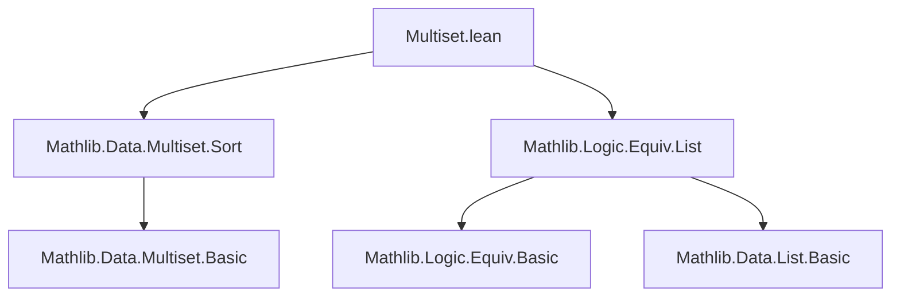

**Technical Brief: Multiset.lean — Encodable and Denumerable Instances for Multisets**

---

### 1. **Key Definitions & Theorems**

| Name | Type / Signature | Purpose |
|------|------------------|---------|
| `enle` | `α → α → Prop` | Pullback of natural ≤ along `encode`, yielding a linear order on `α`. Used to sort multisets canonically. |
| `enle.isLinearOrder` | `IsLinearOrder α enle` | Proves `enle` is a linear order (via preimage of linear order under injective map). |
| `decidable_enle` | `Decidable (enle a b)` | Provides decidability of `enle`, needed for `sort`. |
| `encodeMultiset` | `Multiset α → ℕ` | Encodes a multiset by sorting it via `enle`, then encoding the resulting list. |
| `decodeMultiset` | `ℕ → Option (Multiset α)` | Decodes a natural number to a multiset via list decoding and coercion. |
| `Multiset.encodable` | `Encodable (Multiset α)` | Instance: if `α` is encodable, then `Multiset α` is encodable. |
| `lower` | `List ℕ → ℕ → List ℕ` | Computes *differences* of a list: `lower [a₁,a₂,...] n = [a₁−n, a₂−a₁, ...]`. |
| `raise` | `List ℕ → ℕ → List ℕ` | Computes *partial sums* (cumulative sums) starting from `n`. |
| `lower_raise` | `∀ l n, lower (raise l n) n = l` | `lower` undoes `raise`. |
| `raise_lower` | `∀ {l n}, List.SortedLE (n :: l) → raise (lower l n) n = l` | `raise` undoes `lower` on sorted lists. |
| `isChain_raise` | `∀ l n, List.IsChain (· ≤ ·) (raise l n)` | `raise l n` is strictly non-decreasing (chain w.r.t. ≤). |
| `raise_sorted` | `List.SortedLE (raise l n)` | Immediate corollary: `raise` produces sorted lists. |
| `Multiset.denumerable` | `Denumerable (Multiset α)` | Instance: if `α` is denumerable, then `Multiset α` is denumerable (different encoding from `encodable`). |

---

### 2. **Naming Conventions**

- **Prefixes**:
  - `enle`: *encode*-induced *less-or-equal*.
  - `lower`, `raise`: reflect inverse operations on lists of naturals (difference vs. cumulative sum).
  - `encodeMultiset`, `decodeMultiset`: standard encoding/decoding naming.
- **Suffixes**:
  - `isLinearOrder`, `isChain_raise`, `raise_sorted`: predicate-style naming for properties.
  - `lower_raise`, `raise_lower`: functional inverse pairs.
- **Style**: Functional, mathematically descriptive; avoids abbreviations.

---

### 3. **Tactic Stack**

Frequent tactics used in proofs:

- `rfl` — for definitional equalities (e.g., base cases of `lower`, `raise`).
- `rw [...]` — rewriting using lemmas like `Nat.add_sub_cancel_right`, `raise_lower`, etc.
- `simp [...]` — simplification with lemmas and `ofNat`, `map`, `encodek`, etc.
- `have : ...` + `simp [...]` — intermediate lemma introduction.
- `infer_instance` — to synthesize decidability instances.
- `pairwise_sort`, `pairwise_cons`, `rel_of_pairwise_cons` — for reasoning about sorted lists and `List.IsChain`.
- `ofNat` and `ofNat (List ℕ) n` — coercion from `ℕ` to `List ℕ` and back.

No heavy automation (e.g., `aesop`, `linarith`) — proofs are mostly structural and arithmetic.

---

### 4. **Proof Logic**

- **Encoding multisets**:
  - Use `enle` to impose a linear order on `α`.
  - Sort the multiset into a list using this order.
  - Encode the sorted list as a natural number.

- **Decoding multisets**:
  - Decode a natural number to a list (via `decode` for lists).
  - Coerce list to multiset.

- **Denumerable case**:
  - Encode multiset `s` as `encode (lower (s.map encode).sort 0)`.
    - Map elements to ℕ via `encode`.
    - Sort (using `≤`, which is standard on `ℕ`).
    - Apply `lower` with base `0` to get a list of differences.
  - Decode `n` as `Multiset.map (ofNat α) (raise (ofNat (List ℕ) n) 0)`.
    - Decode `n` to a list of naturals.
    - `raise` reconstructs the sorted list of naturals.
    - Map back to `α` via `ofNat`.

- **Key proof strategy**:
  - Use `lower_raise` and `raise_lower` to show decoding/encoding are inverses.
  - Leverage `raise_sorted` and `pairwise_sort` to ensure correctness of sorting/reconstruction.

---

### 5. **Imports**

- `Mathlib.Data.Multiset.Sort` — provides `sort`, `pairwise_sort`, etc.
- `Mathlib.Logic.Equiv.List` — provides encodings/decodings for lists and equivalences.

These imports define the foundational tools for sorting multisets and encoding/decoding lists and multisets.

---

### 6. **Mermaid Diagrams**

#### **Dependency Graph (Module-Level)**



#### **Overview of Theory Flow**

```mermaid
flowchart LR
  subgraph Setup
    α[Type α] -->|Encodable α| E[encode : α → ℕ]
    E --> enle[enle = encode⁻¹ ∘ (≤)]
    enle --> lin[IsLinearOrder enle]
    lin --> sort[Multiset.sort enle]
  end

  subgraph Encoding
    sort --> encodeMultiset[encodeMultiset : Multiset α → ℕ]
  end

  subgraph Decoding
    decodeList[decode : ℕ → Option (List α)] --> decodeMultiset[decodeMultiset]
    decodeMultiset --> Multiset[coerce List → Multiset]
  end

  subgraph Denumerable Encoding
    mapEncode[s.map encode] --> sortNat[sort ≤] --> lower[lower ... 0] --> encodeDen[encode]
  end

  subgraph Denumerable Decoding
    decodeList' --> raise[raise ... 0] --> mapOfNat[Multiset.map (ofNat α)]
  end

  encodeMultiset <--> decodeMultiset
  encodeDen <--> mapOfNat
```

---

### 7. **Notes**

- Two distinct encodings:
  - `Multiset.encodable`: uses `enle`-based sorting → canonical for encodability.
  - `Multiset.denumerable`: uses `lower/raise` on `encode`-image → canonical for denumerability (bijection with ℕ).
- The warning in `multiset` instance explicitly notes they differ.
- `ofNat α` is used to embed `ℕ` into `α` (requires `Denumerable α`, hence `Inhabited α` and `Nonempty α`).

--- 

*End of Technical Brief.*
