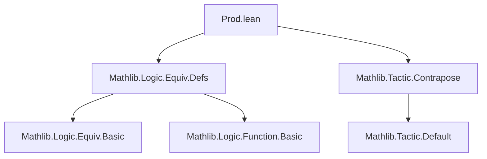
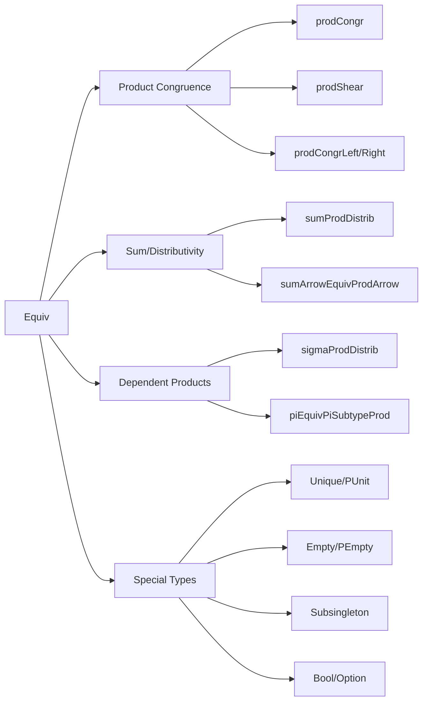

### Technical Brief: `Prod.lean` — Equivalences for Product Types in Lean 4

---

#### **1. Key Definitions & Theorems**

| Name | Type | Purpose |
|------|------|---------|
| `pprodEquivProd` | `PProd α β ≃ α × β` | Equivalence between dependent pair (`PProd`) and standard product. |
| `pprodCongr` | `(α ≃ β) → (γ ≃ δ) → PProd α γ ≃ PProd β δ` | Congruence for `PProd` using two equivalences. |
| `pprodProd` | `(α₁ ≃ α₂) → (β₁ ≃ β₂) → PProd α₁ β₁ ≃ α₂ × β₂` | Combine `PProd` domain with `Prod` codomain via `pprodCongr` + `pprodEquivProd`. |
| `prodPProd` | `(α₁ ≃ α₂) → (β₁ ≃ β₂) → α₁ × β₁ ≃ PProd α₂ β₂` | Reverse direction of `pprodProd`. |
| `prodCongr` | `(α₁ ≃ α₂) → (β₁ ≃ β₂) → α₁ × β₁ ≃ α₂ × β₂` | Main product congruence: `Prod.map` as an equivalence. |
| `prodCongr_symm` | `(prodCongr e₁ e₂).symm = prodCongr e₁.symm e₂.symm` | Symmetry of `prodCongr`. |
| `prodComm` | `α × β ≃ β × α` | Commutativity of product via `Prod.swap`. |
| `prodAssoc` | `(α × β) × γ ≃ α × β × γ` | Associativity of product (flattening). |
| `prodProdProdComm` | `(α × β) × γ × δ ≃ (α × γ) × β × δ` | Four-way commutativity (reordering). |
| `curry` | `(α × β → γ) ≃ (α → β → γ)` | Currying equivalence. |
| `prodPUnit`, `punitProd` | `α × PUnit ≃ α`, `PUnit × α ≃ α` | Right/left identity for product with `PUnit`. |
| `prodUnique`, `uniqueProd` | `[Unique β] ⇒ α × β ≃ α`, `β × α ≃ α` | Right/left identity for product with any `Unique` type. |
| `sigmaPUnit`, `sigmaUnique`, `uniqueSigma` | Various sigma-type identities with `PUnit`/`Unique`. | Dependent analogues of product identities. |
| `prodEmpty`, `emptyProd`, `prodPEmpty`, `pemptyProd` | `α × Empty ≃ Empty`, etc. | Absorbing element properties for `Empty`/`PEmpty`. |
| `prodCongrLeft`, `prodCongrRight` | `(∀ a, β₁ ≃ β₂) ⇒ β₁ × α ≃ β₂ × α`, `α × β₁ ≃ α × β₂` | Family-based congruence on one component. |
| `prodShear` | `(α₁ ≃ α₂) → (α₁ → β₁ ≃ β₂) ⇒ α₁ × β₁ ≃ α₂ × β₂` | Shear mapping: dependent twist in second component. |
| `prodExtendRight` | `a : α → Perm β → Perm (α × β)` | Extend a permutation on `β` to act only on fiber over `a`. |
| `arrowProdEquivProdArrow` | `((i : α) → β i × γ i) ≃ ((i : α) → β i) × ((i : α) → γ i)` | Product distributes over dependent function space. |
| `sumPiEquivProdPi`, `prodPiEquivSumPi`, `sumArrowEquivProdArrow` | Equivalences for functions on sums. | Dependent/non-dependent sum-to-product conversions. |
| `sumProdDistrib` | `(α ⊕ β) × γ ≃ α × γ ⊕ β × γ` | Right distributivity of product over sum. |
| `sigmaProdDistrib` | `(Σ i, α i) × β ≃ Σ i, α i × β` | Distributivity of product over sigma. |
| `boolProdEquivSum` | `Bool × α ≃ α ⊕ α` | Binary product with `Bool` splits into two copies. |
| `boolArrowEquivProd` | `(Bool → α) ≃ α × α` | Functions from `Bool` correspond to pairs. |
| `subtypeProdEquivProd`, `prodSubtypeFstEquivSubtypeProd`, `subtypeProdEquivSigmaSubtype` | Subtype-of-product equivalences. | Decompose subtypes defined by componentwise predicates. |
| `piEquivPiSubtypeProd`, `piSplitAt`, `funSplitAt` | Split dependent products over predicates or indices. | Generalized product splitting. |
| `subsingletonProdSelfEquiv` | `[Subsingleton α] ⇒ α × α ≃ α` | Trivial product for subsingletons. |
| `optionProdEquiv` | `Option α × β ≃ β ⊕ α × β` | Decompose `Option` product. |

---

#### **2. Naming Conventions**

- **Prefixes**:
  - `prod*`: Standard binary product (`×`) constructions.
  - `sigma*`: Dependent product (`Σ`) constructions.
  - `pprod*`: Non-dependent pair (`PProd`) constructions.
  - `curry*`, `arrow*`: Function space constructions.
  - `sum*`: Sum (`⊕`) constructions.
  - `subsingleton*`, `unique*`, `empty*`: Special type classes.
  - `shear`, `extendRight`: Specialized constructions (e.g., group actions).
- **Suffixes**:
  - `Congr`: Congruence (preservation under equivalence).
  - `Comm`: Commutativity.
  - `Assoc`: Associativity.
  - `Distrib`: Distributivity.
  - `Equiv*`: General equivalence definitions.
  - `SplitAt`, `Subtype*`: Structural decomposition.
- **`*CongrLeft`/`*CongrRight`**: Family-based congruence on left/right component.

---

#### **3. Tactic Stack**

- **`grind`**: Dominant automation tactic (custom to Mathlib), used in `@[simps]` attributes and proofs of `left_inv`/`right_inv`.
- **`simp` / `simp only`**: For simplification using `@[simp]` lemmas.
- **`rfl`**: Reflexivity for definitional equalities.
- **`ext`**: Extensionality (e.g., `ext ⟨a, b⟩` for products, `ext i` for functions).
- **`cases` / `intro`**: Case analysis on sums/products/sigma types.
- **`congr` / `congr'`**: For congruence closure (rare, mostly implicit via `grind`).
- **`contrapose!`**: Used in `eq_of_prodExtendRight_ne`.
- **`subst` / `subst h`**: Substitution after equality hypotheses.
- **`if_pos` / `if_neg`**: For `if-then-else` simplification.

---

#### **4. Proof Logic**

- **Induction/Case Analysis**: Standard on inductive types (`Prod`, `Sum`, `Sigma`, `PProd`, `Option`).
- **Extensionality**: Prove equivalences by `ext` and reduce to component-wise equalities.
- **Definitional Simplification**: Use `@[simps]` to generate `apply`, `symm_apply`, and component lemmas automatically.
- **Congruence Reasoning**: Build complex equivalences via `trans` from simpler ones (`prodCongr`, `pprodCongr`, `sigmaCongrRight`).
- **Dependent Handling**: Use `sigmaCongrRight`, `piEquivPiSubtypeProd`, etc., to manage type dependencies.
- **Special Cases**: Leverage type class inference (`[Unique β]`, `[Subsingleton α]`) to simplify identities.

---

#### **5. Imports**

- `Mathlib.Logic.Equiv.Defs`: Core equivalence definitions (`Equiv`, `trans`, `symm`, `refl`, `congr_arg`, etc.).
- `Mathlib.Tactic.Contrapose`: For `contrapose!` tactic.

---

#### **6. Mermaid Diagrams**

##### **Dependency Graph (Top-Level)**



##### **Overview of Theory Flow**



##### **Component Equivalence Hierarchy**

```mermaid
graph TD
  PProd[PProd α β] -->|pprodEquivProd| Prod[α × β]
  Prod -->|prodCongr| Prod'[α₂ × β₂]
  PProd -->|pprodCongr| PProd'[PProd α₂ β₂]
  PProd' -->|pprodEquivProd.symm| Prod'
  
  Sigma[Σ i, α i] -->|sigmaProdDistrib| SigmaProd[Σ i, α i × β]
  SigmaProd -->|sigmaEquivProd| ProdSigma[(Σ i, α i) × β]
  
  Fun[α → β × γ] -->|arrowProdEquivProdArrow| FunProd[(α → β) × (α → γ)]
  FunSum[(α ⊕ β) → γ] -->|sumArrowEquivProdArrow| SumFun[(α → γ) × (β → γ)]
```

---

#### **7. Summary**

This file formalizes a rich algebra of equivalences for product types (`×`), dependent products (`Σ`), and related constructions (`PProd`, `Option`, `Sum`, `Bool`, `PUnit`, `Unique`, `Empty`). It emphasizes *structural congruences* (e.g., `prodCongr`, `prodShear`) and *canonical isomorphisms* (e.g., `curry`, `sumProdDistrib`). The proofs rely heavily on `grind`-based automation and `@[simps]`-generated simplification lemmas, reflecting Lean 4’s emphasis on usability and definitional clarity. The module serves as a foundational layer for higher-level category-theoretic and algebraic developments in Mathlib.
