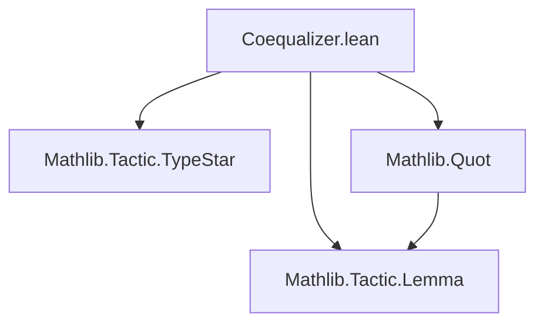

### Technical Brief: Coequalizer in Lean 4

---

#### 1. **Key Definitions & Theorems**

| Name | Type / Signature | Purpose |
|------|------------------|---------|
| `Coequalizer.Rel` | `inductive Rel {α β : Type*} (f g : α → β) : β → β → Prop` | Generates the basic relation identifying `f x` with `g x` for all `x : α`. |
| `Coequalizer` | `def Coequalizer {α : Type*} {β : Type v} (f g : α → β) : Type v := Quot (Rel f g)` | Defines the coequalizer as the quotient of `β` by the equivalence relation generated by `Rel`. |
| `mk` | `def mk (x : β) : Coequalizer f g := Quot.mk _ x` | Canonical projection `β → coeq(f,g)`. |
| `condition` | `lemma condition (x : α) : mk (f x) = mk (g x)` | Encodes the defining property: `f x` and `g x` are identified in the coequalizer. |
| `mk_surjective` | `lemma mk_surjective : Surjective (mk f g)` | States that every element of the coequalizer is represented by some `x : β`. |
| `desc` | `def desc {γ : Type*} (u : β → γ) (hu : u ∘ f = u ∘ g) : coeq f g → γ` | Universal property: any `u` equalizing `f` and `g` factors uniquely through `mk`. |
| `desc_mk` | `@[simp] lemma desc_mk ... : desc u hu (mk x) = u x` | Confirms that `desc u hu ∘ mk = u`. |

---

#### 2. **Naming Conventions**

- **Prefixes**:
  - `Coequalizer.`: Module-level namespace for definitions/lemmas.
  - `mk_`, `desc_`, `condition`: Standard categorical API naming (`mk` for constructor, `desc` for descent/factorization).
- **Suffixes**:
  - `_surjective`, `_mk`: Standard suffixes for properties of constructors/factorizations.
- **Variables**:
  - `{α β : Type*}`: Implicit universe-polymorphic type variables.
  - `(f g : α → β)`: Standard pair of parallel arrows.

---

#### 3. **Tactic Stack**

- `Quot.sound` / `Quot.lift`: Core tactics for working with quotients.
- `congrFun`: Used to extract pointwise equality from function extensionality.
- `rfl`: Used in `desc_mk` to confirm definitional equality.
- Implicit use of `aesop`/`simp` via `@[simp]` attribute.

No heavy automation (e.g., `linarith`, `ring`) is used—proofs are mostly definitional or rely on quotient API.

---

#### 4. **Proof Logic**

- **Construction**: Define a binary relation `Rel` that relates `f x` to `g x`, then take its quotient.
- **Key lemma `condition`**: Uses `Quot.sound` on the generator `.intro x`.
- **Surjectivity**: Follows directly from `Quot.exists_rep`.
- **Universal property**:
  - `desc` uses `Quot.lift`, requiring a proof that `u` respects `Rel`.
  - The proof obligation for `Quot.lift` reduces to showing `u (f x) = u (g x)`, which is exactly `hu : u ∘ f = u ∘ g`.

No induction or case analysis beyond quotient machinery is needed.

---

#### 5. **Imports**

- `Mathlib.Tactic.TypeStar`: Provides `Type*` syntax for universe-polymorphic types.
- `Mathlib.Tactic.Lemma`: Enables `lemma` keyword (standard in Mathlib).

No other dependencies are imported—this is a minimal, self-contained development.

---

#### 8. **Mermaid Diagrams**

##### Dependency Graph (Module-Level)



> *Note*: `Quot` is part of `Mathlib.Data.Quot`, implicitly imported via `Mathlib.Tactic.*`.

##### Theoretical Overview

```mermaid
graph LR
  subgraph Setup
    A[f g : α → β]
  end

  subgraph Construction
    B[Rel f g] --> C[Quot (Rel f g)]
    C --> D[Coequalizer f g]
    A --> B
  end

  subgraph API
    D --> E[mk : β → coeq]
    D --> F[desc : (u : β → γ) → (u∘f = u∘g) → coeq → γ]
    E --> G[condition : mk∘f = mk∘g]
    E --> H[mk_surjective]
    F --> I[desc_mk : desc ∘ mk = u]
  end

  subgraph Universal Property
    G & I --> J[Coequalizer is colimit of f,g]
  end
```

##### Categorical Context

```
α --f--> β --p--> coeq(f,g)
      \         ^
       \       /
        g    u
          \ /
           γ
```

- `p = mk f g`
- `u ∘ f = u ∘ g` ⇒ ∃! `h : coeq → γ`, s.t. `h ∘ p = u`.

---

### Summary

This file formalizes the **set-theoretic coequalizer** in Lean 4 using quotients. It provides the minimal API expected for a colimit in `Type v`: construction, projection, universal property, and basic lemmas. The development is clean, definitional, and aligns with standard categorical practice—no additional structure (e.g., topology, algebra) is assumed.
