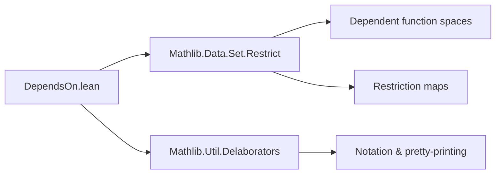
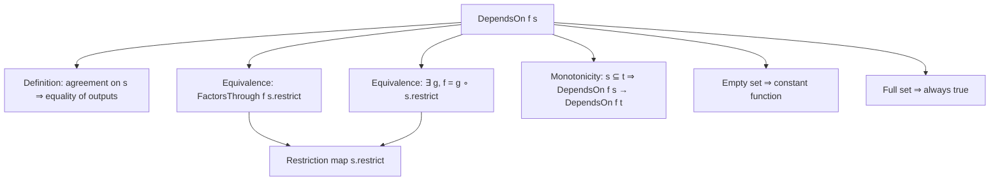

**Technical Brief: `DependsOn.lean` Module**

---

### 1. KEY DEFINITIONS & THEOREMS

| Name | Type | Purpose |
|------|------|---------|
| `DependsOn f s` | `Prop` | Predicate stating that `f : (Π i, α i) → β` depends only on coordinates in `s ⊆ ι`: if `x` and `y` agree on `s`, then `f x = f y`. |
| `dependsOn_iff_factorsThrough` | `DependsOn f s ↔ FactorsThrough f s.restrict` | Equivalence between dependency on `s` and factoring through the restriction map `s.restrict : (Π i, α i) → Π i : s, α i`. |
| `dependsOn_iff_exists_comp` | `DependsOn f s ↔ ∃ g, f = g ∘ s.restrict` (under `Nonempty β`) | Characterization of dependency via explicit factorization through a function on the restricted product. |
| `dependsOn_univ` | `DependsOn f univ` | Any function trivially depends on the full index set (since all coordinates are included). |
| `dependsOn_const` | `DependsOn (const _ b) ∅` | Constant functions depend on no variables (empty set). |
| `DependsOn.mono` | `s ⊆ t → DependsOn f s → DependsOn f t` | Monotonicity: if `f` depends on `s`, it also depends on any superset `t ⊇ s`. |
| `DependsOn.empty` | `DependsOn f ∅ → ∀ x y, f x = f y` | If `f` depends on the empty set, then `f` is constant. |
| `Set.dependsOn_restrict` | `DependsOn (s.restrict) s` | The restriction map itself depends only on `s`. |

---

### 2. NAMING CONVENTIONS

- **Predicate naming**: `DependsOn` (capitalized, noun-like predicate).
- **Lemma naming**:
  - `dependsOn_*`: properties of the predicate (`dependsOn_const`, `dependsOn_univ`, `dependsOn_iff_*`).
  - `DependsOn.*`: lemmas about the predicate as a class-like structure (`DependsOn.mono`, `DependsOn.empty`).
- **No prefix/suffix overloading**: consistent use of `DependsOn` as the core identifier.

---

### 3. TACTIC STACK

- `simp [funext_iff]`, `simp [DependsOn]`: simplification using function extensionality and definitions.
- `intro` / `intro h`: standard for implication proofs.
- `congrArg _` + `funext`: to prove equality of functions by extensionality.
- `rw [...]`: rewriting using equivalences (e.g., `dependsOn_iff_factorsThrough`).
- `exact` / `rintro`: for concise proof construction.
- `by simp [DependsOn]`: used in base cases (e.g., constant function).

No heavy automation (e.g., `aesop`, `linarith`) — proofs are mostly definitional and structural.

---

### 4. PROOF LOGIC

- **Structure**: Most proofs are *bidirectional* (`↔`) and proceed by:
  1. Unfolding definitions (`DependsOn`, `FactorsThrough`, `factorsThrough_iff`).
  2. Applying `funext` to reduce function equality to pointwise equality.
  3. Using `simp` or `rw` to simplify hypotheses/conclusions.
- **Induction**: Not used — all arguments are *extensional* and *pointwise*.
- **Case analysis**: Minimal; mostly handled by `intro` and `cases` on `h : x i = y i`.
- **Key logical flow**:
  - To prove `DependsOn f s → FactorsThrough f s.restrict`: construct `g := f ∘ s.restrict` and verify factorization.
  - To prove `FactorsThrough f s.restrict → DependsOn f s`: use the factorization to reduce equality of `f x`, `f y` to equality of `x`, `y` on `s`.

---

### 5. IMPORTS

- `Mathlib.Data.Set.Restrict`: provides `Set.restrict`, the restriction map on dependent functions.
- `Mathlib.Util.Delaborators`: likely for pretty-printing or notation support (not directly used in logic).

> **Scope**: This module formalizes *dependency of functions on subsets of indices* in dependent function spaces — foundational for marginalization, update operations, and conditional independence in probability or measure theory (as hinted in docstring).

---

### 6. MERMAID DIAGRAMS

#### Dependency Graph (Module-Level)



#### Conceptual Overview (Theory)



#### Proof Strategy Flow (for `dependsOn_iff_factorsThrough`)

```mermaid
graph LR
  Start[Start: DependsOn f s ↔ FactorsThrough f s.restrict] --> Unfold[Unfold definitions]
  Unfold --> Simplify[Apply simp [funext_iff]]
  Simplify --> Equiv[Obtain equivalence]
  Equiv --> End[QED]
```

---

### 7. SEMANTIC INTERPRETATION

- `DependsOn f s` means: *“`f` is insensitive to changes outside `s`”* — i.e., `f` is determined by the restriction of its input to `s`.
- The predicate is **upward-closed** (`mono`) and **weakest** when `s = ∅` (only constant functions satisfy it).
- The equivalence `DependsOn f s ↔ FactorsThrough f s.restrict` shows that dependency is exactly the universal property of the restriction as a *quotient* in the category of sets (or types).

---

### 8. TAGS & USE CASES

- **Tags**: `depends on`, `factorization`, `restriction`, `extensionality`
- **Use cases**:
  - Formalizing *marginalization* in probability (e.g., `MeasureTheory.lmarginal`).
  - Reasoning about *updates* (e.g., `Function.updateFinset`) where only certain coordinates matter.
  - Abstracting away irrelevant variables in dependent types without subtype gymnastics.

--- 

✅ **Summary**: This module provides a clean, extensional, and reusable framework for reasoning about *variable dependency* in dependent function spaces — avoiding tedious subtype manipulations while preserving mathematical rigor.
