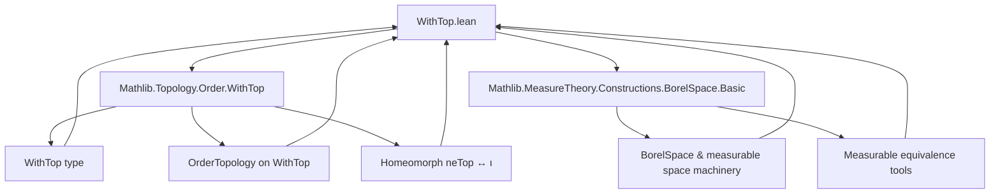

**Technical Brief: `WithTop.lean` — Borel Measurable Space on `WithTop`**

---

### 1. **Key Definitions & Theorems**

| Name | Type / Signature | Purpose |
|------|------------------|---------|
| `instance MeasurableSpace (WithTop ι)` | `MeasurableSpace (WithTop ι)` | Defines the Borel σ-algebra on `WithTop ι` via `borel _`. |
| `instance BorelSpace (WithTop ι)` | `BorelSpace (WithTop ι)` | Shows `WithTop ι` is a Borel space (i.e., its Borel σ-algebra matches the given measurable structure). |
| `MeasurableEquiv.neTopEquiv` | `{ r : WithTop ι | r ≠ ⊤ } ≃ᵐ ι` | Measurable equivalence between non-top elements and `ι`. |
| `measurable_of_measurable_comp_coe` | `(f ∘ coe : ι → α) measurable ⇒ f : WithTop ι → α measurable` | Key lifting lemma: measurability of `f` follows from measurability on the dense subset `ι ↪ WithTop ι`. |
| `measurable_coe` | `Measurable (fun x ↦ (x : WithTop ι))` | Natural inclusion `ι → WithTop ι` is measurable. |
| `Measurable.withTop_coe` | `Measurable f ⇒ Measurable (fun x ↦ (f x : WithTop ι))` | Closure of measurable functions under composition with `withTop_coe`. |
| `measurable_untopD (d : ι)` | `Measurable (untopD d)` | `untopD d` (partial inverse of `coe`, picking `d` for `⊤`) is measurable. |
| `Measurable.untopA [Nonempty ι]` | `Measurable (untopA)` | Total inverse `untopA : WithTop ι → ι` (arbitrarily maps `⊤` to some element) is measurable. |
| `Measurable.untopD {f}` | `Measurable f ⇒ Measurable (x ↦ (f x).untopD d)` | Closure under composition with `untopD`. |
| `Measurable.untopA {f}` | `Measurable f ⇒ Measurable (x ↦ (f x).untopA)` | Closure under composition with `untopA`. |
| `measurableEquivSum` | `WithTop ι ≃ᵐ ι ⊕ Unit` | Measurable equivalence between `WithTop ι` and disjoint sum `ι ⊔ Unit`. |

---

### 2. **Naming Conventions**

- **Prefixes**:
  - `measurable_`: proves measurability of a function (e.g., `measurable_coe`, `measurable_untopD`).
  - `Measurable.`: typeclass-respecting lemmas for `fun_prop` style closure (e.g., `Measurable.withTop_coe`).
- **Suffixes**:
  - `_coe`: refers to inclusion `ι → WithTop ι`.
  - `_untopD`: refers to `untopD d`, a *dependent* partial inverse fixing a basepoint `d`.
  - `_untopA`: refers to `untopA`, a *nondependent* total inverse (requires `Nonempty ι`).
- **Equiv/MeasurableEquiv**:
  - `neTopEquiv`: equivalence on non-top elements.
  - `measurableEquivSum`: equivalence with sum type.

---

### 3. **Tactic Stack**

- `measurable_of_measurable_on_compl_singleton ⊤`: core tactic for reducing to complement of a singleton.
- `.symm.measurable_comp_iff.1 h`: uses equivalence properties to transfer measurability.
- `measurable_of_measurable_comp_coe measurable_id`: applies lifting lemma with identity.
- `continuous_coe.measurable`: uses continuity of inclusion (from `OrderTopology`) to deduce measurability.
- `.comp hf`: standard composition closure.
- `measurable_fun_sum`: used in constructing measurable maps from sums.

No heavy automation (e.g., `aesop`, `ring`, `simp`) is used — proofs are mostly structural and rely on `Measurable` typeclass lemmas.

---

### 4. **Proof Logic**

- **Structure**:  
  1. Define Borel σ-algebra on `WithTop ι` via `borel _`.  
  2. Prove key lifting lemma `measurable_of_measurable_comp_coe` using:
     - Complement of `{⊤}` is measurable (singleton is measurable in Borel σ-algebra).
     - Measurable equivalence `neTopEquiv` identifies `{r ≠ ⊤}` with `ι`.
  3. Derive measurability of `coe`, `untopD`, `untopA` via:
     - `measurable_of_measurable_comp_coe` + `measurable_id`.
     - Composition closure (`Measurable.comp`).
  4. Construct `measurableEquivSum` by:
     - Using `Equiv.optionEquivSumPUnit` (set-theoretic equivalence).
     - Proving both directions measurable via `measurable_of_measurable_comp_coe` and `measurable_const`.

- **Induction/Case Analysis**: Not used directly; relies on topological/order-theoretic properties (order topology, linear order) and measurable equivalence lemmas.

---

### 5. **Imports**

- `Mathlib.MeasureTheory.Constructions.BorelSpace.Basic`: provides `borel`, `BorelSpace`, basic measurable space constructions.
- `Mathlib.Topology.Order.WithTop`: provides `WithTop`, `untopD`, `untopA`, `coe`, `neTopHomeomorph`, order topology on `WithTop`.

---

### 6. **Mermaid Diagrams**

#### Dependency Graph (Module-Level)



#### Overview of Theory Flow

```mermaid
flowchart LR
  subgraph Setup
    ι[ι: LinearOrder + TopologicalSpace + OrderTopology]
    WithTop[WithTop ι]
  end

  subgraph Definitions
    Borel[Borel σ-algebra on WithTop ι]
    neTopEquiv[{r ≠ ⊤} ≃ᵐ ι]
  end

  subgraph Core Lemmas
    lift[measurable_of_measurable_comp_coe]
    coe_meas[Measurable coe]
    untopD_meas[Measurable untopD d]
    untopA_meas[Measurable untopA]
  end

  subgraph Applications
    withTop_coe[Measurable withTop_coe]
    untopD_comp[Measurable (f.untopD d)]
    untopA_comp[Measurable (f.untopA)]
    equiv_sum[WithTop ι ≃ᵐ ι ⊕ Unit]
  end

  ι --> WithTop
  WithTop --> Borel
  Borel --> neTopEquiv
  neTopEquiv --> lift
  lift --> coe_meas
  lift --> untopD_meas
  lift --> untopA_meas
  coe_meas --> withTop_coe
  untopD_meas --> untopD_comp
  untopA_meas --> untopA_comp
  WithTop --> equiv_sum
```

---

### 7. **Domain-Specific AI Agent Notes**

- **Key reasoning pattern**: *extend measurability from a dense subset* (`ι ↪ WithTop ι`) using measurable equivalence and complement of a singleton.
- **Critical assumptions**: `ι` must be a linear order with order topology; `Nonempty ι` needed for `untopA`.
- **Useful lemmas for automation**: `measurable_of_measurable_comp_coe`, `Measurable.withTop_coe`, `Measurable.untopD`, `Measurable.untopA`.
- **Pattern for constructing measurable equivalences**: use set-theoretic equivalence + prove both directions measurable separately.

--- 

Let me know if you'd like a formalized checklist for verifying measurability in similar constructions.
