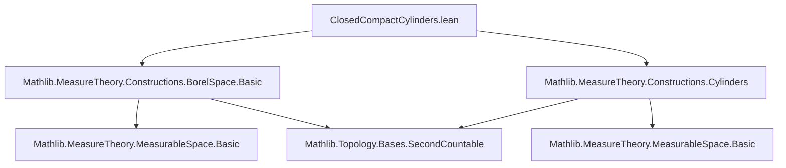
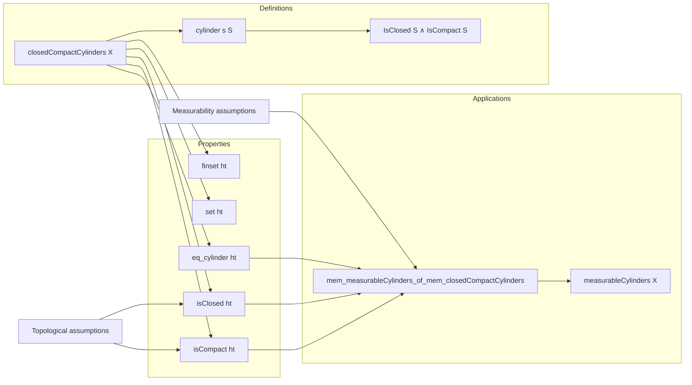
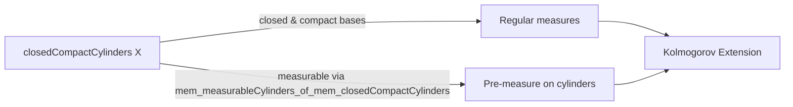

### Technical Brief: `ClosedCompactCylinders.lean`

---

#### **1. Key Definitions & Theorems**

| Name | Type / Signature | Purpose |
|------|------------------|---------|
| `closedCompactCylinders X` | `Set (Set (Π i, X i))` | Defines the collection of all cylinders over product space `Π i, X i` whose base `S` is closed and compact. Formally: `⋃ (s S) [IsClosed S] [IsCompact S], {cylinder s S}` |
| `mem_closedCompactCylinders` | `t ∈ closedCompactCylinders X ↔ ∃ s S, IsClosed S ∧ IsCompact S ∧ t = cylinder s S` | Characterizes membership in `closedCompactCylinders X` via existential witness `(s, S)` |
| `closedCompactCylinders.finset` | `(ht : t ∈ closedCompactCylinders X) → Finset ι` | Extracts the index set `s` such that `t = cylinder s S` |
| `closedCompactCylinders.set` | `(ht : t ∈ closedCompactCylinders X) → Set (Π i : s, X i)` | Extracts the closed compact base `S` for `t` |
| `closedCompactCylinders.isClosed` / `isCompact` | `(ht : t ∈ closedCompactCylinders X) → IsClosed S` / `IsCompact S` | Prove extracted `S` is closed/compact |
| `closedCompactCylinders.eq_cylinder` | `(ht : t ∈ closedCompactCylinders X) → t = cylinder s S` | Confirms `t` is exactly the cylinder over extracted `s, S` |
| `cylinder_mem_closedCompactCylinders` | `(s : Finset ι) → (S : Set (Π i : s, X i)) → IsClosed S → IsCompact S → cylinder s S ∈ closedCompactCylinders X` | Constructs elements of `closedCompactCylinders X` from closed compact bases |
| `mem_measurableCylinders_of_mem_closedCompactCylinders` | Under assumptions `[∀ i, MeasurableSpace (X i)]`, `[∀ i, SecondCountableTopology (X i)]`, `[∀ i, OpensMeasurableSpace (X i)]`:   `t ∈ closedCompactCylinders X → t ∈ measurableCylinders X` | Shows that closed-compact cylinders are measurable cylinders under standard regularity assumptions |

---

#### **2. Naming Conventions**

- **Prefixes**:
  - `closedCompactCylinders.`: namespace for definitions and projections (e.g., `.finset`, `.set`, `.isClosed`)
  - `mem_...`: for membership characterizations (e.g., `mem_closedCompactCylinders`)
- **Suffixes**:
  - `_of_mem_...`: implication from membership in one structure to another (e.g., `mem_measurableCylinders_of_mem_closedCompactCylinders`)
- **General pattern**: `noun_verb_object` or `verb_noun_of_...`, consistent with Mathlib style.

---

#### **3. Tactic Stack**

- `simp_rw [...]`: heavily used to unfold definitions and simplify membership conditions.
- `exact`: for direct proof construction after simplification.
- `refine ⟨...⟩`: to construct existential witnesses (e.g., in `mem_measurableCylinders_of_mem_closedCompactCylinders`).
- `rw [...]`: for rewriting using previously established equalities.
- `cases` / `choose`: implicit via `simp_rw` and `exact` on `choose`-based definitions (e.g., `mem_closedCompactCylinders` uses `choose` for choice of `s, S`).
- No heavy automation (e.g., `aesop`, `linarith`) — proofs are mostly structural and definitional.

---

#### **4. Proof Logic**

- **Definitional decomposition**: Proofs rely on unfolding definitions (`closedCompactCylinders`, `measurableCylinders`) via `simp_rw`.
- **Choice-based extraction**: For `t ∈ closedCompactCylinders X`, use `mem_closedCompactCylinders` to get `∃ s S, ...`, then extract witnesses via `.choose` and `.choose_spec`.
- **Verification of properties**: Once `s, S` are extracted, use `.isClosed`, `.isCompact`, and `.eq_cylinder` to verify required properties (e.g., closedness ⇒ measurable).
- **Main theorem proof strategy**:
  1. Assume `t ∈ closedCompactCylinders X`.
  2. Use `mem_closedCompactCylinders` to get `s, S` with `t = cylinder s S`, `S` closed & compact.
  3. Show `S` is measurable (via `isClosed ⇒ measurableSet` under `OpensMeasurableSpace`).
  4. Conclude `t ∈ measurableCylinders X` by definition.

---

#### **5. Imports**

- `Mathlib.MeasureTheory.Constructions.BorelSpace.Basic`: for Borel spaces, measurable open sets, etc.
- `Mathlib.MeasureTheory.Constructions.Cylinders`: defines `cylinder`, `measurableCylinders`, foundational cylinder set theory.

These imports define the ambient measure-theoretic and topological context.

---

#### **6. Mermaid Diagrams**

##### **Dependency Graph (Module Level)**

##### **Overview of Theory Flow**

##### **Role in Kolmogorov Extension Theorem**

---

#### **7. Summary**

This file formalizes the class of *closed compact cylinders* — a key technical tool in measure-theoretic constructions, especially for extending pre-measures to product measures (e.g., Kolmogorov’s extension theorem). It provides:
- A clean inductive definition via union over closed compact bases,
- Projection functions to extract structural data (`s`, `S`, properties),
- A bridge to measurable sets under standard topological/measurable assumptions.

The formalization is minimal, precise, and adheres to Mathlib’s conventions for cylinder sets and measurable spaces.
