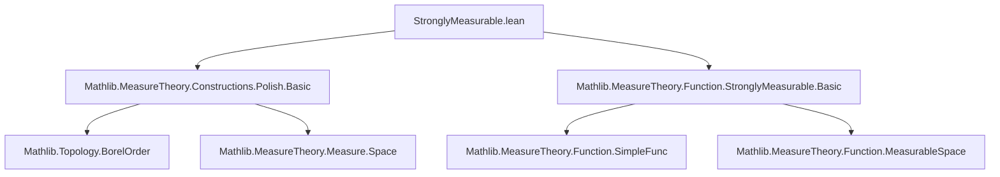
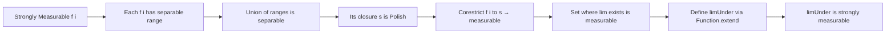

### Technical Brief: `StronglyMeasurable.lean`

---

#### **1. Key Definitions & Theorems**

| Name | Type / Signature | Purpose |
|------|------------------|---------|
| `StronglyMeasurable` | `f : α → β → E` is *strongly measurable* if it is measurable and has separable range (when `E` is a metric space) | Core notion: functions approximable by simple functions with separable range. |
| `measurableSet_exists_tendsto` | `MeasurableSet {x | ∃ c, Tendsto (f · x) l (𝓝 c)}` | Shows the set of points where the filter limit exists is measurable, under strong measurability of each `f i`. |
| `limUnder` | `StronglyMeasurable (fun x ↦ limUnder l (f · x))` | Proves that the pointwise `limUnder` (limit along a filter `l`) of a countable family of strongly measurable functions is again strongly measurable, assuming completeness of the codomain. |

---

#### **2. Naming Conventions**

- **Prefixes**:
  - `measurableSet_`: denotes theorems about measurability of sets defined via quantifiers or limits.
  - `stronglyMeasurable_`: used for lemmas about strong measurability (e.g., `stronglyMeasurable_iff_measurable_separable` imported).
  - `isSeparable_`, `isClosed_`, `isCompletelyMetrizable_`: properties of spaces or sets.
- **Suffixes**:
  - `_of_not_tendsto`: case analysis when a limit does *not* exist.
  - `_subtype_mk`, `_subtype_coe`: constructions involving subtype embeddings.
  - `_extend`: constructions using `Function.extend`.

---

#### **3. Tactic Stack**

Frequently used tactics in this file:

| Tactic | Role |
|--------|------|
| `borelize` | Equips a completely metrizable space with its Borel σ-algebra. |
| `simp_all`, `simp_rw` | Simplification using definitional equalities and rewrite rules. |
| `convert` | Allows changing goal up to definitional equality, often used with `with` to adjust proof obligations. |
| `refine` / `exact` | Construct proofs step-by-step, especially for existential or equality goals. |
| `by_cases` | Case analysis on membership or existence (e.g., `hx : x ∈ conv`). |
| `rw [hc.limUnder_eq]`, `rwa` | Rewriting using lemmas about limits under strong measurability. |
| `measurable_extend`, `measurable_of_tendsto_metrizable'` | Advanced measurability lemmas for extending functions or proving measurability via convergence. |
| `subset_union_left`, `subset_union_right`, `mem_closure_of_tendsto` | Set-theoretic reasoning in topology/measurable context. |

---

#### **4. Proof Logic**

The proofs follow a structured pattern leveraging:

- **Countability assumptions**: `Countable ι`, `l.IsCountablyGenerated` allow reducing to sequential arguments.
- **Completeness & Polish structure**: `IsCompletelyMetrizableSpace E` ensures Borel = completion of separable metric topology; used to corestrict functions to separable closures.
- **Case analysis on the filter**:
  - `eq_or_neBot l`: handles `l = ⊥` (trivial filter) separately.
- **Corestriction to separable closure**:
  - Define `s := closure (⋃ i, range (f i))` (or union with a point if needed).
  - Show `s` is Polish/separable.
  - Lift `f i` to `g i : X → s`, which is measurable.
- **Measurability via extension**:
  - Use `Function.extend` to define the limit function on all `X`, extending from the measurable set where the limit exists.
  - Apply `measurable_extend` with convergence data from `measurable_of_tendsto_metrizable'`.

---

#### **5. Imports**

| Module | Purpose |
|--------|---------|
| `Mathlib.MeasureTheory.Constructions.Polish.Basic` | Polish space theory, separability, completeness, Borel σ-algebra. |
| `Mathlib.MeasureTheory.Function.StronglyMeasurable.Basic` | Definitions and basic facts about strongly measurable functions (e.g., `stronglyMeasurable_iff_measurable_separable`). |

---

#### **6. Mermaid Diagrams**

##### **Dependency Graph (File-Level)**

##### **Theoretical Overview (Conceptual Flow)**

---

#### **7. Summary**

This file extends classical results on measurable functions to the *strongly* measurable setting by leveraging completeness and separability of the codomain. It shows that:
- The existence set of limits is measurable.
- The pointwise limit along a countably generated filter remains strongly measurable.

These results are foundational for extending theorems (e.g., dominated convergence, Fubini) from measurable to strongly measurable functions without assuming separability of the codomain.

--- 

Let me know if you'd like a formalized dependency graph (e.g., `leanpkg` tree) or a comparison with similar files in Mathlib.
