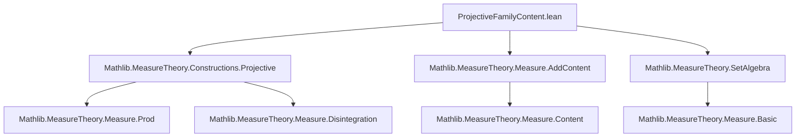

**Technical Brief: `ProjectiveFamilyContent.lean`**

---

### 1. **Key Definitions & Theorems**

| Name | Type / Signature | Purpose |
|------|------------------|---------|
| `projectiveFamilyFun` | `P : ∀ J, Measure (Π j : J, α j) → Set (Π i, α i) → ℝ≥0∞` | Extends a projective family of measures to a function on *all* subsets of the product space, defined as `P I S` on measurable cylinders and `0` otherwise. |
| `projectiveFamilyFun_congr` | `IsProjectiveMeasureFamily P → s ∈ measurableCylinders α → s = cylinder I S → MeasurableSet S → projectiveFamilyFun P s = P I S` | Shows that the value of `projectiveFamilyFun` is independent of the representation of a measurable cylinder. |
| `projectiveFamilyFun_empty` | `IsProjectiveMeasureFamily P → projectiveFamilyFun P ∅ = 0` | Verifies that the empty set is assigned measure zero. |
| `projectiveFamilyFun_union` | `IsProjectiveMeasureFamily P → s, t ∈ measurableCylinders α → Disjoint s t → projectiveFamilyFun P (s ∪ t) = projectiveFamilyFun P s + projectiveFamilyFun P t` | Proves finite additivity on disjoint measurable cylinders. |
| `projectiveFamilyContent` | `IsProjectiveMeasureFamily P → AddContent ℝ≥0∞ (measurableCylinders α)` | Constructs an *additive content* (finitely additive, non-negative, normalized on ∅) on the set algebra of measurable cylinders. |
| `projectiveFamilyContent_cylinder` | `IsProjectiveMeasureFamily P → MeasurableSet S → projectiveFamilyContent hP (cylinder I S) = P I S` | Evaluates the content on a cylinder set. |
| `projectiveFamilyContent_mono` | `IsProjectiveMeasureFamily P → s ⊆ t → content(s) ≤ content(t)` | Monotonicity of the content. |
| `projectiveFamilyContent_iUnion_le` | `IsProjectiveMeasureFamily P → (s n ∈ measurableCylinders) → content(⋃ i ≤ n, s i) ≤ ∑_{i ≤ n} content(s i)` | Subadditivity over finite unions (used for outer measure construction later). |
| `projectiveFamilyContent_ne_top` | `[∀ J, IsFiniteMeasure (P J)] → content(s) ≠ ∞` | Ensures finiteness of the content when all `P J` are finite measures. |
| `projectiveFamilyContent_diff` / `projectiveFamilyContent_diff_of_subset` | `content(s \ t) ≥ content(s) - content(t)` (and equality under finiteness) | Behavior under set difference, needed for Carathéodory extension. |

---

### 2. **Naming Conventions**

- **Prefixes**:
  - `projectiveFamilyFun` / `projectiveFamilyContent`: core objects built from the projective family `P`.
  - `isSetRing_`, `isSetSemiring_`, `isSetAlgebra_`: structural properties of `measurableCylinders`.
- **Suffixes**:
  - `_congr`: congruence lemmas (independence of representation).
  - `_empty`, `_union`, `_mono`, `_diff`, `_iUnion_le`: properties of the content.
  - `_cylinder`: evaluation on cylinder sets.
- **Variables**:
  - `I : Finset ι`, `S : Set (Π i : I, α i)`: finite index set and measurable set in the product over `I`.
  - `s, t`: subsets of the full product `Π i, α i`.
  - `P`: the projective family of measures.

---

### 3. **Tactic Stack**

- `rw`: rewriting using lemmas (especially `projectiveFamilyFun_congr`, `cylinder_eq_cylinder_union`, etc.)
- `simp only [mem_range_succ_iff]`: simplification with specific lemmas.
- `cases isEmpty_or_nonempty (Π i, α i)`: case analysis on emptiness of the product space.
- `rwa [...]`: rewrite + assumption.
- `finiteness`: custom tactic (likely from `MeasureTheory.Measure.IsFiniteMeasure`) to prove finiteness.
- `aesop`, `ring`, `simp`: not explicitly used here, but `finiteness` suggests use of automation for measure-theoretic finiteness goals.

---

### 4. **Proof Logic**

- **Structure**: The proof proceeds in three stages:
  1. **Set-algebraic properties** of `measurableCylinders`: show it is a set algebra, ring, and semiring.
  2. **Construction of `projectiveFamilyFun`**: define a function on all subsets, then prove:
     - Well-definedness on cylinders (`projectiveFamilyFun_congr`) using projectivity (`IsProjectiveMeasureFamily`).
     - Additivity on disjoint cylinders (`projectiveFamilyFun_union`) via cylinder union lemmas and restriction maps (`restrict₂`).
  3. **Construction of `projectiveFamilyContent`**: apply `addContent_of_union` to `projectiveFamilyFun`, using the proved properties (empty, union).
- **Key ideas**:
  - Use of *projectivity* to ensure consistency across projections.
  - Reduction to finite index sets via representation of measurable cylinders.
  - Handling of empty product via `isEmpty_or_nonempty` case split.

---

### 5. **Imports**

| Import | Role |
|--------|------|
| `Mathlib.MeasureTheory.Constructions.Projective` | Defines `IsProjectiveMeasureFamily`, projections, cylinder sets. |
| `Mathlib.MeasureTheory.Measure.AddContent` | Provides `AddContent`, `addContent_of_union`, monotonicity, subadditivity lemmas. |
| `Mathlib.MeasureTheory.SetAlgebra` | Defines `IsSetAlgebra`, `IsSetRing`, `IsSetSemiring`, and `measurableCylinders`. |

---

### 6. **Mermaid Diagrams**

#### **Dependency Graph (Module Level)**



#### **Overview of Theory Flow**

```mermaid
graph LR
  subgraph Setup
    ι[Index type ι]
    α[Family α : ι → Type*]
    mα[Measurable spaces mα i]
  end

  subgraph ProjectiveFamily
    P[Family P J : Measure (Π j : J, α j)]
    proj[Projection maps]
    compat[Compatibility: π_{JI}* (P I) = P J for J ⊆ I]
  end

  subgraph MeasurableCylinders
    cyl[Cylinders cylinder I S]
    alg[Set algebra / ring / semiring]
  end

  subgraph ContentConstruction
    fun[projectiveFamilyFun P]
    add[Additivity: disjoint union]
    cont[projectiveFamilyContent = addContent_of_union fun]
  end

  subgraph Application
    ext[Extension to outer measure]
    car[Carathéodory extension]
    lim[Projective limit measure]
  end

  P --> fun
  fun --> add
  add --> cont
  cont --> ext
  ext --> car
  car --> lim
  cyl --> alg
  alg --> cont
```

---

### 7. **Theoretical Context**

- **Goal**: Construct the *projective limit* of a family of measures `P` over an arbitrary index set `ι`.
- **Current status**:
  - `projectiveFamilyContent` is a *finitely additive* content on measurable cylinders.
  - Next steps (not yet formalized in Mathlib): extend to a countably additive measure via Carathéodory’s extension theorem.
- **Related theorems**:
  - *Ionescu-Tulcea*: for countable `ι`, using kernels.
  - *Kolmogorov Extension Theorem*: for general `ι`, under topological assumptions (Polish spaces, etc.).

---

### 8. **Summary**

This file formalizes the foundational step toward constructing a projective limit measure: defining a finitely additive content on measurable cylinders from a projective family of measures. It leverages:
- structural properties of `measurableCylinders`,
- projectivity to ensure consistency,
- `AddContent` machinery to package finite additivity.

The definitions and lemmas are carefully designed to support future extension to a full measure (via outer measure + Carathéodory), and serve as a key intermediate object in both probabilistic and measure-theoretic constructions over infinite products.
