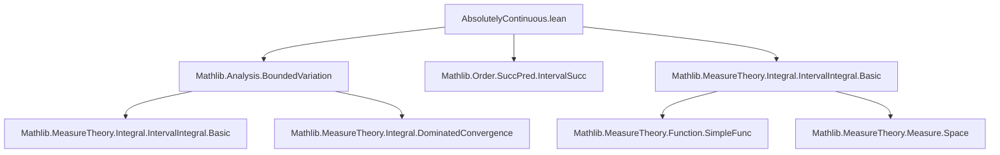
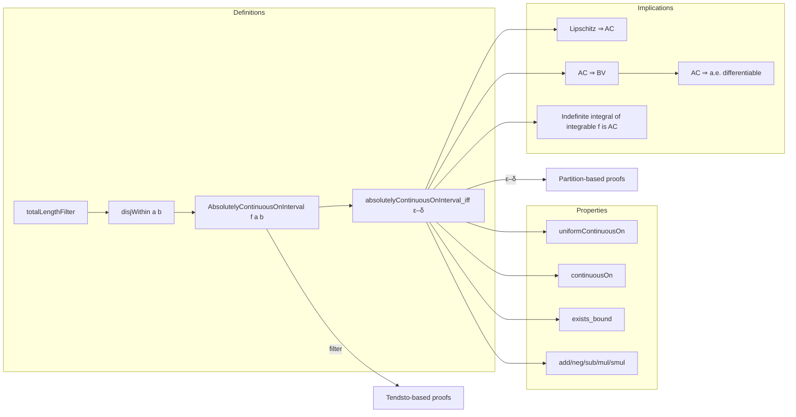

### Technical Brief: Absolutely Continuous Functions in Lean 4 (`AbsolutelyContinuous.lean`)

---

#### **1. Key Definitions & Theorems**

| Name | Type / Signature | Purpose |
|------|------------------|---------|
| `totalLengthFilter` | `Filter (ℕ × (ℕ → X × X))` | Filter on finite sequences of intervals, measuring total length → 0. |
| `disjWithin a b` | `Set (ℕ × (ℕ → ℝ × ℝ))` | Subcollection of finite interval sequences within `uIcc a b`, pairwise disjoint `uIoc` intervals. |
| `AbsolutelyContinuousOnInterval f a b` | `Prop` | `f` is absolutely continuous on `uIcc a b`: sum of `dist(f(aᵢ), f(bᵢ))` → 0 as total length → 0. |
| `absolutelyContinuousOnInterval_iff` | `↔` | Equivalence between filter-based and classical ε–δ definition. |
| `uniformContinuousOn` | `hf → UniformContinuousOn f (uIcc a b)` | AC ⇒ uniformly continuous. |
| `continuousOn` | `hf → ContinuousOn f (uIcc a b)` | AC ⇒ continuous. |
| `exists_bound` | `hf → ∃ C, ‖f x‖ ≤ C` | AC ⇒ bounded on compact interval. |
| `add`, `neg`, `sub`, `const_smul`, `const_mul`, `smul`, `mul` | `hf → hg → ...` | Closure of AC functions under algebraic operations. |
| `symm`, `mono` | `hf → ...` | Symmetry and monotonicity of AC w.r.t. interval reversal/inclusion. |
| `LipschitzOnWith.absolutelyContinuousOnInterval` | `LipschitzOnWith K f → AC f` | Lipschitz ⇒ AC. |
| `boundedVariationOn` | `hf → BoundedVariationOn f (uIcc a b)` | AC ⇒ bounded variation. |
| `ae_differentiableAt` | `hf → a.e. differentiable` | AC ⇒ a.e. differentiable (via bounded variation + Lebesgue’s theorem). |
| `IntervalIntegrable.absolutelyContinuousOnInterval_intervalIntegral` | `IntervalIntegrable f → AC (fun x ↦ ∫ c..x f)` | Fundamental theorem of calculus for AC: indefinite integral of integrable `f` is AC. |

---

#### **2. Naming Conventions**

- **Prefixes**:
  - `is_` not used here; instead, predicate is named `AbsolutelyContinuousOnInterval`.
  - `absolutelyContinuousOnInterval_` prefix for lemmas about the predicate.
- **Suffixes**:
  - `OnInterval` suffix for definitions/lemmas about AC on intervals.
  - `On` suffix for restrictions to sets (e.g., `uniformContinuousOn`, `continuousOn`).
- **Algebraic operations**:
  - `add`, `neg`, `sub`, `mul`, `smul`, `const_mul`, `const_smul` — standard Lean algebraic closure lemmas.
- **Filter-related**:
  - `totalLengthFilter`, `disjWithin`, `tendsto_volume_*`, `hasBasis_*`.

---

#### **3. Tactic Stack**

| Tactic | Usage Frequency | Purpose |
|--------|-----------------|---------|
| `grind` | High | Simplifies set-theoretic and metric reasoning (custom tactic in Mathlib). |
| `simp` / `simp only` | Very High | Simplification with definitional lemmas, especially for `Finset.sum`, `dist`, `uIcc`, `uIoc`. |
| `gcongr` | High | Handles inequalities in sums and distances (e.g., `dist (f a) f b) ≤ K * dist a b`). |
| `rw` / `convert` | High | Rewriting and congruence-based equality proofs (e.g., `dist_edist`, `integral_symm`). |
| `filter_upwards` | Medium | Proving filter convergence by bounding along neighborhoods. |
| `tendsto_of_tendsto_of_tendsto_of_le_of_le` | Medium | Sandwich argument for filter convergence (used in `tendsto_volume_*`). |
| `aesop` | Low | Not used here; `grind` and manual simplification dominate. |
| `linarith`, `field`, `norm_cast` | Medium | Arithmetic and field simplifications in real analysis. |
| `convert` + `symm` | Medium | Matching goals with known theorems (e.g., `veq`, `v_sum`). |

---

#### **4. Proof Logic**

- **Structure of proofs**:
  1. **Filter-based approach**:
     - Define `totalLengthFilter` and `disjWithin`.
     - Prove `absolutelyContinuousOnInterval_iff` to connect with ε–δ.
     - Use filter convergence lemmas (`squeeze_zero`, `tendsto_of_tendsto_of_le_of_le`) to prove closure properties.
  2. **ε–δ approach**:
     - For properties like Lipschitz ⇒ AC or AC ⇒ BV, switch to ε–δ via `absolutelyContinuousOnInterval_iff`.
     - Construct partitions or decompositions (e.g., splitting `[a, b]` into `n+1` subintervals of length `< δ`).
  3. **Inductive/constructive decomposition**:
     - In `boundedVariationOn`, use existence of `δ` for ε = 1, then partition `[a, b]` into finitely many small intervals.
     - Bound variation on each subinterval by 1, then sum.
  4. **Measure-theoretic arguments**:
     - In `absolutelyContinuousOnInterval_intervalIntegral`, use `tendsto_setLIntegral_zero` and integral estimates (`abs_integral_le_integral_abs`).
     - Leverage `integral_biUnion_finset`, `restrict_restrict_of_subset`, and `intervalIntegral` lemmas.

- **Common pattern**:
  - Prove filter convergence ⇒ ε–δ via `absolutelyContinuousOnInterval_iff`.
  - Prove ε–δ ⇒ structural properties (e.g., BV, differentiability).
  - Use algebraic lemmas (`add`, `mul`, etc.) to build new AC functions.

---

#### **5. Imports & Dependencies**

| Module | Role |
|--------|------|
| `Mathlib.Analysis.BoundedVariation` | Defines `BoundedVariationOn`, `eVariationOn`, and differentiability a.e. for BV functions. |
| `Mathlib.Order.SuccPred.IntervalSucc` | Provides interval arithmetic and succ/pred machinery (used in `uIoc`, `uIcc`). |
| `Mathlib.MeasureTheory.Integral.IntervalIntegral.Basic` | Interval integrals, `intervalIntegral.integral_interval_sub_left`, `abs_intervalIntegral_eq`, etc. |
| `Mathlib.MeasureTheory.Function.SimpleFunc` (implicit) | Used for `tendsto_setLIntegral_zero`. |
| `Mathlib.Topology.MetricSpace.Basic` | `dist`, `edist`, `Metric.tendsto_nhds`. |
| `Mathlib.MeasureTheory.Measure.Space` | `volume`, `restrict`, `measure_biUnion_finset_le`. |

---

#### **6. Mermaid Diagrams**

##### **Dependency Graph (Module-Level)**

##### **Conceptual Overview (Theory Flow)**

---

#### **7. Summary**

This file formalizes **absolutely continuous functions** on closed intervals in Lean 4, using a **filter-theoretic definition** equivalent to the classical ε–δ definition. It establishes:

- **Algebraic closure** under addition, multiplication, scalar multiplication, etc.
- **Implications**: AC ⇒ uniformly continuous ⇒ continuous ⇒ bounded.
- **Connections to other regularity notions**: Lipschitz ⇒ AC ⇒ bounded variation ⇒ a.e. differentiable.
- **Constructive examples**: Indefinite Lebesgue integrals of integrable functions are AC.

The formalization leverages:
- Filter convergence for clean ε–δ reasoning,
- Measure-theoretic tools (`volume`, `restrict`, `integral`) for the fundamental theorem of calculus,
- Classical real analysis techniques (partitioning intervals, bounding sums) for BV and differentiability.

This is foundational for the **Lebesgue differentiation theory** and the **fundamental theorem of calculus for Lebesgue integrals** in Mathlib.
