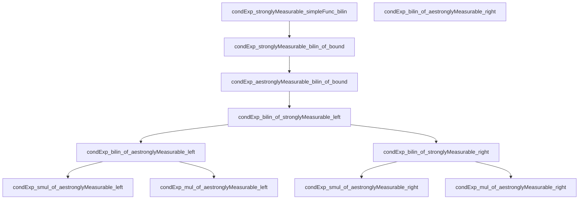
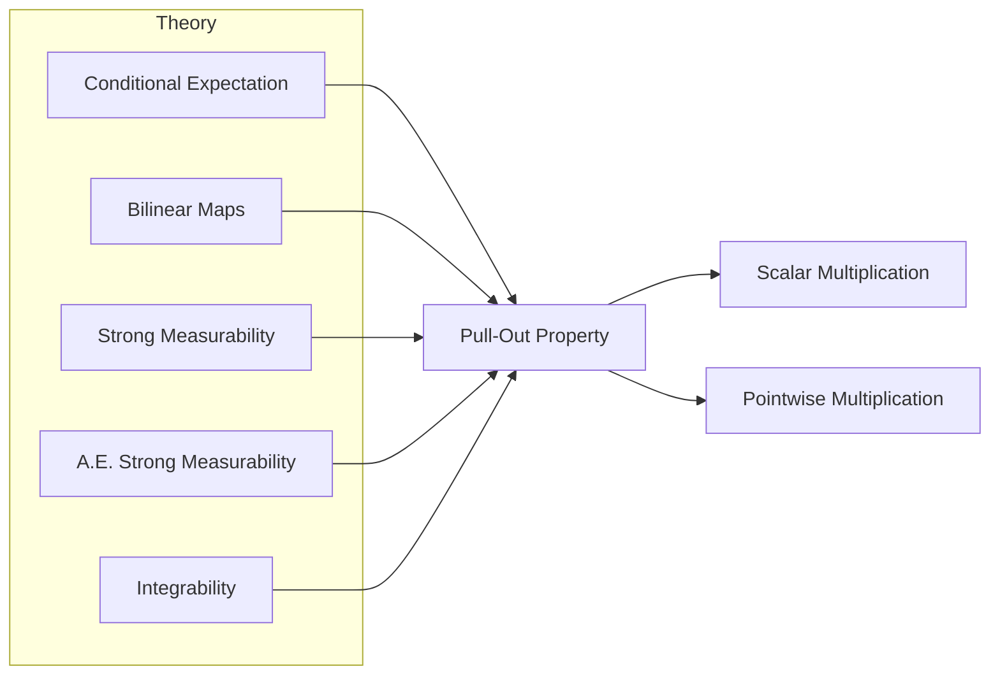

### Technical Brief: Pull-Out Property of Conditional Expectation (`PullOut.lean`)

---

#### **1. Key Definitions & Theorems**

| Name | Type / Signature | Purpose |
|------|------------------|---------|
| `condExp_stronglyMeasurable_simpleFunc_bilin` | `[CompleteSpace E] → (m ≤ mΩ) → f : SimpleFunc m F → Integrable g μ → μ[B f g | m] =ᵐ[μ] B f (μ[g | m])` | Proves pull-out for simple functions using induction and properties of conditional expectation. |
| `condExp_stronglyMeasurable_bilin_of_bound` | `[CompleteSpace E] → (m ≤ mΩ) → IsFiniteMeasure μ → StronglyMeasurable[m] f → Integrable g μ → ∃ c, ‖f‖ ≤ c a.e. → μ[B f g | m] =ᵐ[μ] B f (μ[g | m])` | Extends pull-out to bounded strongly measurable functions via approximation. |
| `condExp_aestronglyMeasurable_bilin_of_bound` | `[CompleteSpace E] → (m ≤ mΩ) → IsFiniteMeasure μ → AEStronglyMeasurable[m] f μ → Integrable g μ → ∃ c, ‖f‖ ≤ c a.e. → μ[B f g | m] =ᵐ[μ] B f (μ[g | m])` | Generalizes to almost everywhere strongly measurable functions using `hf.mk`. |
| `condExp_bilin_of_stronglyMeasurable_left` | `[CompleteSpace E] → StronglyMeasurable[m] f → Integrable (B f g) μ → Integrable g μ → μ[B f g | m] =ᵐ[μ] B f (μ[g | m])` | Main pull-out theorem for left argument under strong measurability. |
| `condExp_bilin_of_stronglyMeasurable_right` | `[CompleteSpace F] → StronglyMeasurable[m] g → Integrable (B f g) μ → Integrable f μ → μ[B f g | m] =ᵐ[μ] B (μ[f | m]) g` | Pull-out for right argument (via `B.flip`). |
| `condExp_bilin_of_aestronglyMeasurable_left` | `[CompleteSpace E] → AEStronglyMeasurable[m] f μ → Integrable (B f g) μ → Integrable g μ → μ[B f g | m] =ᵐ[μ] B f (μ[g | m])` | Pull-out for left argument under a.e. strong measurability. |
| `condExp_bilin_of_aestronglyMeasurable_right` | `[CompleteSpace F] → AEStronglyMeasurable[m] g μ → Integrable (B f g) μ → Integrable f μ → μ[B f g | m] =ᵐ[μ] B (μ[f | m]) g` | Pull-out for right argument under a.e. strong measurability. |
| `condExp_smul_of_aestronglyMeasurable_left` | `AEStronglyMeasurable[m] f μ → Integrable (f • g) μ → Integrable g μ → μ[f • g | m] =ᵐ[μ] f • μ[g | m]` | Pull-out for scalar multiplication (`•`). |
| `condExp_mul_of_aestronglyMeasurable_left` | `AEStronglyMeasurable[m] f μ → Integrable (f * g) μ → Integrable g μ → μ[f * g | m] =ᵐ[μ] f * μ[g | m]` | Pull-out for pointwise multiplication (`*`). |

---

#### **2. Naming Conventions**

- **Prefixes**:
  - `condExp_`: Conditional expectation-related theorems.
  - `stronglyMeasurable_`: For strongly measurable functions.
  - `aestronglyMeasurable_`: For almost everywhere strongly measurable functions.
  - `simpleFunc_`: For simple functions.
  - `bound` / `bound₀`: When boundedness assumption is used explicitly.
- **Suffixes**:
  - `_left` / `_right`: Indicates which argument of the bilinear map is pulled out.
  - `_flip`: Used in proofs relying on flipping arguments (e.g., `B.flip`).
- **Bilinear maps**:
  - `.lsmul ℝ ℝ`: Scalar multiplication as a continuous linear map.
  - `.mul ℝ ℝ`: Real multiplication as a continuous bilinear map.

---

#### **3. Tactic Stack**

- **Core tactics**:
  - `simp`, `simp_rw`: Simplification and rewriting with definitional equalities.
  - `rw`: Rewriting using equalities.
  - `refine`: Constructing proofs with holes.
  - `filter_upwards`: For proving statements almost everywhere.
  - `tendsto_condExp_unique`: Used in approximation arguments.
  - `grw`: Goal-directed rewriting (from `Mathlib.Tactic.GRing`).
  - `aesop`: Automated reasoning for first-order logic.
  - `norm_cast`, `exact`, `assumption`, `cases`, `by_cases`, `obtain`, `exists`, `have`, `suffices`, `calc`, `nth_rw`, `convert`, `congr'`, `fun_prop`, ` measurable_set_preimage`, ` measurable_of_measurable_post`.

- **Measure-theoretic automation**:
  - `ae_of_all`, `ae_restrict`, `ae_all_iff`, `ae_neBot`, `ae_of_all`, `ae_of_all`, `ae_of_all`.

---

#### **4. Proof Logic**

The proofs follow a standard **approximation strategy**:

1. **Base case**: Prove for simple functions using induction and properties like:
   - `condExp_indicator`
   - `condExp_add`
   - `B.map_add`
   - Boundedness of simple functions.

2. **Bounded case**: Extend to bounded strongly measurable functions using:
   - Approximation by simple functions (`approxBounded`)
   - Dominated convergence / uniqueness of conditional expectation (`tendsto_condExp_unique`)
   - Continuity of bilinear maps (`Continuous.comp_stronglyMeasurable`)

3. **Almost everywhere case**: Reduce to the bounded case using:
   - `hf.mk f` to get a strongly measurable representative equal a.e.
   - `condExp_congr_ae` to replace functions a.e.

4. **General case**:
   - Use spanning sets (`hf.exists_spanning_measurableSet_norm_le`) to reduce to finite measure case.
   - Use restriction of measures (`μ.restrict`) and properties like `condExp_restrict_ae_eq_restrict`.

5. **Right argument**: Use symmetry via `B.flip` and `flip_apply`.

---

#### **5. Imports & Dependencies**

- **Core imports**:
  ```lean
  Mathlib.MeasureTheory.Function.ConditionalExpectation.Basic
  Mathlib.MeasureTheory.Function.ConditionalExpectation.Indicator
  Mathlib.MeasureTheory.Function.Holder
  ```
- **Key dependencies**:
  - `MeasureTheory.Lp`: For integrability and `Lp`-norms.
  - `TopologicalSpace`, `Filter`, `ContinuousLinearMap`: For topology and continuity.
  - `NNReal`, `ENNReal`: Extended non-negative reals for measure theory.
  - `CompleteSpace`, `NormedAddCommGroup`, `NormedSpace ℝ`: Functional-analytic structure.

---

#### **6. Mermaid Diagrams**

##### **Dependency Graph (Theorems)**



##### **Overview of File Structure**



---

#### **7. Summary**

This file formalizes the **pull-out property** of conditional expectation for bilinear maps, scalar multiplication, and pointwise multiplication. It proceeds from simple functions to general measurable functions via approximation and boundedness arguments. The structure reflects standard measure-theoretic techniques: induction on simple functions, approximation by bounded functions, and extension via almost-everywhere equality.

The naming and structure are consistent with Lean’s `Mathlib` conventions, emphasizing modularity and reuse (e.g., `condExp_bilin_*` as a general theorem, with `condExp_smul_*` and `condExp_mul_*` as corollaries).
