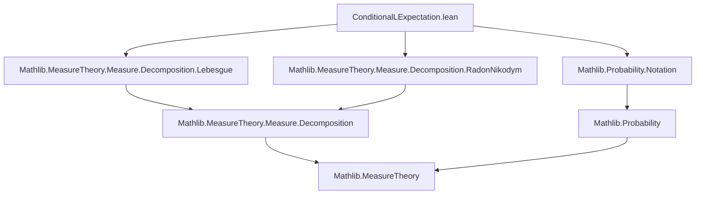
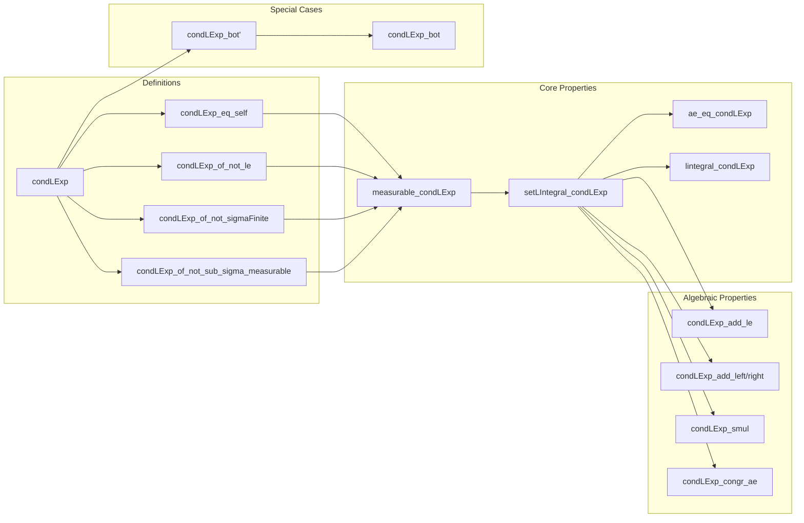

### Technical Brief: `ConditionalLExpectation.lean`

---

#### **1. Key Definitions & Theorems**

| Name | Type / Signature | Purpose |
|------|------------------|---------|
| `condLExp` | `condLExp (mΩ : MeasurableSpace Ω) (P : Measure[mΩ₀] Ω) (X : Ω → ℝ≥0∞) : Ω → ℝ≥0∞` | Defines the conditional Lebesgue expectation $P⁻[X \mid mΩ]$, using Radon–Nikodym derivative when $mΩ ≤ mΩ₀$ and $\sigma$-finiteness holds; otherwise returns `0`. |
| `setLIntegral_condLExp` | `∫⁻ ω in s, P⁻[X|mΩ] ω ∂P = ∫⁻ ω in s, X ω ∂P` | Characterizes conditional expectation via equality of integrals over all $mΩ$-measurable sets $s$. |
| `ae_eq_condLExp` | `Y =ᵐ[P] P⁻[X|mΩ]` under integral equality and $mΩ$-measurability of $Y$ | Uniqueness up to $P$-a.e. equality of conditional expectation. |
| `condLExp_eq_self` | If $X$ is $mΩ$-measurable, then $P⁻[X|mΩ] = X$ | Simplification when $X$ is already measurable w.r.t. the conditioning σ-algebra. |
| `measurable_condLExp` | `Measurable[mΩ] P⁻[X|mΩ]` | Ensures the conditional expectation is $mΩ$-measurable. |
| `condLExp_bot'` | $P⁻[X \mid \bot] = (\omega \mapsto P(\Omega)^{-1} \cdot \int^- X \, dP)$ | Conditional expectation w.r.t. the trivial σ-algebra (constant function equal to the expectation). |
| `condLExp_add_le`, `condLExp_add_left/right`, `condLExp_smul`, `condLExp_smul_le`, `condLExp_smul'` | Inequalities/equalities involving sums and scalar multiples | Basic linearity properties (up to a.e. equality or inequality), foundational for further analysis. |
| `condLExp_congr_ae`, `condLExp_congr_ae_trim` | $X =ᵐ[P] Y \Rightarrow P⁻[X|mΩ] =ᵐ[P] P⁻[Y|mΩ]$ | Stability under almost-everywhere equivalence. |

---

#### **2. Naming Conventions**

- **Prefixes**:
  - `condLExp_`: All definitions and theorems related to conditional Lebesgue expectation.
  - `setLIntegral_`: For integrals over measurable sets.
  - `ae_`: For properties holding almost everywhere.
  - `lintegral_`: For full-space integrals.
- **Suffixes**:
  - `_trim`: When working with the trimmed measure $P \upharpoonright_{mΩ}$.
  - `_le`, `_left`, `_right`: For inequalities or left/right versions of operations.
  - `_eq_self`: When the function is already measurable.
  - `_bot`: Special case for the bottom (trivial) σ-algebra.
- **Notation**:
  - `P⁻[X|mΩ]` is the primary notation for `condLExp mΩ P X`.

---

#### **3. Tactic Stack**

Frequently used tactics in proofs:

| Tactic | Usage |
|--------|-------|
| `by_cases` | To split on whether $mΩ ≤ mΩ₀$, or $\sigma$-finiteness holds. |
| `simp` / `simp_rw` | To simplify definitions (`condLExp`, `setLIntegral_condLExp`, etc.) using hypotheses. |
| `rw` | Rewriting using known equalities (e.g., `setLIntegral_condLExp`, `condLExp_eq_self`). |
| `filter_upwards` | For proving a.e. statements by reducing to pointwise statements on a filter. |
| `measurability` / `fun_prop` | To discharge measurability goals (e.g., `measurable_condLExp`). |
| `grw` | Goal-directed rewriting (from `Mathlib.Tactic.GCongr`). |
| `aesop` | Not explicitly used here, but `grw` and `filter_upwards` cover similar ground. |
| `apply ae_eq_of_forall_setLIntegral_eq_of_sigmaFinite₀` | Core tactic for uniqueness proofs. |

---

#### **4. Proof Logic**

The logical flow of most proofs follows this pattern:

1. **Case analysis** on:
   - Whether $mΩ ≤ mΩ₀$ (`by_cases hm`).
   - Whether $P \upharpoonright_{mΩ}$ is $\sigma$-finite (`by_cases hσ`).
   - Whether $X$ is $mΩ$-measurable (`by_cases hX`).

2. **Simplification** using:
   - `condLExp` definition (via `condLExp_eq_self`, `condLExp_of_not_sub_sigma_measurable`, etc.).
   - Properties of trimmed measures, Radon–Nikodym derivatives, and integrals.

3. **Application of core theorems**:
   - `setLIntegral_condLExp`, `setLIntegral_condLExp_trim`, `lintegral_condLExp`.
   - `ae_eq_condLExp₀`, `ae_eq_condLExp` for uniqueness.

4. **Measurability checks**:
   - `measurable_condLExp`, `measurable_condLExp'`, often via `fun_prop`.

5. **Almost-everywhere arguments**:
   - Use of `ae_le_of_forall_setLIntegral_le_of_sigmaFinite`, `ae_eq_of_forall_setLIntegral_eq_of_sigmaFinite₀`.

6. **Special cases**:
   - Trivial σ-algebra (`condLExp_bot'`), constant functions (`condLExp_const`), etc.

---

#### **5. Imports & Dependencies**

| Import | Role |
|--------|------|
| `Mathlib.MeasureTheory.Measure.Decomposition.Lebesgue` | Provides Lebesgue decomposition and related tools. |
| `Mathlib.MeasureTheory.Measure.Decomposition.RadonNikodym` | Supplies Radon–Nikodym theorem and `rnDeriv`. |
| `Mathlib.Probability.Notation` | Provides probabilistic notation (e.g., `•`, `•`, `∫⁻`, `=ᵐ[P]`). |
| `MeasureTheory`, `ProbabilityTheory`, `Measure` | Core libraries for measure theory and probability. |

---

#### **6. Mermaid Diagrams**

##### **Dependency Graph (Module-Level)**

##### **Overview of Theory Flow**

---

#### **7. Summary**

This module formalizes the **conditional Lebesgue expectation** for $[0,\infty]$-valued functions in Lean 4, building on the Radon–Nikodym theorem and trimmed measures. It defines the object via case analysis (ensuring existence), proves its key properties (measurability, integral characterization, uniqueness up to a.e. equality), and establishes foundational algebraic properties (linearity, monotonicity, scalar multiplication). The design reflects a careful balance between theoretical correctness (via Radon–Nikodym) and practical usability (e.g., junk value `0` when conditions fail, simplifications for measurable inputs). The notation `P⁻[X|mΩ]` is central and well-integrated into Lean’s syntax.

--- 

Let me know if you'd like a formalized dependency graph (e.g., `.lean` file-level), or a summary of the *proof strategy* for a specific theorem (e.g., `setLIntegral_condLExp`).
