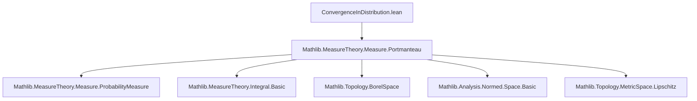
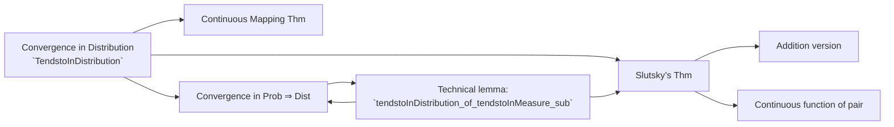

**Technical Brief: `ConvergenceInDistribution.lean`**

---

### 1. **Key Definitions & Theorems**

| Name | Type / Signature | Purpose |
|------|------------------|---------|
| `TendstoInDistribution` | `structure` | Defines convergence in distribution: weak convergence of pushforward probability measures along a filter `l`. |
| `tendstoInDistribution_const` | `lemma` | Constant random variables converge in distribution to themselves. |
| `tendstoInDistribution_of_isEmpty` | `lemma` | Trivial convergence when codomain is empty (subsingleton). |
| `tendstoInDistribution_unique` | `lemma` | Uniqueness of limit in distribution (up to pushforward equality). |
| `TendstoInDistribution.continuous_comp` | `theorem` | **Continuous Mapping Theorem**: continuous image preserves convergence in distribution. |
| `tendstoInDistribution_of_tendstoInMeasure_sub` | `lemma` | Technical tool: if `Xₙ → Z` in distribution and `Yₙ − Xₙ → 0` in probability, then `Yₙ → Z` in distribution. |
| `TendstoInMeasure.tendstoInDistribution_of_aemeasurable` | `lemma` | Convergence in probability + a.e. measurability ⇒ convergence in distribution. |
| `TendstoInMeasure.tendstoInDistribution` | `lemma` | Special case of above without explicit `hZ`. |
| `TendstoInDistribution.prodMk_of_tendstoInMeasure_const` | `theorem` | **Slutsky’s Theorem**: `(Xₙ, Yₙ) → (Z, c)` in distribution if `Xₙ → Z` in distribution and `Yₙ → c` in probability. |
| `TendstoInDistribution.continuous_comp_prodMk_of_tendstoInMeasure_const` | `theorem` | Continuous function of pair `(Xₙ, Yₙ)` converges to function of limit pair. |
| `TendstoInDistribution.add_of_tendstoInMeasure_const` | `lemma` | Sum version of Slutsky: `Xₙ + Yₙ → Z + c` in distribution. |

---

### 2. **Naming Conventions**

- **Prefixes**:
  - `tendstoInDistribution_...`: lemmas about constructing or using `TendstoInDistribution`.
  - `TendstoInDistribution...`: methods on the structure (e.g., `continuous_comp`).
- **Suffixes**:
  - `_of_tendstoInMeasure_const`: assumptions involve convergence in probability to a constant.
  - `_const`: constant limit or argument (e.g., `tendstoInDistribution_const`).
- **Structure name**: `TendstoInDistribution` — follows Mathlib’s `Tendsto*` pattern (e.g., `TendstoInMeasure`, `TendstoUniformlyOn`).

---

### 3. **Tactic Stack**

Frequently used tactics:
- `fun_prop`: to prove almost-everywhere measurability.
- `simp` / `simp_rw`: simplification and rewriting with definitional equalities.
- `rw`: rewriting using subtype/ext, integral/map lemmas.
- `gcongr`: for bounding integrals and inequalities.
- `field_simp`, `ring`, `grw`: arithmetic simplifications.
- `filter_upwards`: for filter-based arguments (especially with `∀ᶠ`).
- `convert`: to align goals via definitional equality or provable equivalences.
- `rcases` / `obtain`: case analysis (e.g., `isEmpty_or_nonempty`).
- `have` / `suffices`: intermediate lemma introduction.
- `aesop`: not explicitly used here, but `fun_prop` and `measurable_*` handle measurability.

---

### 4. **Proof Logic**

- **Structure of proofs**:
  1. **Measurability checks**: `forall_aemeasurable`, `aemeasurable_limit` via `fun_prop`.
  2. **Reduction to integral convergence**: via `tendsto_iff_forall_lipschitz_integral_tendsto` or `tendsto_iff_forall_integral_tendsto`.
  3. **Decomposition**: split integrals over sets where `‖Yₙ − Xₙ‖ < ε/2` and its complement.
  4. **Lipschitz + boundedness**: use Lipschitz constant for small deviations, boundedness for large ones.
  5. **Filter arguments**: use `TendstoInMeasure` assumptions to make measure terms vanish.
  6. **Uniqueness & continuity**: apply continuity of maps to lift convergence.

- **Induction**: not used — proofs are direct, leveraging measure-theoretic convergence criteria.

---

### 5. **Imports & Dependencies**

- **Primary import**:
  ```lean
  import Mathlib.MeasureTheory.Measure.Portmanteau
  ```
  - Provides the **Portmanteau theorem** and related tools for weak convergence of measures.
- **Assumptions used**:
  - `[TopologicalSpace E]`, `[OpensMeasurableSpace E]`, `[BorelSpace E]`, `[SecondCountableTopology E]`, `[SeminormedAddCommGroup E]`
  - `[IsProbabilityMeasure μ]`, `[l.IsCountablyGenerated]`, `[l.NeBot]`
- **Core Mathlib modules implicitly used**:
  - `MeasureTheory.Measure.ProbabilityMeasure`
  - `MeasureTheory.Integral.Basic`, `MeasureTheory.Function.AEMeasurable`
  - `Topology.Basic`, `Metric.Lipschitz`, `Analysis.Normed.Space.Basic`

---

### 6. **Mermaid Diagrams**

#### **Dependency Graph (Module Level)**



#### **Conceptual Overview (Theory Flow)**



#### **Proof Strategy Flow (for `tendstoInDistribution_of_tendstoInMeasure_sub`)**

```mermaid
graph TD
  Start[Given: Xₙ → Z in dist, Yₙ − Xₙ → 0 in prob] --> CheckMeas[Check a.e. measurability]
  CheckMeas --> ReduceToIntegral[Reduce to Lipschitz integrals]
  ReduceToIntegral --> SplitIntegrals[Split over {‖Yₙ−Xₙ‖ < ε/2} and complement]
  SplitIntegrals --> UseLip[Lipschitz bound on small set]
  SplitIntegrals --> UseBnd[Boundedness on large set]
  UseLip --> Combine
  UseBnd --> Combine
  Combine --> UseConvProb[Use `TendstoInMeasure` to kill measure term]
  Combine --> UseConvDist[Use `TendstoInDistribution` on Xₙ]
  UseConvProb --> End[Conclude Yₙ → Z in dist]
  UseConvDist --> End
```

---

### 7. **Domain-Specific AI Agent Notes**

- **Key reasoning patterns**:
  - *Measure-theoretic approximation*: decompose integrals using measurable sets.
  - *Lipschitz + bounded tradeoff*: standard in weak convergence proofs.
  - *Filter-based convergence*: rely on `Tendsto`, `∀ᶠ`, and `IsCountablyGenerated` for sequential arguments.
- **Common lemmas to recall**:
  - `integral_map`, `norm_integral_le_integral_norm`, `tendsto_iff_forall_lipschitz_integral_tendsto`.
- **Critical assumptions**:
  - `IsCountablyGenerated` for equivalence of filter convergence and sequential convergence.
  - `BorelSpace` + `SecondCountableTopology` for regularity and metrizability of weak convergence.

--- 

Let me know if you'd like a formalized dependency graph (e.g., `.lean`-level imports) or a tactic-level proof trace.
