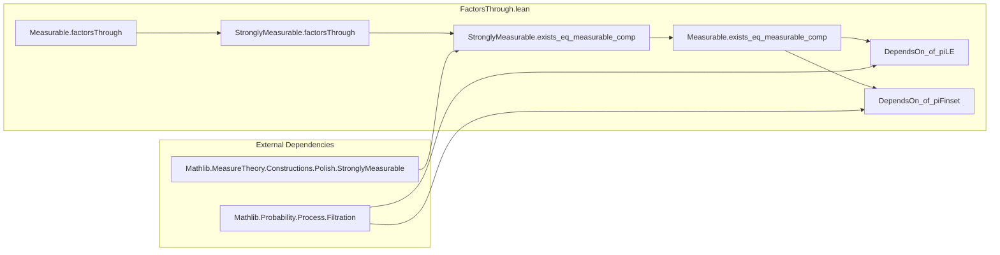

### Technical Brief: `FactorsThrough.lean`

---

#### **1. Key Definitions & Theorems**

| Name | Type / Signature | Purpose |
|------|------------------|---------|
| `FactorsThrough` | `g.FactorsThrough f := ∀ x₁ x₂, f x₁ = f x₂ → g x₁ = g x₂` | Formalizes that `g` is constant on fibers of `f`, i.e., descends to a function on the image of `f`. |
| `_root_.Measurable.factorsThrough` | `[MeasurableSpace Z] [MeasurableSingletonClass Z] → Measurable[mY.comap f] g → g.FactorsThrough f` | Shows that measurable maps w.r.t. pullback σ-algebra factor through `f` *as functions* (no regularity on `h` yet). |
| `StronglyMeasurable.factorsThrough` | `[TopologicalSpace Z] [PseudoMetrizableSpace Z] [T1Space Z] → StronglyMeasurable[mY.comap f] g → g.FactorsThrough f` | Same as above, but for strongly measurable maps (uses `borelize` to reduce to measurable case). |
| `StronglyMeasurable.exists_eq_measurable_comp` | `[Nonempty Z] [IsCompletelyMetrizableSpace Z] → StronglyMeasurable[mY.comap f] g → ∃ h, StronglyMeasurable h ∧ g = h ∘ f` | Doob–Dynkin lemma: existence of a *strongly measurable* factorization `h`. |
| `_root_.Measurable.exists_eq_measurable_comp` | `[Nonempty Z] [StandardBorelSpace Z] → Measurable[mY.comap f] g → ∃ h, Measurable h ∧ g = h ∘ f` | Measurable version of Doob–Dynkin (uses `upgradeStandardBorel` to reduce to completely metrizable case). |
| `_root_.Measurable.dependsOn_of_piLE` | `[MeasurableSpace Z] [MeasurableSingletonClass Z] → Measurable[piLE i] f → DependsOn f (Iic i)` | If `f` is measurable w.r.t. σ-algebra generated by first `≤ i` coordinates, then `f` depends only on those. |
| `StronglyMeasurable.dependsOn_of_piLE` | `[TopologicalSpace Z] [PseudoMetrizableSpace Z] [T1Space Z] → StronglyMeasurable[piLE i] f → DependsOn f (Iic i)` | Strongly measurable version of above. |
| `_root_.Measurable.dependsOn_of_piFinset` | `[MeasurableSpace Z] [MeasurableSingletonClass Z] → Measurable[piFinset s] f → DependsOn f s` | Measurable version for finite coordinate sets. |
| `StronglyMeasurable.dependsOn_of_piFinset` | `[TopologicalSpace Z] [PseudoMetrizableSpace Z] [T1Space Z] → StronglyMeasurable[piFinset s] f → DependsOn f s` | Strongly measurable version for finite sets. |

> **Note**: `dependsOn_iff_factorsThrough` is used implicitly — it equates `DependsOn f s` with `f.FactorsThrough (piFinset s)` or `piLE i`.

---

#### **2. Naming Conventions**

- **Prefixes**:
  - `measurable_`, `stronglyMeasurable_`: for properties of maps.
  - `factorsThrough`: core concept (noun/property).
  - `dependsOn_of_`: for results linking dependence on coordinates to factorization.
- **Suffixes**:
  - `_comp`: indicates existence of a factorization `g = h ∘ f`.
  - `_of_piLE`, `_of_piFinset`: indicates application to σ-algebras generated by coordinate projections.
- **Pattern**:
  - `Measurable.theorem_name` / `StronglyMeasurable.theorem_name` for class-specific lemmas.
  - `_root_.Measurable.theorem_name` for lemmas in the `MeasureTheory` namespace but defined at top level.

---

#### **3. Tactic Stack**

| Tactic | Usage Frequency | Role |
|--------|-----------------|------|
| `borelize` | Medium | Converts topological assumptions to measurable ones (e.g., `PseudoMetrizableSpace Z` → standard Borel). |
| `induction ... using StronglyMeasurable.induction'` | High | Structural induction on strongly measurable functions (const, piecewise, limit). |
| `obtain ⟨...⟩` / `choose` | High | Extract witnesses from existential hypotheses (e.g., representation of strongly measurable functions). |
| `rw`, `simp_all`, `ext` | High | Rewriting, simplification, extensionality (especially in limit case). |
| `exact`, `refine`, `intro` | Medium | Basic proof construction. |
| `piecewise_comp` | Low | Rewriting `piecewise` under composition. |
| `Tendsto.limUnder_eq` | Low | Used in limit case to identify limit under ultrafilter. |

---

#### **4. Proof Logic**

- **General Strategy**:
  1. **Factorization as functional dependence**: Prove `g.FactorsThrough f` first (via `measurableSet_singleton` + preimage properties).
  2. **Constructive factorization**:
     - For *strongly measurable* `g`, use induction on the definition of strong measurability:
       - **Constant case**: trivial.
       - **Piecewise case**: combine factorizations using `piecewise`.
       - **Limit case**: construct `h(y) = lim_{n→∞} h_n(y)` where `h_n` are approximants; use `limUnder` and `StronglyMeasurable.limUnder`.
  3. **Measurable case** (with `StandardBorelSpace Z`):
     - Upgrade to standard Borel (ensures complete metrizability up to isomorphism).
     - Reduce to strongly measurable case via `hg.stronglyMeasurable.exists_eq_measurable_comp`.

- **Key Logical Flow**:
  ```
  Measurable[comap f] g  ⇒  g.FactorsThrough f  ⇒  ∃ h, g = h ∘ f
  (with regularity on h under extra topological assumptions)
  ```

---

#### **5. Imports & Dependencies**

| Module | Role |
|--------|------|
| `Mathlib.MeasureTheory.Constructions.Polish.StronglyMeasurable` | Provides `StronglyMeasurable`, its induction principle, and closure properties. |
| `Mathlib.Probability.Process.Filtration` | Provides `piLE`, `piFinset`, and related σ-algebras for filtrations. |
| `Filter`, `Filtration`, `Set`, `TopologicalSpace` | Used for technical lemmas (e.g., `Tendsto`, `DependsOn`, `piLE`). |
| `Topology` (scoped) | For topological assumptions (`PseudoMetrizableSpace`, `IsCompletelyMetrizableSpace`, etc.). |

---

#### **6. Mermaid Diagrams**

##### **Dependency Graph (Theoretical)**

```mermaid
graph TD
  A[MeasurableSpace] --> B[Pullback σ-algebra mY.comap f]
  B --> C[Measurable[g] g]
  C --> D[g.FactorsThrough f]
  D --> E[∃ h, g = h ∘ f]

  C --> F[StronglyMeasurable[g]]
  F --> G[Topological assumptions on Z]
  G --> H[IsCompletelyMetrizableSpace Z]
  H --> I[Doob-Dynkin Lemma: ∃ h measurable/strongly measurable]

  D --> J[DependsOn f (Iic i) / s]
  K[piLE i, piFinset s] --> C
```

##### **File Overview**



---

#### **7. Theory Context**

- **Main Result**: Doob–Dynkin Lemma in measurable-theoretic form.
- **Scope**: Applies to general measurable spaces, with refinements for Polish/standard Borel targets.
- **Applications**:
  - Filtrations & stochastic processes: shows that `ℱₙ`-measurable r.v.s depend only on first `n` coordinates.
  - Conditional expectation, martingales, and information flow in probability theory.

---

#### **8. Summary**

This file formalizes the foundational idea that *measurability with respect to a pullback σ-algebra implies functional dependence on the base map*, culminating in the Doob–Dynkin lemma. It bridges measure theory and functional dependence, with careful attention to regularity (measurability vs. strong measurability) and topological structure (Polish, standard Borel). The proofs rely on structural induction for strongly measurable functions and standard Borel technology for the measurable case.
