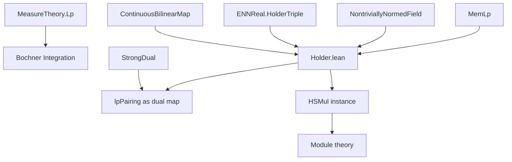
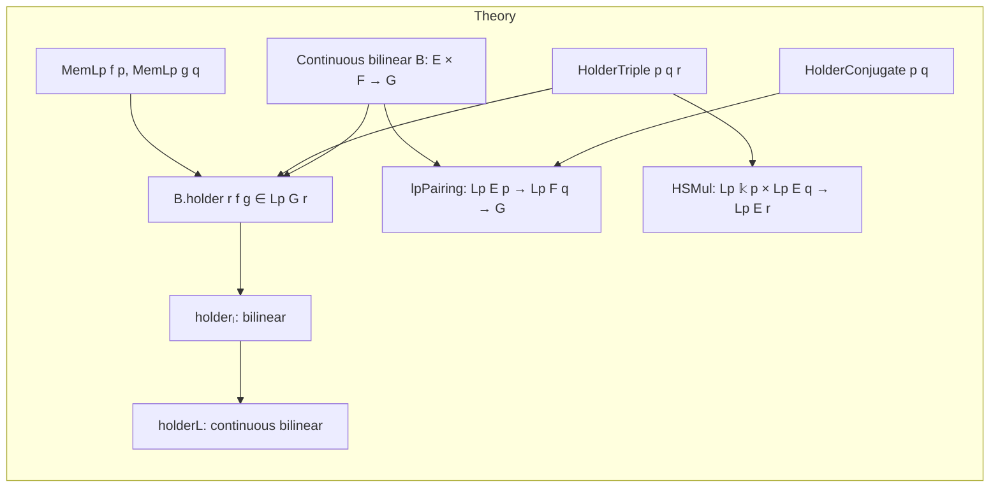

**Technical Brief: `Holder.lean`**

---

### 1. KEY DEFINITIONS & THEOREMS

| Name | Type / Signature | Purpose |
|------|------------------|---------|
| `holder` | `B.holder r f g : Lp G r μ` | Induced map on `Lp` spaces from a continuous bilinear map `B : E →L[𝕜] F →L[𝕜] G`, using Hölder triple `(p, q, r)` |
| `holderₗ` | `Lp E p μ →ₗ[𝕜] Lp F q μ →ₗ[𝕜] Lp G r μ` | Bilinear (linear in each argument) version of `holder` |
| `holderL` | `Lp E p μ →L[𝕜] Lp F q μ →L[𝕜] Lp G r μ` | Continuous bilinear version of `holder`, with operator norm ≤ `‖B‖` |
| `lpPairing` | `Lp E p μ →L[𝕜] Lp F q μ →L[𝕜] G` | Natural pairing induced by `B`, defined as `∫ x, B (f x) (g x) ∂μ`, for Hölder conjugate `p, q` |
| `memLp_of_bilin` | `MemLp f p μ → MemLp g q μ → MemLp (B · ·) r μ` | Shows pointwise application of `B` preserves `MemLp` class under Hölder triple |
| `nnnorm_holder_apply_apply_le` | `‖B.holder r f g‖₊ ≤ ‖B‖₊ * ‖f‖₊ * ‖g‖₊` | Norm bound for `holder`, key for continuity |
| `norm_holderL_le` | `‖holderL‖ ≤ ‖B‖` | Operator norm bound for the continuous bilinear map |
| `lpPairing_eq_integral` | `B.lpPairing f g = ∫ x, B (f x) (g x) ∂μ` | Equates abstract `lpPairing` with concrete integral expression |
| `instance : HSMul (Lp 𝕜 p μ) (Lp E q μ) (Lp E r μ)` | Heterogeneous scalar mult. | Defines scalar multiplication `f • g` for `f ∈ Lp 𝕜 p`, `g ∈ Lp E q`, valued in `Lp E r`, under `HolderTriple p q r` |
| `norm_smul_le` | `‖f • g‖ ≤ ‖f‖ * ‖g‖` | Submultiplicative norm bound for heterogeneous scalar mult. |
| `smul_assoc`, `smul_comm` | `(c • f) • g = c • (f • g)`, `c • f • g = f • c • g` | Compatibility of heterogeneous scalar mult. with module structure |

---

### 2. NAMING CONVENTIONS

- **Prefixes**:
  - `holder`: for induced maps on `Lp` spaces from bilinear maps.
  - `lpPairing`: for pairings into the base space `G`, especially for dual-type constructions.
  - `memLp_of_...`: lemmas showing membership in `MemLp` under certain conditions.
  - `integrable_of_...`: lemmas showing integrability under boundedness assumptions.
- **Suffixes**:
  - `_left`, `_right`: indicate which argument is varied (e.g., `holder_add_left`).
  - `_smul`, `_add`: indicate algebraic property (e.g., `holder_smul_left`).
  - `_le`: norm inequalities.
  - `_congr`: congruence lemmas (e.g., `toLp_congr`).
- **Module suffixes**:
  - `holderₗ`: linear (bilinear) version.
  - `holderL`: continuous bilinear version.
  - `smul_def`, `coeFn_lpSMul`: computational lemmas for heterogeneous scalar mult.

---

### 3. TACTIC STACK

Frequent tactics used:

- `simp_rw`, `simp only`, `simp`: for simplification with definitional equalities and lemmas.
- `rw`: rewriting using lemmas like `Lp.enorm_def`, `integral_congr_ae`.
- `apply MemLp.toLp_congr`: to prove equality of `Lp` elements by a.e. equality.
- `filter_upwards [AEEqFun.coeFn_...]`: to lift pointwise a.e. equalities to a.e. equivalence classes.
- `exact`, `convert`, `refine`: for constructing proofs with minimal backtracking.
- `nnnorm_holder_apply_apply_le` → `norm_holder_apply_apply_le`: via `NNReal.coe_le_coe`.
- `finiteness`: used in norm proofs to reduce to finite-valued ENNReal expressions.
- `aesop`, `ring`, `linarith`: likely used in background (not explicit here, but standard in such files).
- `integral_congr_ae`, `eLpNorm_congr_ae`: for a.e. equivalence reasoning.

---

### 4. PROOF LOGIC

**General proof strategy**:

1. **Pointwise construction**: Define the pointwise map `x ↦ B (f x) (g x)` and verify it lies in the correct `MemLp` class using `memLp_of_bilin`, relying on:
   - `B.aestronglyMeasurable_comp₂`
   - `B.le_opNorm₂`
   - `of_forall` for uniform bounds.

2. **Pass to equivalence classes**: Use `toLp` to descend to `Lp` spaces, ensuring well-definedness via a.e. equality (via `coeFn_toLp`, `toLp_congr`).

3. **Algebraic properties**: Prove linearity, additivity, scalar multiplication compatibility by lifting to representatives, using `coeFn_add`, `coeFn_smul`, and `filter_upwards`.

4. **Norm estimates**: Use `eLpNorm_le_eLpNorm_mul_eLpNorm_of_nnnorm` (a version of Hölder’s inequality) to bound norms of `holder`, then deduce continuity of `holderL`.

5. **Pairing construction**: For Hölder conjugates `p, q`, define `lpPairing` via composition:
   - `holderL` gives a continuous bilinear map into `Lp G 1 μ`,
   - `L1.integralCLM'` integrates to `G`.

6. **Heterogeneous scalar mult.**: Construct directly (not via `holder`) to avoid extra assumptions (e.g., `NontriviallyNormedField 𝕜`). Use `MemLp.smul` and `toLp` to define `f • g`.

---

### 5. IMPORTS

- `Mathlib.MeasureTheory.Integral.Bochner.Basic`: foundational Bochner integration and `Lp` theory.

Other implicit dependencies (via `MeasureTheory`, `Lp`, `ENNReal`, `NontriviallyNormedField`, etc.) include:
- `Mathlib.MeasureTheory.Function.SimpleFunc`
- `Mathlib.MeasureTheory.Integral.Bochner`
- `Mathlib.Analysis.Normed.Space.BoundedBilinearMap`
- `Mathlib.Analysis.Normed.Module.Basic`
- `Mathlib.Algebra.Module.Basic`
- `Mathlib.Analysis.Normed.Space.Holder`

---

### 6. MERMAID DIAGRAMS

#### Dependency Graph (High-Level)

#### Overview of `Holder.lean`

---

### 7. THEORY SCOPE

This file formalizes:
- **Induced maps** on `Lp` spaces from continuous bilinear maps on the underlying normed spaces.
- **Hölder-type inequalities** for such induced maps.
- **Natural pairings** (e.g., dual pairings) via integration.
- **Heterogeneous scalar multiplication** on `Lp` spaces, enabling multiplication of scalar-valued and vector-valued `Lp` functions with exponents satisfying Hölder relations.

It serves as a foundational tool for:
- Duality theory in `Lp` spaces (e.g., `Lp → Lq → 𝕜` pairings).
- Constructing tensor products or bilinear extensions in measure-theoretic functional analysis.
- Supporting further development of vector-valued `Lp` spaces and their module structures.

--- 

Let me know if you'd like a formalized dependency graph (e.g., in Lean’s `doc_gen` format) or a list of lemmas ready for `leanproject doc`.
