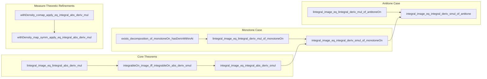

### Technical Brief: `JacobianOneDim.lean`

---

#### **1. Key Definitions & Theorems**

| Name | Type / Signature | Purpose |
|------|------------------|---------|
| `lintegral_image_eq_lintegral_abs_deriv_mul` | `MeasurableSet s → (∀ x ∈ s, HasDerivWithinAt f (f' x) s x) → InjOn f s → (ℝ → ℝ≥0∞) → ∫⁻ x in f '' s, g x = ∫⁻ x in s, ENNReal.ofReal (|f' x|) * g (f x)` | General change-of-variables for nonnegative measurable functions under injective differentiable maps on measurable sets. Replaces determinant with absolute derivative. |
| `integrableOn_image_iff_integrableOn_abs_deriv_smul` | Same hypotheses as above, but for $g : \mathbb{R} \to F$ | Equivalence of integrability on image vs. weighted pullback. |
| `integral_image_eq_integral_abs_deriv_smul` | Same hypotheses, Bochner integral version | Equality of integrals: $\int_{f(s)} g = \int_s |f'| \cdot g \circ f$. |
| `exists_decomposition_of_monotoneOn_hasDerivWithinAt` | `MeasurableSet s → MonotoneOn f s → (∀ x ∈ s, HasDerivWithinAt f (f' x) s x) → ∃ a b c, ...` | Structural decomposition of monotone differentiable functions into countable isolated points (`a`), flat parts (`b`, where $f' = 0$), and injective parts (`c`, where $f' \ge 0$). |
| `lintegral_image_eq_lintegral_deriv_mul_of_monotoneOn` | Monotone + differentiable + measurable set → $\int_{f(s)} u = \int_s f' \cdot u \circ f$ | Simplified change-of-variables for monotone functions: no absolute value needed since $f' \ge 0$ a.e. on injective part. |
| `lintegral_deriv_eq_volume_image_of_monotoneOn` | Same hypotheses, $u = 1$ | Volume of image = integral of derivative: $\mathrm{vol}(f(s)) = \int_s f'$. |
| `integrableOn_image_iff_integrableOn_deriv_smul_of_monotoneOn` | Same as above, integrability equivalence. |
| `integral_image_eq_integral_deriv_smul_of_monotoneOn` | Same, Bochner integral version. |
| `lintegral_image_eq_lintegral_deriv_mul_of_antitoneOn` | Antitone version: $\int_{f(s)} u = \int_s (-f') \cdot u \circ f$ | Handles decreasing functions via sign flip. |
| `lintegral_deriv_eq_volume_image_of_antitoneOn` | Antitone volume formula: $\mathrm{vol}(f(s)) = \int_s -f'$. |
| `integrableOn_image_iff_integrableOn_deriv_smul_of_antitoneOn` | Antitone integrability criterion. |
| `integral_image_eq_integral_deriv_smul_of_antitone` | Antitone Bochner integral formula. |
| `MeasurableEmbedding.withDensity_ofReal_comap_apply_eq_integral_abs_deriv_mul` | For measurable embeddings $f$, $\nu \circ f^{-1}(s) = \int_s |f'| \cdot g \circ f$ where $\nu = \mathrm{vol} \llcorner g$ | Change-of-variables for weighted pushforward/comap measures. |
| `MeasurableEquiv.withDensity_ofReal_map_symm_apply_eq_integral_abs_deriv_mul` | Same for measurable equivalences. |
| `MeasurableEmbedding.withDensity_ofReal_comap_apply_eq_integral_abs_deriv_mul'` | Global differentiability version (HasDerivAt everywhere). |
| `MeasurableEquiv.withDensity_ofReal_map_symm_apply_eq_integral_abs_deriv_mul'` | Same for measurable equivalences with global differentiability. |

---

#### **2. Naming Conventions**

- **Prefixes**:
  - `lintegral_...`: Lebesgue integral (extended nonnegative reals).
  - `integral_...`: Bochner integral (Banach-space-valued).
  - `integrableOn_...`: Integrability criteria.
  - `withDensity_...`: Measures defined via densities.
- **Suffixes**:
  - `_of_monotoneOn`, `_of_antitoneOn`: Special cases for monotone/antitone functions.
  - `_image_eq_integral_...`: Change-of-variables statements.
  - `_deriv_smul`, `_abs_deriv_smul`: Weighting by derivative or its absolute value.
  - `_mul`: Multiplication form (scalar-valued integrands).
- **Helper names**:
  - `exists_decomposition_of_...`: Structural decomposition lemmas.
  - `hasDerivWithinAt`, `HasDerivAt`: Local differentiability assumptions.

---

#### **3. Tactic Stack**

- **Core tactics**:
  - `simpa only [...] using ...`: Simplify using lemmas and rewrite rules (especially `det_toSpanSingleton`).
  - `rw [...]`: Rewriting with equalities (e.g., image unions, decompositions).
  - `convert ... using n`: Partial unification with manual subgoals.
  - `simp only [...]`: Simplification with precise lemmas.
  - `apply ...`: Direct application of lemmas.
  - `exact ...`: Immediate proof completion.
- **Measure-theoretic helpers**:
  - `setLIntegral_congr`, `setIntegral_congr`, `integrableOn_congr`: Equality via a.e. equivalence.
  - `ae_eq_empty.mpr`, `measure_zero`: Handling null sets.
  - `biUnion`, `union_ae_eq_right_of_ae_eq_empty`: Managing countable unions and null sets.
- **Analysis-specific**:
  - `hasDerivWithinAt_const`, `hasDerivWithinAt_neg`: Derivative of constant/negation.
  - `nonneg_of_monotoneOn`: Monotonicity implies nonnegative derivative.
  - `UniqueDiffWithinAt.eq_deriv`: Uniqueness of derivative in 1D.
  - `ordConnected_singleton.preimage_monotoneOn`: Preimage of singleton under monotone function is interval.

---

#### **4. Proof Logic**

- **General pattern**:
  1. Reduce to known higher-dimensional theorem (e.g., `lintegral_image_eq_lintegral_abs_det_fderiv_mul`) using `det_toSpanSingleton`.
  2. For monotone/antitone cases:
     - Decompose domain via `exists_decomposition_of_monotoneOn_hasDerivWithinAt`.
     - Show contributions from `a` (isolated points) and `b` (flat parts) vanish (countable or $f' = 0$).
     - Reduce to injective part `c`, where derivative is nonnegative (or nonpositive), and apply injective case.
  3. Use measure-theoretic tools (`ae_eq`, `measure_zero`, `integrableOn_congr`) to handle null sets.
  4. For `withDensity` lemmas, reduce to general pushforward/comap formulas and simplify using `det_toSpanSingleton`.

- **Induction/Case analysis**:
  - Not induction-based; instead, case analysis on order (`lt_or_gt_of_ne`, `lt_or_le`) and decomposition sets (`a`, `b`, `c`).
  - Use `wlog` (without loss of generality) for symmetric cases.

---

#### **5. Imports & Dependencies**

- **Core imports**:
  ```lean
  Mathlib.Analysis.Calculus.Deriv.Slope
  Mathlib.MeasureTheory.Function.Jacobian
  ```
- **Key modules used**:
  - `MeasureTheory.Measure`: Volume measure, pushforward/comap, densities.
  - `MeasureTheory.Function.Jacobian`: General Jacobian change-of-variables.
  - `Mathlib.Analysis.Calculus.Deriv.Slope`: Derivative existence and properties (`HasDerivWithinAt`, `HasFDerivWithinAt`).
  - `Mathlib.TopologicalSpace.Basic`: Neighborhoods, isolated points, `nhdsWithin`.
  - `Mathlib.Order.Filter.Basic`: `Filter`, `ae`, `measurableSet`.
  - `Mathlib.MeasureTheory.Integral.Integral`: Bochner integral, integrability.
  - `Mathlib.MeasureTheory.Function.SimpleFunc`: For measure-theoretic constructions.

---

#### **6. Mermaid Diagrams**

##### **Dependency Graph (High-Level)**

```mermaid
graph TD
  A[JacobianOneDim.lean] --> B[Mathlib.Analysis.Calculus.Deriv.Slope]
  A --> C[Mathlib.MeasureTheory.Function.Jacobian]
  B --> D[Mathlib.Analysis.Calculus.Deriv.Basic]
  B --> E[Mathlib.Analysis.Calculus.FDeriv.Basic]
  C --> F[Mathlib.MeasureTheory.Measure.Pushforward]
  C --> G[Mathlib.MeasureTheory.Integral.Integral]
  C --> H[Mathlib.MeasureTheory.Function.MeasurableSpace]
  A --> I[Mathlib.MeasureTheory.IntervalIntegral.IntegrationByParts] % used for non-monotone case
```

##### **Overview of File Structure**



##### **Decomposition Lemma Logic Flow**

```mermaid
flowchart LR
  A[Monotone f on s] --> B[Decompose s = a ∪ b ∪ c]
  B --> C[a: isolated points (countable)]
  B --> D[b: f constant on components (f' = 0)]
  B --> E[c: injective, f' ≥ 0]
  C --> F[∫_a = 0]
  D --> G[∫_b = 0]
  E --> H[Apply injective case on c]
  F & G & H --> I[Full integral = ∫_c]
```

---

#### **7. Summary**

This file formalizes **one-dimensional change-of-variables formulas** for Lebesgue, Bochner, and weighted integrals. It leverages the general Jacobian theorem from `Mathlib.MeasureTheory.Function.Jacobian`, simplifying the determinant to the absolute value of the derivative in 1D. Key innovations include:

- Handling **monotone/antitone** functions without injectivity assumptions (by decomposing into negligible and injective parts).
- Providing **equivalence and equality** versions for integrability and integration.
- Supporting **measurable embeddings and equivalences** with density transformations.

The proofs are highly structured, relying on measure-theoretic null-set arguments and decomposition lemmas, avoiding heavy induction in favor of case analysis and structural decomposition.

--- 

Let me know if you'd like a formalized dependency graph in `leanpkg` format or a summary of related files (e.g., `IntervalIntegral/IntegrationByParts.lean`).
