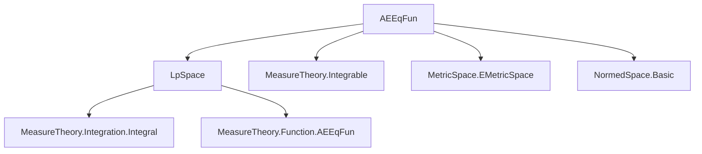
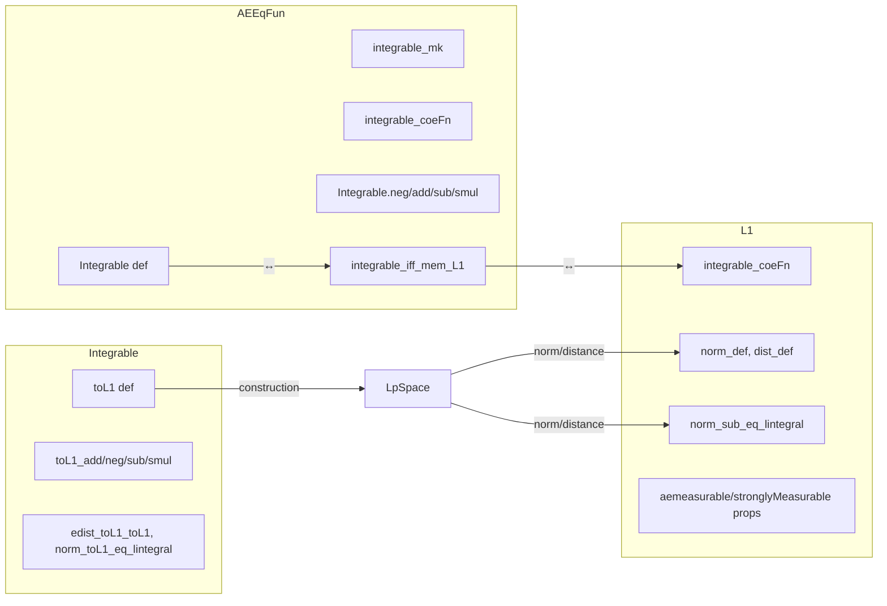

### Technical Brief: `AEEqFun.lean` — `L¹` Space API in Lean 4

---

#### **1. Key Definitions & Theorems**

| Name | Type / Signature | Purpose |
|------|------------------|---------|
| `Integrable` | `def Integrable (f : α →ₘ[μ] ε) : Prop` | Defines integrability for an equivalence class of a.e. equal functions via its representative. |
| `integrable_mk` | `theorem integrable_mk {f : α → ε} (hf : AEStronglyMeasurable f μ)` | Relates integrability of `mk f hf` to integrability of `f`. |
| `integrable_coeFn` | `theorem integrable_coeFn {f : α →ₘ[μ] ε}` | Equates integrability of an `AEEqFun` and its canonical representative. |
| `integrable_zero` | `theorem integrable_zero` | Zero function is integrable. |
| `Integrable.neg` | `theorem Integrable.neg {f : α →ₘ[μ] β}` | Closed under negation. |
| `Integrable.add` | `theorem Integrable.add {f g : α →ₘ[μ] β}` | Closed under addition. |
| `Integrable.sub` | `theorem Integrable.sub {f g : α →ₘ[μ] β}` | Closed under subtraction. |
| `Integrable.smul` | `theorem Integrable.smul {c : 𝕜} {f : α →ₘ[μ] β}` | Closed under scalar multiplication (requires `IsBoundedSMul`). |
| `integrable_iff_mem_L1` | `theorem integrable_iff_mem_L1 {f : α →ₘ[μ] β}` | Connects integrability with membership in `L¹` space: `f ∈ (α →₁[μ] β)`. |
| `L1.integrable_coeFn` | `theorem integrable_coeFn (f : α →₁[μ] β)` | Every `L¹` function (as element of `Lp β 1 μ`) is integrable. |
| `L1.norm_def` | `theorem norm_def (f : α →₁[μ] β)` | Norm in `L¹` is the `toReal` of the extended norm integral. |
| `L1.norm_sub_eq_lintegral` | `theorem norm_sub_eq_lintegral (f g : α →₁[μ] β)` | Computes norm of difference using a.e.-equal pointwise difference. |
| `Integrable.toL1` | `def toL1 (f : α → β) (hf : Integrable f μ)` | Maps an integrable function to its equivalence class in `L¹`. |
| `Integrable.toL1_add`, `toL1_neg`, `toL1_sub`, `toL1_smul` | `theorem`s | `toL1` preserves algebraic structure (addition, negation, subtraction, scalar mult). |
| `Integrable.edist_toL1_toL1` | `theorem` | Distance between `toL1` images equals integral of pointwise `edist`. |
| `Integrable.norm_toL1_eq_lintegral_norm` | `theorem` | Norm of `toL1 f` equals `toReal` of integral of pointwise norm. |

---

#### **2. Naming Conventions**

- **Prefixes**:
  - `integrable_`: properties about integrability of functions or equivalence classes.
  - `toL1_`: constructions and properties of the map from integrable functions to `L¹`.
  - `coeFn_`: properties of the canonical representative (`coeFn`) of an `AEEqFun`.
  - `aestronglyMeasurable_`, `aemeasurable_`, `stronglyMeasurable_`, `measurable_`: measurability properties of `L¹` representatives.

- **Suffixes**:
  - `_def`: definitions of metric/norm/distance in terms of integrals.
  - `_eq_lintegral`: norm/distance expressed as `toReal` of a `lintegral`.
  - `_aeeqFun`: properties specific to the `AEEqFun` representation.

- **Notation**:
  - `α →₁[μ] β`: `L¹` space (typed `\1`).
  - `α →ₘ[μ] β`: space of a.e. equivalence classes (`AEEqFun`).
  - `[f]` or `f` (when contextually clear): element of `L¹`.

---

#### **3. Tactic Stack**

- **Core tactics**:
  - `simp`, `rw`, `congr`, `apply`, `refine`, `induction_on`, `induction_on₂`
  - `filter_upwards` (for almost-everywhere arguments)
  - `aesop` (implicit in `simp`-based automation)
  - `lintegral_congr_ae`, `integrable_congr` (measure-theoretic congruences)

- **Specialized lemmas**:
  - `edist_def`, `dist_def`, `norm_def`, `lintegral_congr_ae`, `memLp_one_iff_integrable`, `Lp.coeFn_sub`, `AEEqFun.coeFn_mk`

---

#### **4. Proof Logic**

- **Induction on equivalence classes**:
  - Many theorems about `AEEqFun` or `L¹` elements are proven by `induction_on`, reducing to representatives.
  - E.g., `Integrable.add`, `Integrable.neg`, `Integrable.smul`.

- **Almost-everywhere reasoning**:
  - `filter_upwards [h] with _ ha` + `simp only [ha, ...]` used to handle pointwise equalities a.e.

- **Integral-based norm/distance computations**:
  - Use `lintegral_congr_ae` to replace integrands with a.e.-equal ones.
  - `edist_def`, `norm_def`, `norm_sub_eq_lintegral`, etc., rely on simplifying definitions via `Lp.*` lemmas.

- **Equivalence with `Lp` theory**:
  - `memLp_one_iff_integrable`, `Lp.memLp`, `Lp.norm_toLp`, `Lp.edist_toLp_toLp` are heavily used to bridge `AEEqFun` and `Lp`.

---

#### **5. Imports & Dependencies**

- **Core imports**:
  ```lean
  import Mathlib.MeasureTheory.Function.L1Space.Integrable
  ```
- **Key external theories used**:
  - `MeasureTheory.Function.AEEqFun` (implicit via `→ₘ[μ]`)
  - `MeasureTheory.Function.LpSpace` (via `Lp`, `memLp_one_iff_integrable`, `Lp.norm_toLp`, etc.)
  - `MeasureTheory.Integration.Integral` (via `Integrable`, `HasFiniteIntegral`)
  - `Topology.MetricSpace.EMetricSpace` (via `edist`, `edist_def`)
  - `Analysis.NormedSpace.Basic` (via `NormedAddCommGroup`, `IsBoundedSMul`)
  - `MeasureTheory.Measure.ENNRealValued` (via `lintegral`, `ENNReal`)

---

#### **6. Mermaid Diagrams**

##### **Dependency Graph (Module-Level)**



##### **Overview of File Structure**



##### **Conceptual Flow**

1. **Start** with integrable *representatives* (`α → β`) and define integrability on equivalence classes (`AEEqFun`).
2. **Show closure** under vector space operations (add, neg, smul).
3. **Connect** integrability on `AEEqFun` to membership in `L¹` (`α →₁[μ] β`).
4. **Lift** to `L¹` (as `Lp β 1 μ`) and prove metric/norm formulas.
5. **Construct** canonical map `toL1` from integrable functions to `L¹`, preserving algebraic structure.

---

#### **7. Summary**

This file formalizes the foundational API for the `L¹` space of equivalence classes of integrable functions. It bridges:
- **Pointwise integrability** (via `Integrable f μ`),
- **Equivalence classes** (via `AEEqFun` and `mk`),
- **`Lp` theory** (via `memLp_one_iff_integrable`, `Lp` norms/distances),
- **Metric properties** (via `edist`, `dist`, `norm` formulas).

The design emphasizes *representative independence* and *a.e. reasoning*, with heavy use of `induction_on` and `lintegral_congr_ae`. The `toL1` map provides the crucial link from concrete integrable functions to abstract `L¹` elements.

--- 

Let me know if you'd like a dependency graph for `Lp` theory or a formalization roadmap for extending this to `L^p` for general `p`.
