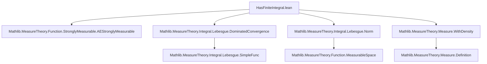
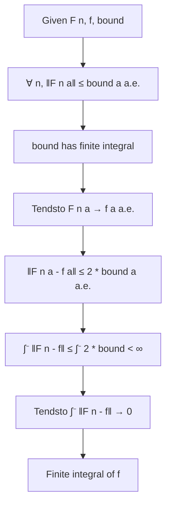

### Technical Brief: `HasFiniteIntegral` in Lean 4 (Mathlib)

---

#### **1. Key Definitions & Theorems**

| Name | Type / Signature | Purpose |
|------|------------------|---------|
| `HasFiniteIntegral` | `def HasFiniteIntegral (f : α → ε) (μ : Measure α) : Prop` | Predicate asserting that the extended-nonnegative integral of the *enorm* of `f` is finite: $ \int^- a, \|f(a)\|_e \, d\mu < \infty $. |
| `hasFiniteIntegral_def` | `↔ (∫⁻ a, ‖f a‖ₑ ∂μ < ∞)` | Definition equivalence. |
| `hasFiniteIntegral_iff_enorm` | `↔ ∫⁻ a, ‖f a‖ₑ ∂μ < ∞` | Simplified form using `enorm`. |
| `hasFiniteIntegral_iff_norm` | `↔ ∫⁻ a, ENNReal.ofReal ‖f a‖ ∂μ < ∞` | Equivalent formulation using standard norm (for `β : NormedAddCommGroup`). |
| `hasFiniteIntegral_iff_edist` | `↔ ∫⁻ a, edist (f a) 0 ∂μ < ∞` | Uses distance to zero (for `β : NormedAddCommGroup`). |
| `lintegral_enorm_eq_lintegral_edist` | `∫⁻ a, ‖f a‖ₑ ∂μ = ∫⁻ a, edist (f a) 0 ∂μ` | Equivalence of `enorm` and `edist` integrals. |
| `lintegral_norm_eq_lintegral_edist` | `∫⁻ a, ENNReal.ofReal ‖f a‖ ∂μ = ∫⁻ a, edist (f a) 0 ∂μ` | Connects norm, `ofReal`, and `edist`. |
| `HasFiniteIntegral.mono` | `∀ᵐ a ∂μ, ‖f a‖ ≤ ‖g a‖ → HasFiniteIntegral g μ → HasFiniteIntegral f μ` | Monotonicity under a.e. norm bound. |
| `HasFiniteIntegral.congr` | `f =ᵐ[μ] g → HasFiniteIntegral f μ → HasFiniteIntegral g μ` | Congruence under a.e. equality. |
| `hasFiniteIntegral_const_iff` | `HasFiniteIntegral (λ _, c) μ ↔ c = 0 ∨ IsFiniteMeasure μ` | When constant functions have finite integral. |
| `HasFiniteIntegral.of_bounded` | `∀ᵐ a ∂μ, ‖f a‖ ≤ C → IsFiniteMeasure μ → HasFiniteIntegral f μ` | Bounded functions on finite measure spaces have finite integral. |
| `HasFiniteIntegral.of_finite` | `[Finite α] → [IsFiniteMeasure μ] → HasFiniteIntegral f μ` | Functions on finite domains have finite integral. |
| `hasFiniteIntegral_add_measure` | `HasFiniteIntegral f (μ + ν) ↔ HasFiniteIntegral f μ ∧ HasFiniteIntegral f ν` | Additivity over measures. |
| `hasFiniteIntegral_smul_measure` | `c ≠ ∞ → HasFiniteIntegral f μ → HasFiniteIntegral f (c • μ)` | Scaling measure preserves finiteness. |
| `HasFiniteIntegral.smul` | `HasFiniteIntegral f μ → HasFiniteIntegral (c • f) μ` | Scalar multiplication preserves finiteness. |
| `hasFiniteIntegral_of_dominated_convergence` | Dominated convergence for finiteness: if `‖F n a‖ ≤ bound a` and `bound` has finite integral, then limit `f` does too. |
| `tendsto_lintegral_norm_of_dominated_convergence` | Under domination, integrals of `‖F n - f‖` tend to 0. |
| `hasFiniteIntegral_count_iff` | `HasFiniteIntegral f Measure.count ↔ Summable (‖f ·‖)` | For counting measure, finite integral ⇔ summable norm. |

---

#### **2. Naming Conventions**

- **Predicates**: `HasFiniteIntegral`, `isFiniteMeasure`, `Summable`
- **Constants & trivial cases**:
  - `hasFiniteIntegral_zero`, `hasFiniteIntegral_const`, `hasFiniteIntegral_neg_iff`
- **Monotonicity/congruence**:
  - `mono`, `mono'`, `mono_enorm`, `mono'_enorm`
  - `congr`, `congr'`, `congr'_enorm`
- **Equivalence lemmas**:
  - `hasFiniteIntegral_iff_*` (e.g., `norm`, `edist`, `ofReal`, `ofNNReal`)
- **Special cases**:
  - `of_bounded`, `of_bounded_enorm`, `of_finite`, `of_subsingleton`, `of_mem_Icc`
- **Measure operations**:
  - `add_measure`, `left_of_add_measure`, `right_of_add_measure`, `smul_measure`, `restrict`
- **Function operations**:
  - `neg`, `enorm`, `norm`, `max_zero`, `min_zero`, `smul`, `const_mul`, `mul_const`
- **Dominated convergence**:
  - `hasFiniteIntegral_of_dominated_convergence`, `tendsto_lintegral_norm_of_dominated_convergence`

Prefixes/suffixes:
- `hasFiniteIntegral_*`: lemmas about the predicate itself.
- `HasFiniteIntegral.*`: methods/instances (e.g., `mono`, `smul`).
- `*_enorm`: versions using `enorm` (for general `ε : ENorm`).
- `*_norm`: versions using standard norm (for `β : NormedAddCommGroup`).

---

#### **3. Tactic Stack**

Frequently used tactics:
- `simp` / `simp only` / `simp_rw`: for unfolding definitions and rewriting.
- `filter_upwards`: for handling almost-everywhere statements.
- `lintegral_mono`, `lintegral_mono_ae`: monotonicity of ∫⁻.
- `calc`: chaining inequalities.
- `exact`, `refine`, `apply`: for direct proof steps.
- `rw`, `convert`: rewriting and congruence.
- `finiteness`, `volume_tac`: custom tactics (likely from `MeasureTheory` infrastructure).
- `aesop`, `ring`, `linarith`: for algebraic simplifications (implied by usage of `calc`, `add_lt_top`, etc.).

---

#### **4. Proof Logic**

- **Structure**: Most proofs follow a pattern:
  1. Unfold `HasFiniteIntegral` via `hasFiniteIntegral_iff_*`.
  2. Apply monotonicity (`lintegral_mono_ae`) or congruence (`lintegral_congr_ae`) to reduce to known bounds.
  3. Use properties of `ENNReal` (e.g., `mul_lt_top`, `add_lt_top`, `lt_top_iff_ne_top`) to conclude finiteness.
- **Dominated convergence proofs**:
  - Show pointwise a.e. convergence of norms/enorms.
  - Use triangle inequality to bound `‖F n - f‖` by `2 * bound`.
  - Apply `tendsto_lintegral_of_dominated_convergence'` (a version of dominated convergence for ∫⁻).
- **Congruence/monotonicity**: Use `EventuallyEq`, `ae_of_all`, `ae_all_iff`, and `le_of_tendsto'` to pass from pointwise to a.e. statements.

---

#### **5. Imports & Dependencies**

Core imports defining scope:
```lean
Mathlib.MeasureTheory.Function.StronglyMeasurable.AEStronglyMeasurable
Mathlib.MeasureTheory.Integral.Lebesgue.DominatedConvergence
Mathlib.MeasureTheory.Integral.Lebesgue.Norm
Mathlib.MeasureTheory.Measure.WithDensity
```

Key dependencies:
- `ENNReal`, `NNReal`, `edist`, `enorm`, `aemeasurable`, `aestring`, `Measure.withDensity`
- `AEStronglyMeasurable`, `tendsto`, `lintegral`, `Measure.restrict`, `Measure.count`
- `NormedAddCommGroup`, `ENorm`, `ESeminormedAddMonoid`, `SMul`, `IsBoundedSMul`

---

#### **6. Mermaid Diagrams**

##### **Dependency Graph (Module-Level)**



##### **Conceptual Overview of `HasFiniteIntegral` Theory**

```mermaid
flowchart LR
  subgraph Definitions
    A[HasFiniteIntegral f μ] -->|def| B[∫⁻ ‖f‖ₑ < ∞]
  end

  subgraph Equivalences
    B --> C[∫⁻ edist (f 0) < ∞]
    B --> D[∫⁻ ofReal ‖f‖ < ∞]
  end

  subgraph Closure Properties
    A --> E[Monotonicity]
    A --> F[Congruence]
    A --> G[Additivity over measures]
    A --> H[Scalar multiplication]
    A --> I[Bounded on finite measure]
  end

  subgraph Applications
    E --> J[Dominated Convergence]
    H --> K[L¹ space construction]
    I --> L[Counting measure ↔ summability]
  end

  style A fill:#f9f,stroke:#333
  style J fill:#bbf,stroke:#333
```

##### **Proof Strategy Flow (Dominated Convergence)**



---

#### **7. Summary**

This module formalizes the foundational theory of functions with finite integral in a general measure-theoretic setting. It introduces `HasFiniteIntegral`, a predicate central to defining integrability (`Integrable`) and constructing $L^1$ spaces. The theory is built around:
- Equivalences between norms, `enorm`, and `edist` integrals.
- Closure properties under monotonicity, congruence, scalar multiplication, and measure operations.
- A dominated convergence theorem for finiteness (a precursor to full $L^1$ convergence).
- Special cases for counting measure (linking to summability) and finite domains.

It serves as a critical stepping stone for $L^p$ theory, Radon–Nikodym, and stochastic integration in Mathlib.

--- 

Let me know if you'd like a formalized dependency graph (e.g., `.dot`), or a summary of how `Integrable` builds on this.
