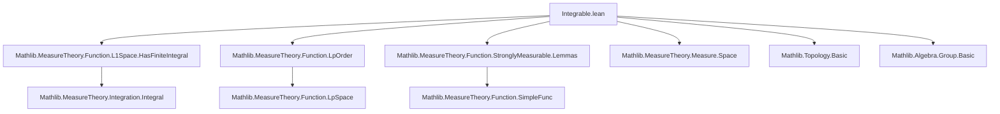
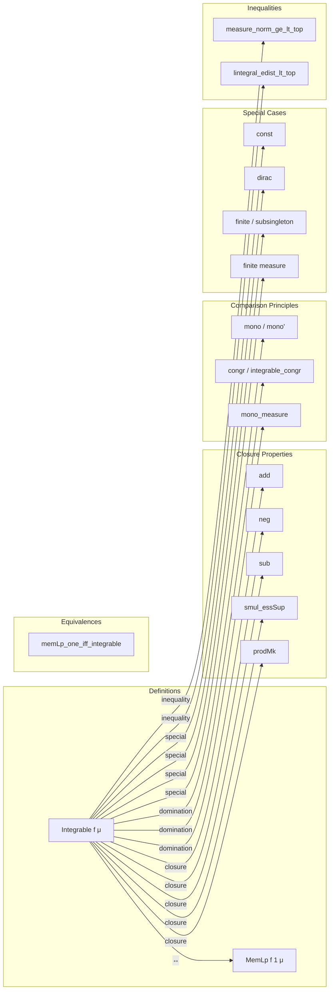

Here is the structured technical brief for the `Integrable.lean` file:

---

### **1. Key Definitions & Theorems**

| Name | Type | Purpose |
|------|------|---------|
| `Integrable f μ` | `Prop` | Predicate meaning `f` is `AEStronglyMeasurable` and `HasFiniteIntegral f μ`. |
| `memLp_one_iff_integrable` | `MemLp f 1 μ ↔ Integrable f μ` | Equivalence between `MemLp` at exponent `1` and `Integrable`. |
| `Integrable.aestronglyMeasurable` | `Integrable f μ → AEStronglyMeasurable f μ` | Extracts measurability from integrability. |
| `Integrable.hasFiniteIntegral` | `Integrable f μ → HasFiniteIntegral f μ` | Extracts finite integral property. |
| `Integrable.mono` / `Integrable.mono'` | Comparison lemmas | If `f` is dominated a.e. by an integrable `g`, then `f` is integrable. |
| `Integrable.congr` / `integrable_congr` | `f =ᵐ[μ] g ⇒ Integrable f ↔ Integrable g` | Integrability is invariant under almost-everywhere equality. |
| `integrable_const_iff` | `Integrable (const c) μ ↔ c = 0 ∨ IsFiniteMeasure μ` | Characterizes when constant functions are integrable. |
| `Integrable.add` | `Integrable f μ → Integrable g μ → Integrable (f + g) μ` | Closure under addition (requires `ContinuousAdd`). |
| `Integrable.neg` | `Integrable f μ → Integrable (-f) μ` | Closure under negation. |
| `Integrable.sub` | `Integrable f μ → Integrable g μ → Integrable (f - g) μ` | Closure under subtraction. |
| `Integrable.smul_essSup` / `Integrable.essSup_smul` | Hölder-type inequalities | Scalar multiplication with essentially bounded scalar function preserves integrability. |
| `integrable_enorm_iff` / `integrable_norm_iff` | `Integrable ‖f‖ₑ ↔ Integrable f` (under `AEStronglyMeasurable f`) | Equivalence of integrability of `f` and its (essential) norm. |
| `Integrable.measure_norm_ge_lt_top` | `ε > 0 ⇒ μ({x | ε ≤ ‖f x‖}) < ∞` | Non-quantitative Markov inequality for integrable functions. |
| `integrable_add_iff_integrable_right` | `Integrable (f + g) ↔ Integrable g` (if `f` integrable) | Additive cancellation property. |

---

### **2. Naming Conventions**

- **Predicates**: `Integrable`, `integrable_*`, `memLp_*`
- **Properties**:
  - `Integrable.*` for lemmas about `Integrable f μ`.
  - `integrable_*` for equivalences or simpler forms (often `↔`).
- **Operations**:
  - `Integrable.add`, `Integrable.neg`, `Integrable.sub`, `Integrable.prodMk`, `Integrable.smul_essSup`, etc.
  - `Integrable.mono`, `Integrable.mono'`, `Integrable.mono_enorm`, `Integrable.mono'_enorm` for domination-based criteria.
- **Equivalence lemmas**:
  - `integrable_*_iff` for `↔` statements.
  - `integrable_congr`, `integrable_congr'`, `integrable_congr'_enorm`.
- **Special cases**:
  - `integrable_zero`, `integrable_const`, `integrable_dirac`, `integrable_dirac'`, `integrable_add_measure`, `integrable_smul_measure`.

---

### **3. Tactic Stack**

Frequently used tactics:
- `simp_rw`, `simp`, `rw` — for rewriting definitions and equivalences.
- `fun_prop` — for proving `fun_prop` instances (e.g., `AEStronglyMeasurable`, `AEMeasurable`, `Integrable`).
- `filter_upwards` — for almost-everywhere arguments.
- `calc` — for chaining inequalities.
- `by_cases`, `by_contra`, `exfalso` — case analysis and contradiction.
- `exact`, `refine`, `apply`, `assumption` — basic proof construction.
- `linarith`, `grind`, `norm_num` — arithmetic reasoning.
- `convert` — for congruence up to definitional equality (e.g., norm vs. enorm).
- `induction` (e.g., `Finset.induction_on`) — for finite sums.

---

### **4. Proof Logic**

- **Structure**:
  - Most proofs follow a pattern:  
    `Integrable f μ` ↔ `AEStronglyMeasurable f μ ∧ HasFiniteIntegral f μ`.  
    So proofs often split into two goals:  
    (1) prove measurability (via `fun_prop`, `aestronglyMeasurable_*`, `aemeasurable_*`),  
    (2) prove finite integral (via `hasFiniteIntegral_*`, `mono`, `mono'`, `congr`, `of_mem_Icc`, etc.).
- **Common idioms**:
  - Use `memLp_one_iff_integrable` to switch between `MemLp` and `Integrable`.
  - Use `aesop`-style automation for `fun_prop` goals (e.g., `aestronglyMeasurable_const`, `aestronglyMeasurable.add`).
  - For domination arguments: `mono`, `mono'`, `mono_enorm`, `mono'_enorm`.
  - For equivalence proofs: `⟨fun h => ..., fun h => ...⟩` or `integrable_congr`.
  - For finite measure spaces: use `integrable_const`, `of_finite`, `of_subsingleton`, `of_mem_Icc`.
  - For Dirac measures: `integrable_dirac`, `integrable_dirac'`.
  - For sums: `Finset.sum_induction`, `integrable_finset_sum`.
  - For inequalities: `lintegral_mono`, `lintegral_enorm_add_left`, `eLpNorm_smul_le_mul_eLpNorm`.

---

### **5. Imports & Dependencies**

**Primary imports**:
- `Mathlib.MeasureTheory.Function.L1Space.HasFiniteIntegral`
- `Mathlib.MeasureTheory.Function.LpOrder`
- `Mathlib.MeasureTheory.Function.StronglyMeasurable.Lemmas`

**Key external theories used**:
- Measure theory (`MeasureTheory.*`)
- Normed groups and spaces (`NormedAddCommGroup`, `TopologicalSpace`, `ContinuousENorm`, `ESeminormedAddMonoid`)
- ENNReal arithmetic (`ENNReal`, `EMetric`)
- Filter theory (`Filter`, `AEStronglyMeasurable`, `AEMeasurable`)
- Lattice and ordered structures (for `abs`, `inf`, `sup`)
- Measurable embeddings and pushforwards (`Measure.map`, `MeasurePreserving`)

---

### **6. Mermaid Diagrams**

#### **Dependency Graph (High-Level)**

#### **Overview of Integrable Theory Flow**

--- 

Let me know if you'd like a formal dependency graph (e.g., `leanpkg graph` output) or a more detailed tactic-level proof trace.
