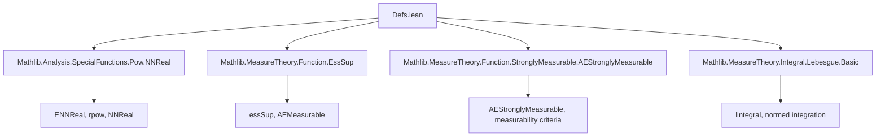
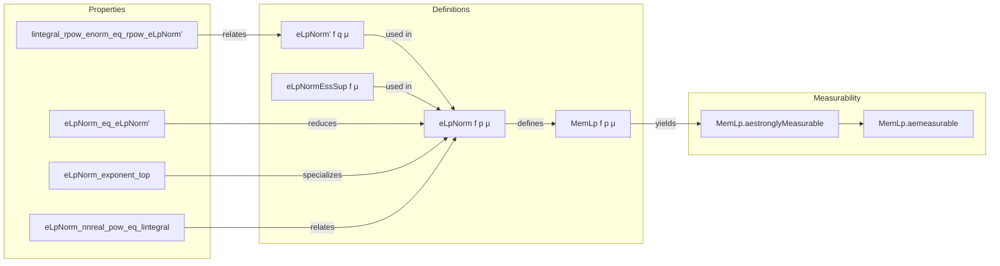

**Technical Brief: ℒp Space Definitions in Lean 4 (Defs.lean)**  
*Based on `Mathlib.MeasureTheory.LpSpace.Defs` (source: `Defs.lean`)*

---

### 1. KEY DEFINITIONS & THEOREMS

| Name | Type | Purpose |
|------|------|---------|
| `eLpNorm' f q μ` | `α → ε → ℝ → Measure α → ℝ≥0∞` | Auxiliary seminorm for real exponents: $(\int \|f\|^q\,d\mu)^{1/q}$ |
| `eLpNormEssSup f μ` | `α → ε → Measure α → ℝ≥0∞` | Seminorm for $p = \infty$: essential supremum $\operatorname{ess\,sup} \|f\|$ |
| `eLpNorm f p μ` | `α → ε → ℝ≥0∞ → Measure α → ℝ≥0∞` | Full ℒₚ seminorm: piecewise definition over $p = 0, 0 < p < \infty, p = \infty$ |
| `MemLp f p μ` | `α → ε → ℝ≥0∞ → Measure α → Prop` | Predicate: $f$ is a.e. strongly measurable and has finite ℒₚ seminorm |
| `eLpNorm_eq_eLpNorm'` | `p ≠ 0 ∧ p ≠ ∞ ⇒ eLpNorm f p μ = eLpNorm' f (toReal p) μ` | Reduction of finite nonzero $p$ to auxiliary norm |
| `eLpNorm_one_eq_lintegral_enorm` | `eLpNorm f 1 μ = ∫⁻ ‖f‖` | Special case $p = 1$ simplifies to lintegral of norm |
| `eLpNorm_exponent_top` | `eLpNorm f ∞ μ = eLpNormEssSup f μ` | $p = \infty$ case matches essential supremum |
| `lintegral_rpow_enorm_eq_rpow_eLpNorm'` | $q > 0 ⇒ \int \|f\|^q = (\|f\|_{ℒ^q})^q$ | Integral–norm duality for $eLpNorm'$ |
| `eLpNorm_nnreal_pow_eq_lintegral` | $p ≠ 0 ⇒ (\|f\|_{ℒ^p})^p = \int \|f\|^p$ | Power–integral identity for finite $p > 0$ |

---

### 2. NAMING CONVENTIONS

- **Prefixes**:
  - `eLpNorm` → ℒₙ seminorm (extended/nonnegative extended reals)
  - `eLpNorm'` → auxiliary real-exponent version
  - `eLpNormEssSup` → $p = \infty$ case
- **Suffixes**:
  - `_eq_…`: definitional or simplification lemmas (e.g., `eLpNorm'_eq_lintegral_enorm`)
  - `_nnreal`, `_top`, `_one`: special-case lemmas for $p \in \{0,1,\infty\}$
- **Predicate naming**:
  - `MemLp` → membership in ℒₚ space (Prop-valued)
  - `aestronglyMeasurable`, `aemeasurable` → derived properties from `MemLp`

---

### 3. TACTIC STACK

Frequently used tactics in proofs (inferred from file structure and lemmas):
- `simp`, `simp_rw` → for definitional simplification and rewriting
- `rw` → for rewriting using equalities (e.g., `eLpNorm_eq_eLpNorm'`)
- `exact`, `exact_mod_cast` → for direct proof steps and type coercion
- `rpow_mul`, `inv_mul_cancel₀`, `ENNReal.rpow_one` → specialized lemmas for extended reals
- `pos_iff_ne_zero`, `ne_of_gt` → for positivity ↔ nonzeroness equivalence
- `volume_tac` → placeholder for default measure argument inference

---

### 4. PROOF LOGIC

- **Structure**: Modular decomposition by exponent cases:
  1. Prove lemma for `eLpNorm'` (finite $0 < p < \infty$)
  2. Prove for `eLpNormEssSup` ($p = \infty$)
  3. Combine via `eLpNorm` definition (piecewise)
  4. Translate to `MemLp` via `∧`-elimination and `eLpNorm < ∞`
- **Common pattern**:
  - Use `if`-splitting on `p = 0`, `p = ∞`, or `p ≠ 0 ∧ p ≠ ∞`
  - Apply `ENNReal.toReal`/`ENNReal.coe` to bridge `ℝ≥0∞` and `ℝ≥0`
  - Use `lintegral_rpow_enorm_eq_rpow_eLpNorm'` to convert between integrals and norms
- **Key reasoning tools**:
  - Properties of essential supremum (`essSup`)
  - Almost everywhere (a.e.) measurability (`AEStronglyMeasurable`, `AEMeasurable`)
  - Extended nonnegative reals arithmetic (`ENNReal` lemmas)

---

### 5. IMPORTS & DEPENDENCIES

**Primary imports** (define scope and foundational tools):
- `Mathlib.Analysis.SpecialFunctions.Pow.NNReal` → power functions on nonnegative reals
- `Mathlib.MeasureTheory.Function.EssSup` → essential supremum theory
- `Mathlib.MeasureTheory.Function.StronglyMeasurable.AEStronglyMeasurable` → a.e. strong measurability
- `Mathlib.MeasureTheory.Integral.Lebesgue.Basic` → basic Lebesgue integration (lintegral, normed spaces)

**Key algebraic/typeclass assumptions**:
- `[NormedAddCommGroup E]`, `[ENorm ε]` → normed additive commutative groups
- `[TopologicalSpace ε]`, `[BorelSpace ε]` → for measurability of functions
- `[MeasurableSpace α]` → base measurable space

---

### 6. MERMAID DIAGRAMS

#### Dependency Graph (Module-Level)

#### Overview of ℒₚ Theory Flow

--- 

*End of Technical Brief.*
