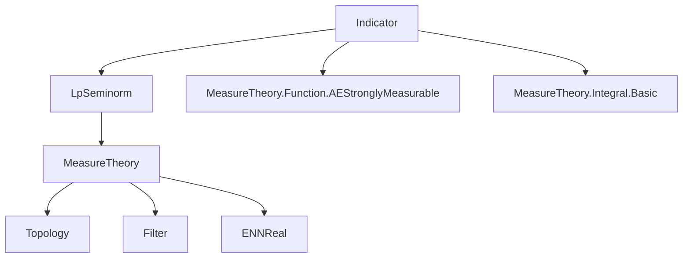
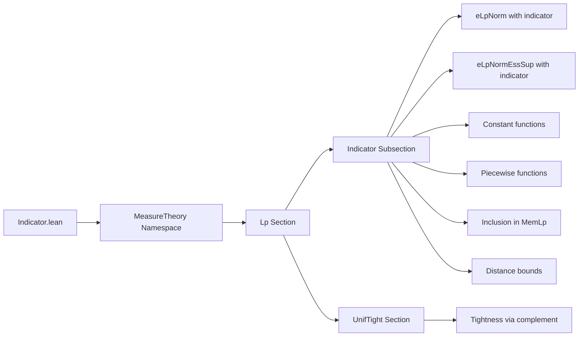

**Technical Brief: `Indicator.lean` — ℒp Seminorms and Indicator Functions**

---

### 1. **Key Definitions & Theorems**

| Name | Type / Signature | Purpose |
|------|------------------|---------|
| `eLpNorm` | `eLpNorm (f : α → ε) (p : ℝ≥0∞) (μ : Measure α) : ℝ≥0∞` | Extended ℒp seminorm (extended real-valued), generalizing $L^p$-norms to $p \in [0,\infty]$. |
| `eLpNormEssSup` | `eLpNormEssSup f μ = eLpNorm f ∞ μ` | The essential supremum norm ($L^\infty$-seminorm). |
| `indicator` | `s.indicator f` | Function equal to $f$ on $s$, zero elsewhere (or zero element in codomain). |
| `MemLp` | `MemLp f p μ` | Predicate: $f$ is $p$-integrable w.r.t. $\mu$ (i.e., $e\mathcal{L}^p$-seminorm finite and strongly measurable). |
| `piecewise` | `Set.piecewise s f g` | Function equal to $f$ on $s$, $g$ on $s^c$. |

#### Key Lemmas / Theorems

| Name | Statement (informal) |
|------|----------------------|
| `eLpNorm_indicator_eq_eLpNorm_restrict` | $ \| \mathbf{1}_s f \|_{L^p(\mu)} = \| f \|_{L^p(\mu|_s)} $ for measurable $s$. |
| `eLpNorm_indicator_le` | $ \| \mathbf{1}_s f \|_{L^p(\mu)} \le \| f \|_{L^p(\mu)} $. |
| `eLpNorm_indicator_const₀` | For constant $c$, $ \| \mathbf{1}_s c \|_{L^p(\mu)} = \|c\|_e \cdot \mu(s)^{1/p} $ (when $0 < p < \infty$). |
| `eLpNormEssSup_indicator_const_eq` | If $\mu(s) \ne 0$, then $ \| \mathbf{1}_s c \|_{L^\infty} = \|c\|_e $. |
| `MemLp.indicator` | If $f \in L^p(\mu)$ and $s$ measurable, then $\mathbf{1}_s f \in L^p(\mu)$. |
| `memLp_indicator_iff_restrict` | $\mathbf{1}_s f \in L^p(\mu) \iff f \in L^p(\mu|_s)$. |
| `MemLp.piecewise` | If $f \in L^p(\mu|_s)$ and $g \in L^p(\mu|_{s^c})$, then $\mathrm{piecewise}_s(f,g) \in L^p(\mu)$. |
| `eLpNorm_indicator_sub_le_of_dist_bdd` | If $\mathrm{dist}(f(x),g(x)) \le c$ on $s$, then $ \| \mathbf{1}_s (f-g) \|_{L^p} \le c \cdot \mu(s)^{1/p} $. |
| `MemLp.exists_eLpNorm_indicator_compl_lt` | For $f \in L^p$, $p < \infty$, and $\varepsilon > 0$, there exists finite-measure $s$ s.t. $ \| \mathbf{1}_{s^c} f \|_{L^p} < \varepsilon $. |

---

### 2. **Naming Conventions**

- **Prefixes**:
  - `eLpNorm*`: Extended ℒp seminorm variants (`eLpNorm`, `eLpNormEssSup`).
  - `indicator*`: Operations involving indicator functions (`indicator_eq_restrict`, `indicator_le`, `indicator_const`, `indicator_sub_le`).
  - `memLp*`: Membership in $L^p$ space (`memLp_indicator_iff_restrict`, `memLp_indicator_const`).
  - `piecewise*`: Operations with `piecewise` functions.

- **Suffixes**:
  - `_eq`: Equality with restriction or another norm.
  - `_le`: Inequality (monotonicity, domination).
  - `_const`: Special case for constant functions.
  - `_compl`: Complement sets (e.g., `indicator_compl_lt`).
  - `_iff`: Logical equivalence (biconditional).

- **Other patterns**:
  - `_₀`, `_₀'`, `_₀''`: Variants handling edge cases (e.g., $p=0$, $p=\infty$).
  - `_toReal`: Conversion to real exponent via `p.toReal`.

---

### 3. **Tactic Stack**

Frequently used tactics in proofs:

| Tactic | Role |
|--------|------|
| `simp_rw` / `simp` | Simplification with rewrite rules (especially for `indicator`, `enorm`, `lintegral`). |
| `rw` | Rewriting using lemmas (e.g., `eLpNorm_indicator_eq_eLpNorm_restrict`). |
| `congr` | Congruence closure for equality proofs (e.g., integrals). |
| `exact` / `refine` | Direct proof construction. |
| `by_cases` | Case analysis on equalities like `p = 0`, `p = ∞`, `μ s = 0`. |
| `have`, `obtain`, `rcases` | Introducing intermediate facts or decomposing hypotheses. |
| `apply`, `apply _le_`, `apply lt_of_le_of_lt` | Applying monotonicity lemmas. |
| ` positivity` | Proving positivity of expressions (e.g., $p > 0$). |
| ` aesop` / `norm_num` | Not heavily used here; mostly manual simplification. |
| `setLIntegral_congr_fun` | Congruence for restricted integrals. |

---

### 4. **Proof Logic**

**Typical proof structure**:

1. **Case analysis** on $p = 0$, $p = \infty$, or $\mu(s) = 0$.
2. **Rewrite** using definitions:
   - `eLpNorm_eq_lintegral_rpow_enorm` for $0 < p < \infty$,
   - `eLpNorm_exponent_top` for $p = \infty$.
3. **Reduce** indicator expressions via lemmas:
   - `enorm_indicator_eq_indicator_enorm`,
   - `lintegral_indicator`, `lintegral_indicator_const₀`.
4. **Apply monotonicity** lemmas (`eLpNorm_mono_ae'`, `essSup_mono_ae`, `eLpNorm_mono_measure`).
5. **Use measure-theoretic facts**:
   - `measure_toMeasurable`, `subset_toMeasurable`,
   - `ae_iff.mp`, `ae_lt_of_essSup_lt`.
6. **Conclude** via `le_antisymm`, `fineness`, or `lt_of_le_of_lt`.

**Induction is not used** — proofs are mostly direct case analysis + rewriting + measure-theoretic monotonicity.

---

### 5. **Imports & Dependencies**

- **Core imports**:
  ```lean
  Mathlib.MeasureTheory.Function.LpSeminorm.Basic
  ```
- **Used modules**:
  - `TopologicalSpace`, `MeasureTheory`, `Filter`
  - `ENNReal`, `NNReal`, `ComplexConjugate` (scalars)
  - `NormedAddCommGroup`, `ENorm`, `ESeminormedAddMonoid`
  - `MeasureTheory.Measure`, `MeasureTheory.Function.AEStronglyMeasurable`
  - `MeasureTheory.Integral.Basic` (via `lintegral_*` lemmas)

- **Key external lemmas used**:
  - `lintegral_indicator`, `lintegral_indicator_const₀`
  - `enorm_indicator_eq_indicator_enorm`
  - `essSup_piecewise`, `essSup_indicator_eq_essSup_restrict`
  - `eLpNorm_mono_measure`, `eLpNorm_mono_ae'`

---

### 6. **Mermaid Diagrams**

#### **Dependency Graph (Module-Level)**



#### **Overview of File Structure**



#### **Conceptual Theory Flow**

```mermaid
flowchart LR
  A[Indicator functions] --> B[Restriction of measure]
  B --> C[Equality of eLpNorms]
  C --> D[Monotonicity & domination]
  D --> E[Integrability (MemLp)]
  E --> F[Piecewise gluing]
  F --> G[Approximation / Tightness]
```

---

### 7. **Domain-Specific AI Agent Notes**

- **Focus area**: Measure theory, functional analysis, $L^p$ spaces.
- **Key reasoning patterns**:
  - Reduction to integral expressions via definitions.
  - Handling of edge exponents ($p=0$, $p=\infty$) via case splits.
  - Use of measurable sets and null sets for equality a.e.
- **Common proof goals**:
  - Show equality of norms under restriction/indicator.
  - Prove integrability of piecewise/indicator functions.
  - Bound norms using distance or constant bounds.

Let me know if you'd like a ** tactic recommendation engine ** or ** lemma search interface ** built for this theory.
