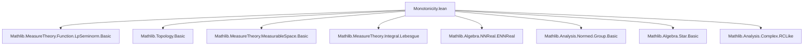
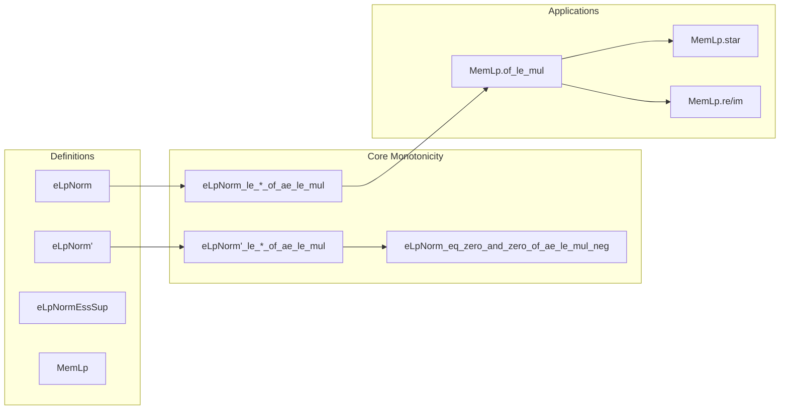

### Technical Brief: Monotonicity.lean

---

#### **1. Key Definitions & Theorems**

| Name | Type / Signature | Purpose |
|------|------------------|---------|
| `eLpNorm' f p μ` | `eLpNorm' : (α → F) → ℝ → Measure α → ℝ≥0∞` | Unnormalized $ \mathcal{L}^p $-seminorm (extended non-negative real-valued), defined via Bochner integral of $ \|f\|^p $. |
| `eLpNorm f p μ` | `eLpNorm : (α → F) → ℝ≥0∞ → Measure α → ℝ≥0∞` | Full $ \mathcal{L}^p $-norm (including $ p = 0 $ and $ p = \infty $), defined piecewise using `eLpNorm'` and essential sup. |
| `eLpNormEssSup f μ` | `eLpNormEssSup : (α → F) → Measure α → ℝ≥0∞` | $ \mathcal{L}^\infty $-seminorm: essential supremum of $ \|f\| $. |
| `MemLp f p μ` | `MemLp : (α → F) → ℝ≥0∞ → Measure α → Prop` | Membership in $ L^p $: $ f $ is a.e. strongly measurable and $ eLpNorm f p μ < \infty $. |
| `eLpNorm'_le_nnreal_smul_eLpNorm'_of_ae_le_mul` | `∀ᵐ x ∂μ, ‖f x‖₊ ≤ c * ‖g x‖₊ → eLpNorm' f p μ ≤ c • eLpNorm' g p μ` | Monotonicity of $ \mathcal{L}^p $-seminorm under a.e. pointwise domination by a scalar multiple. |
| `eLpNorm'_le_mul_eLpNorm'_of_ae_le_mul` | Same as above, but for `ESeminormedAddMonoid`, allows $ c = \infty $, requires $ g $ a.e. strongly measurable. |
| `eLpNorm_le_nnreal_smul_eLpNorm_of_ae_le_mul` | Extends monotonicity to full $ eLpNorm $ (including $ p = 0, \infty $). |
| `eLpNorm_le_mul_eLpNorm_of_ae_le_mul''` | General monotonicity for $ eLpNorm $ with $ c = \infty $, requires $ g $ a.e. strongly measurable. |
| `eLpNorm_eq_zero_and_zero_of_ae_le_mul_neg` | If $ \|f x\| ≤ c \|g x\| $ a.e. with $ c < 0 $, then both $ f $ and $ g $ have zero $ \mathcal{L}^p $-norm. |
| `MemLp.of_le_mul` | If $ g \in L^p $ and $ \|f\| ≤ c \|g\| $ a.e., then $ f \in L^p $. |
| `eLpNorm_star`, `MemLp.star` | Invariance of $ \mathcal{L}^p $-norm under star operation (e.g., complex conjugation). |
| `eLpNorm_conj` | Invariance under complex conjugation. |
| `MemLp.re`, `MemLp.im` | Real and imaginary parts of an $ L^p $ complex-valued function are in $ L^p $. |

---

#### **2. Naming Conventions**

- **Prefixes**:
  - `eLpNorm'`: unnormalized $ \mathcal{L}^p $-seminorm (for finite $ p > 0 $).
  - `eLpNorm`: full $ \mathcal{L}^p $-norm (including $ p = 0, \infty $).
  - `eLpNormEssSup`: $ \mathcal{L}^\infty $-seminorm.
  - `MemLp`: membership in $ L^p $ space.
- **Suffixes**:
  - `_of_ae_le_mul`: monotonicity under a.e. pointwise domination.
  - `_nnnorm`: variants using `‖·‖₊` (nnnorm), deprecated in favor of `enorm`.
  - `_enorm`: variants using `‖·‖ₑ` (extended seminorm), preferred.
  - `'`, `''`: variants with increasing generality (e.g., finite vs infinite $ c $, measurability assumptions).
- **Operators**:
  - `•`: scalar multiplication (nnreal or ennreal).
  - `*`: multiplication in ring/field.
  - `↑c`: coercion from $ \mathbb{R}_{\ge 0} $ to $ \mathbb{R}_{\ge 0}^\infty $.

---

#### **3. Tactic Stack**

- **Core tactics**:
  - `simp_rw`: repeated simplification + rewriting.
  - `rw`: rewriting using equalities (especially ENNReal lemmas).
  - `apply lintegral_mono_ae`: monotonicity of integral.
  - `filter_upwards`: for filtering almost-everywhere statements.
  - `by_cases`: case analysis on equalities like $ p = 0 $, $ p = \infty $, $ c = \top $.
  - `calc`: chaining inequalities.
  - `have aux ...; simpa [aux]`: auxiliary lemma + simplification.
  - `aesop`, `linarith`, `fineness`: used for arithmetic and finiteness checks.

- **ENNReal-specific**:
  - `ENNReal.rpow_le_rpow_iff`, `ENNReal.mul_rpow_of_nonneg`, `ENNReal.coe_rpow_of_nonneg`, `ENNReal.essSup_const_mul`.

---

#### **4. Proof Logic**

- **Structure**:
  1. **Case analysis** on $ p $ (0, finite positive, $ \infty $) and $ c $ (finite, $ \infty $).
  2. **Reduction** to known lemmas (e.g., `eLpNorm'_le_*`) via `eLpNorm_eq_eLpNorm'`.
  3. **Integral monotonicity**: reduce pointwise inequality to integral inequality via `lintegral_mono_ae`.
  4. **ENNReal algebra**: manipulate powers, products, and coercions using standard lemmas.
  5. **Zero-case handling**: if $ eLpNorm' g p μ = 0 $, deduce $ g = 0 $ a.e., then $ f = 0 $ a.e.
  6. **Negativity case**: if $ c < 0 $, deduce both functions vanish a.e.

- **Induction**: not used — proofs are direct and case-based.

---

#### **5. Imports**

- `Mathlib.MeasureTheory.Function.LpSeminorm.Basic`: core definitions of $ \mathcal{L}^p $-seminorms and norms.
- `TopologicalSpace`, `MeasureTheory`, `Filter`: for measure-theoretic context (a.e., measurable sets, etc.).
- `NNReal`, `ENNReal`, `ComplexConjugate`: for extended non-negative reals and complex conjugation.
- `NormedAddCommGroup`, `ESeminormedAddMonoid`, `StarAddMonoid`, `RCLike`: algebraic and topological structures on codomains.

---

#### **6. Mermaid Diagrams**

##### **Dependency Graph (Module-Level)**

##### **Overview of Theoretical Flow**

---

#### **7. Summary**

This file formalizes **monotonicity properties** of $ \mathcal{L}^p $-seminorms and norms under pointwise domination $ \|f\| \le c \|g\| $ almost everywhere. It handles:
- Finite and infinite $ p $,
- Finite and infinite scalars $ c $,
- Both normed space and extended seminormed space codomains,
- Special cases like negative scalars (forcing zero norm),
- Stability under star operations (e.g., conjugation) and real/imaginary parts.

The proofs rely heavily on **ENNReal arithmetic**, **integral monotonicity**, and **case analysis**, with a clear hierarchy of lemmas from basic (`eLpNorm'`) to full (`eLpNorm`), and from finite to infinite $ c $. The `TODO` comments indicate future cleanup (deprecation of `nnnorm` variants).
