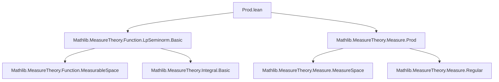
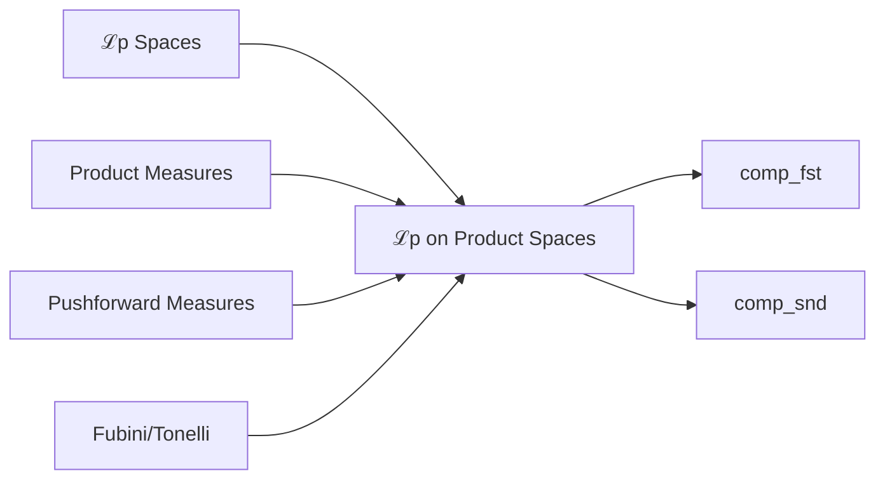

**Technical Brief: `Prod.lean` — ℒp Spaces and Product Measures**

---

### 1. **Key Definitions & Theorems**

| Name | Type / Signature | Purpose |
|------|------------------|---------|
| `MemLp.comp_fst` | `{f : α → ε} → MemLp f p μ → IsFiniteMeasure ν → MemLp (f ∘ Prod.fst) p (μ.prod ν)` | Pulls back ℒp membership along the first projection in a product measure space, assuming the second measure is finite. |
| `MemLp.comp_snd` | `{f : β → ε} → MemLp f p ν → IsFiniteMeasure μ → SFinite ν → MemLp (f ∘ Prod.snd) p (μ.prod ν)` | Pulls back ℒp membership along the second projection, requiring μ finite and ν σ-finite. |

- **`MemLp f p μ`**: Standard definition: $f$ is in ℒ^p(μ) iff $\int \|f\|^p \, d\mu < \infty$, where $\|\cdot\|$ is the norm induced by the continuous ENorm on ε.
- **`μ.prod ν`**: Product measure on α × β.
- **`f ∘ Prod.fst`** and **`f ∘ Prod.snd`**: Lift functions from α or β to the product space.

---

### 2. **Naming Conventions**

- **Prefixes**:
  - `MemLp.`: Module prefix for ℒp membership lemmas.
  - `comp_`: Indicates composition with a map (here, projection maps).
- **Suffixes**:
  - `_fst`, `_snd`: Denote use of first/second projection.
- **Other**:
  - `smul_measure`: Used internally to scale a measure by a constant (here, `ν.univ • μ` is scalar multiplication of measure by total mass of ν).

---

### 3. **Tactic Stack**

- `have`: Introduces intermediate lemmas (e.g., `hf'`).
- `simp`: Simplifies expressions like `ν.univ • μ`.
- `change`: Rewrites goal to an equivalent form (e.g., `f ∘ Prod.fst`).
- `rw [← memLp_map_measure_iff ?_ (by fun_prop)]`: Rewrites using a characterization of ℒp membership via pushforward measures.
- `simpa`: Finishes using the intermediate `hf'` and its first component (`hf'.1`).
- `fun_prop`: Propagates measurability/finiteness assumptions.

---

### 4. **Proof Logic**

- **Strategy**: Reduce to known ℒp membership via change of measure via pushforward.
- **Steps**:
  1. Use `smul_measure` to relate $f$ on $(\alpha, \mu)$ to $f \circ \mathrm{fst}$ on $(\alpha \times \beta, \mu \times \nu)$, using that $\mu \times \nu = \nu(\beta) \cdot \mu$ when projecting to α (and vice versa).
  2. Apply `memLp_map_measure_iff`, which states:  
     $f \in L^p(\nu \circ T^{-1}) \iff f \circ T \in L^p(\nu)$ for measurable $T$.
  3. Use `simpa` to discharge both the integrability condition and the measurability condition.

- **Key Insight**: For finite ν, $\pi_1 : (\alpha \times \beta, \mu \times \nu) \to (\alpha, \nu(\beta) \cdot \mu)$ is measure-preserving up to scaling.

---

### 5. **Imports**

- `Mathlib.MeasureTheory.Function.LpSeminorm.Basic`: Core ℒp definitions and basic lemmas (e.g., `MemLp`, `memLp_map_measure_iff`).
- `Mathlib.MeasureTheory.Measure.Prod`: Product measure construction and basic properties (e.g., `prod`, `univ`, `smul_measure`).

---

### 6. **Dependencies & Scope**

- **Assumptions on ε**: `TopologicalSpace ε` + `ContinuousENorm ε` → ensures norm is measurable and integrable notions are well-defined.
- **Measure assumptions**:
  - `IsFiniteMeasure ν` (for `comp_fst`)
  - `IsFiniteMeasure μ` and `SFinite ν` (for `comp_snd`)
- **Scope**: Functional analysis on product spaces; foundational for Fubini-type results and ℒp theory on product measures.

---

### 7. **Mermaid Diagrams**

#### Dependency Graph (Module-Level)



#### Proof Strategy Overview (for `comp_fst`)

```mermaid
flowchart LR
  A[hf : MemLp f p μ] --> B[hf.smul_measure]
  B --> C[MemLp f p (ν.univ • μ)]
  C --> D[rewrite as MemLp (f ∘ fst) p (μ.prod ν)]
  D --> E[apply memLp_map_measure_iff]
  E --> F[use hf.smul_measure and hf.smul_measure.1]
  F --> G[simpa]
```

#### Theoretical Context



--- 

This module provides foundational lifting lemmas for ℒp functions through projections in product measure spaces — essential for extending functional-analytic arguments to product spaces, especially in preparation for Fubini-type theorems or tensor product constructions in ℒp.
