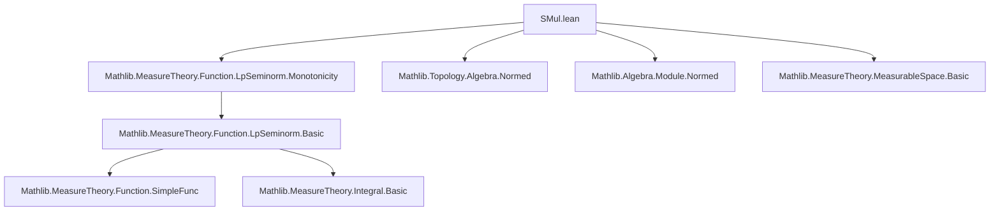

**Technical Brief: `SMul.lean` — Scalar Multiplication on ℒᵖ Spaces**

---

### 1. **Key Definitions & Theorems**

| Name | Type / Signature | Purpose |
|------|------------------|---------|
| `eLpNorm'` | `eLpNorm' : (α → F) → ℝ≥0∞ → Measure α → ℝ≥0∞` | Extended ℒᵖ *seminorm* (pre-norm) for measurable functions; used for $0 < q < \infty$. |
| `eLpNormEssSup` | `eLpNormEssSup : (α → F) → Measure α → ℝ≥0∞` | Essential supremum seminorm (ℒ^∞-seminorm). |
| `eLpNorm` | `eLpNorm : (α → F) → ℝ≥0∞ → Measure α → ℝ≥0∞` | Full ℒᵖ seminorm (includes $p = \infty$ case via `eLpNormEssSup`). |
| `MemLp` | `MemLp : (α → F) → ℝ≥0∞ → Measure α → Prop` | Membership in ℒᵖ space: $f \in L^p(\mu)$ iff $f$ is measurable and $eLpNorm f p μ < \infty$. |
| `eLpNorm'_const_smul_le` | `0 < q ⇒ eLpNorm' (c • f) q μ ≤ ‖c‖ₑ * eLpNorm' f q μ` | Submultiplicative inequality for scalar multiplication in ℒᵖ′ (pre-seminorm). |
| `eLpNormEssSup_const_smul_le` | `eLpNormEssSup (c • f) μ ≤ ‖c‖ₑ * eLpNormEssSup f μ` | Submultiplicative inequality for essential sup norm. |
| `eLpNorm_const_smul_le` | `eLpNorm (c • f) p μ ≤ ‖c‖ₑ * eLpNorm f p μ` | Submultiplicative inequality for full ℒᵖ seminorm. |
| `MemLp.const_smul` | `f ∈ L^p ⇒ c • f ∈ L^p` | Closure of ℒᵖ under scalar multiplication (bounded action). |
| `MemLp.const_mul`, `MemLp.mul_const` | Special cases for scalar-valued functions (`𝕜`). | |
| `eLpNorm'_const_smul`, `eLpNormEssSup_const_smul`, `eLpNorm_const_smul` | Equalities under `NormedDivisionRing` + `NormSMulClass`. | Tightness of inequalities: equality holds when scalars are invertible (e.g., in normed division rings). |
| `eLpNorm_nsmul` | `eLpNorm (n • f) p μ = n * eLpNorm f p μ` | Special case for natural-number scaling (via `ℝ`-module structure). |

> **Notation**: `‖c‖ₑ` = extended norm of scalar $c$ (as `ENNReal`), i.e., `ennnorm c`.

---

### 2. **Naming Conventions**

- **Prefixes**:
  - `eLpNorm'`: extended ℒᵖ *pre*-seminorm (for $0 < q < \infty$).
  - `eLpNormEssSup`: ℒ^∞-type seminorm (essential sup).
  - `eLpNorm`: unified ℒᵖ seminorm (covers all $p$).
- **Suffixes**:
  - `_const_smul`: scalar multiplication by a *constant* function (i.e., $c • f$).
  - `_const_mul` / `_mul_const`: scalar multiplication in function space `α → 𝕜`.
  - `_le`: inequality direction (submultiplicative bound).
  - No suffix (e.g., `eLpNorm_const_smul`) → *equality* under stronger assumptions.
- **Prime variants** (`_le'`, `_const_smul'`): apply to more general codomains (`ε` with `ENormSMulClass`), not just `NormedAddCommGroup F`.

---

### 3. **Tactic Stack**

| Tactic | Usage Frequency | Role |
|--------|-----------------|------|
| `simp` / `simp_rw` | High | Simplify `nnnorm_smul`, `enorm_smul`, `smul_apply`, `essSup_const_mul`. |
| `aesop` | Medium | Automated reasoning for measurable functions, inequalities. |
| `ring` | Low | For algebraic simplifications (e.g., `n * ‖c‖ = ‖n * c‖` in `eLpNorm_nsmul`). |
| `obtain rfl | hc := eq_or_ne c 0` | Medium | Case split on whether scalar is zero (used in equality proofs). |
| `le_antisymm` | Medium | Prove equality by bounding both sides. |
| `simpa [enorm_inv, hc, ENNReal.div_eq_inv_mul] using ...` | Medium | Use inverse to flip inequality (e.g., $c ≠ 0 ⇒ c^{-1}$ exists). |
| `exact` / `refine` | Medium | Construct proofs with intermediate lemmas. |

---

### 4. **Proof Logic**

- **General Strategy**:
  1. **Inequality direction** (`≤`): Use `eLpNorm'_le_nnreal_smul_eLpNorm'_of_ae_le_mul` (or variants), which requires an a.e. bound:  
     $$
     \|c \cdot f(x)\| \le \|c\|_e \cdot \|f(x)\| \quad \text{a.e.}
     $$
     This is provided by `nnnorm_smul_le` or `enorm_smul`.
  2. **Reverse inequality** (for equality): Use invertibility of $c$ (when $c ≠ 0$) and apply the same lemma to $c^{-1} • (c • f) = f$, yielding:
     $$
     eLpNorm f ≤ \|c^{-1}\|_e \cdot eLpNorm (c • f) \Rightarrow eLpNorm (c • f) ≥ \|c\|_e \cdot eLpNorm f.
     $$
  3. **Zero case**: Trivial simplification (`simp`).
- **Induction**: Not used — proofs are direct and rely on algebraic properties of norms and scalar multiplication.
- **Case analysis**: On `c = 0` vs `c ≠ 0` (via `eq_or_ne`), especially in equality proofs.

---

### 5. **Imports & Dependencies**

| Import | Role |
|--------|------|
| `Mathlib.MeasureTheory.Function.LpSeminorm.Monotonicity` | Provides foundational lemmas: `eLpNorm'_le_nnreal_smul_eLpNorm'_of_ae_le_mul`, `eLpNorm_const_smul_le_nnreal_smul_eLpNorm_of_ae_le_mul`, etc. |
| `MeasureTheory` namespace | Core measure theory infrastructure: measurable functions, integrals, seminorms. |
| `Filter`, `ENNReal` scopes | For essential sup, a.e. reasoning, and extended nonnegative reals. |
| `NormedAddCommGroup`, `NormedRing`, `NormedDivisionRing`, `Module`, `SMul`, `MulActionWithZero`, `IsBoundedSMul`, `ENormSMulClass`, `NormSMulClass`, `TopologicalSpace`, `ESeminormedAddMonoid`, `ContinuousConstSMul` | Structural assumptions on scalar field `𝕜` and target space `F`/`ε`. |

---

### 6. **Mermaid Diagrams**

#### **Dependency Graph (Module-Level)**



#### **Overview of Theoretical Flow**

```mermaid
flowchart LR
  subgraph Setup
    A[Measurable Space α] --> B[Measure μ]
    C[Normed Ring/Division Ring 𝕜] --> D[SMul 𝕜 F]
    B --> E[ℒᵖ Spaces]
    D --> E
  end

  subgraph Inequalities (General Bounded Action)
    E --> F1[eLpNorm'_const_smul_le]
    E --> F2[eLpNormEssSup_const_smul_le]
    E --> F3[eLpNorm_const_smul_le]
    F1 & F2 & F3 --> G[MemLp.const_smul]
  end

  subgraph Equalities (Normed Division Ring + NormSMulClass)
    E --> H1[eLpNorm'_const_smul]
    E --> H2[eLpNormEssSup_const_smul]
    E --> H3[eLpNorm_const_smul]
    H1 & H2 & H3 --> I[Tightness via inverse]
  end

  subgraph Special Cases
    I --> J[eLpNorm_nsmul]
  end
```

---

### 7. **Summary**

This file formalizes the behavior of scalar multiplication in ℒᵖ spaces, distinguishing between:
- **Submultiplicative bounds** (under `IsBoundedSMul` or `ENormSMulClass`),
- **Exact equalities** (under `NormedDivisionRing` + `NormSMulClass`), where invertibility of nonzero scalars yields tightness.

It leverages:
- A unified framework for seminorms (`eLpNorm'`, `eLpNormEssSup`, `eLpNorm`),
- A standard proof pattern: *bound via a.e. inequality → reverse via inverse*,
- Extensive use of `ENNReal` arithmetic and essential supremum properties.

The results are foundational for ℒᵖ space theory (e.g., proving it is a normed module over a normed division ring).
