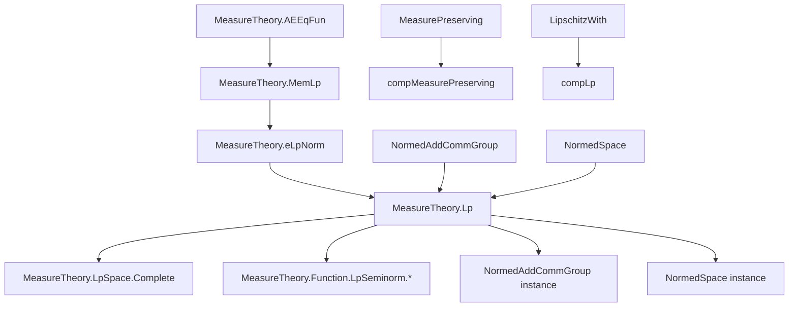
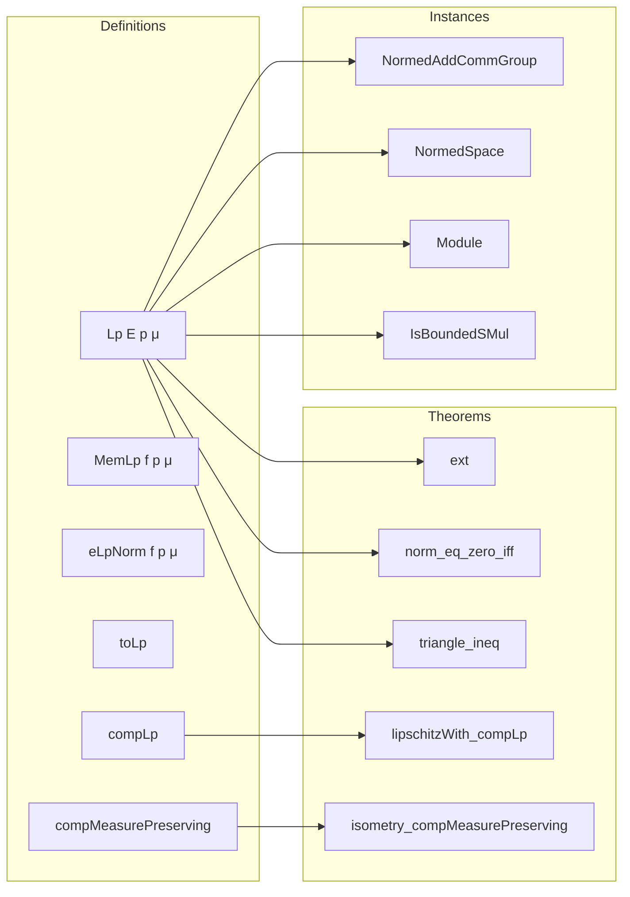

Here is the structured technical brief extracted from the provided Lean 4 file `Basic.lean`:

---

## **1. KEY DEFINITIONS & THEOREMS**

| Name | Type / Signature | Purpose |
|------|------------------|---------|
| `Lp E p μ` | `AddSubgroup (α →ₘ[μ] E)` | Space of equivalence classes of measurable functions with finite $eL^p$-norm. |
| `MemLp f p μ` | `Prop` | Predicate asserting $f$ is strongly measurable and $\|f\|_{L^p} < \infty$. |
| `eLpNorm f p μ` | `ENNReal` | Extended $L^p$-seminorm (possibly $\infty$). |
| `toLp f h` | `MemLp f p μ → Lp E p μ` | Embeds a function satisfying `MemLp` into `Lp`. |
| `compLp` | `LipschitzWith c g → g 0 = 0 → Lp E p μ → Lp F p μ` | Action of a Lipschitz map $g$ (vanishing at 0) on $L^p$ via composition. |
| `compMeasurePreserving f hf` | `Lp E p μb →+ Lp E p μ` | Pullback of $L^p$ functions along a measure-preserving map. |
| `compMeasurePreservingₗ` | `Lp E p μb →ₗ[𝕜] Lp E p μ` | Linearization of `compMeasurePreserving`. |
| `compMeasurePreservingₗᵢ` | `Lp E p μb →ₗᵢ[𝕜] Lp E p μ` | Linear isometry version (requires $1 \le p$). |
| `normedAddCommGroup` instance | `[Fact (1 ≤ p)] → NormedAddCommGroup (Lp E p μ)` | Makes `Lp` a normed additive commutative group. |
| `normedSpace` instance | `[Fact (1 ≤ p)] → NormedSpace 𝕜 (Lp E p μ)` | Makes `Lp` a normed space over `𝕜`. |
| `isometry_compMeasurePreserving` | `[Fact (1 ≤ p)] → Isometry (compMeasurePreserving f hf)` | `compMeasurePreserving` is an isometry. |
| `lipschitzWith_compLp` | `[Fact (1 ≤ p)] → LipschitzWith c (compLp g0 f)` | Composition with Lipschitz $g$ is $c$-Lipschitz on `Lp`. |
| `continuous_compLp` | `[Fact (1 ≤ p)] → Continuous (compLp g0 f)` | Continuity of composition operator. |

**Key lemmas:**
- `eLpNorm_congr_ae`: Norm is invariant under a.e. equality.
- `mem_Lp_iff_memLp`: Membership in `Lp` ↔ `MemLp`.
- `ext`: Extensionality: equality a.e. implies equality in `Lp`.
- `norm_eq_zero_iff`: $\|f\| = 0 \iff f = 0$ (for $p > 0$).
- `eq_zero_iff_ae_eq_zero`: $f = 0 \iff f = 0$ a.e.
- `eLpNorm_add_le`: Triangle inequality for $eL^p$-norm (requires $1 \le p$).
- `norm_compLp_sub_le`: Lipschitz control on `compLp`.

---

## **2. NAMING CONVENTIONS**

| Pattern | Meaning | Examples |
|--------|---------|----------|
| `eLpNorm_*` | Extended $L^p$-seminorm lemmas | `eLpNorm_zero`, `eLpNorm_add_lt_top`, `eLpNorm_congr_ae` |
| `coeFn_*` | Coercion to function (a.e. equality) | `coeFn_add`, `coeFn_neg`, `coeFn_zero`, `coeFn_sub`, `coeFn_smul`, `coeFn_compLp` |
| `toLp_*` | Embedding `MemLp` → `Lp` | `toLp_zero`, `toLp_add`, `toLp_congr`, `toLp_coeFn` |
| `mem_Lp_*` | Membership criteria | `mem_Lp_iff_eLpNorm_lt_top`, `mem_Lp_of_ae_le_mul`, `mem_Lp_of_ae_bound` |
| `norm_*` | Norm properties | `norm_def`, `norm_zero`, `norm_eq_zero_iff`, `norm_compLp_le` |
| `nnnorm_*` | Non-negative norm (NNReal) | `nnnorm_def`, `nnnorm_zero`, `nnnorm_neg` |
| `enorm_*` | Extended norm (ENNReal) | `enorm_def`, `enorm_toLp` |
| `edist_*` | Extended distance | `edist_def`, `edist_dist`, `edist_toLp_toLp` |
| `compLp_*`, `compMeasurePreserving_*` | Composition operators | `compLp_zero`, `compMeasurePreserving_val`, `compMeasurePreservingₗ` |
| `Lp.*` | Namespace for `Lp`-specific lemmas | `Lp.ext`, `Lp.stronglyMeasurable`, `Lp.antitone` |

---

## **3. TACTIC STACK**

Frequently used tactics in proofs:
- `simp` / `simp only` / `grw` (for rewriting with `@[simp]` lemmas)
- `rw` / `rwa` (rewrite with assumptions)
- `filter_upwards` (for proving a.e. statements)
- `ext` / `ext1` (extensionality for functions / a.e. equality)
- `congr_arg` (equality of images under functions)
- `cases` / `rcases` (case analysis on hypotheses)
- `have` / `suffices` (intermediate claims)
- `finiteness` (custom tactic for verifying finiteness of measures/norms)
- `with_reducible_and_instances` (for instance unification)
- `aesop` (for automated reasoning, especially `safe apply`)

---

## **4. PROOF LOGIC**

**Typical proof structure:**
1. **Reduction to representatives**: Work with the underlying function coercion (`f : α →ₘ[μ] E`) using `coeFn_*` lemmas.
2. **A.e. equality reasoning**: Use `filter_upwards` to reduce universal statements over functions to pointwise ones, then apply `simp` with hypotheses.
3. **Norm comparisons**: Use `eLpNorm_*` lemmas (e.g., monotonicity, triangle inequality, Hölder/Minkowski) to bound norms.
4. **Extensionality**: Prove equality in `Lp` by showing a.e. equality of coercions (`ext` rule).
5. **Lifting to `Lp`**: Use `toLp` to embed `MemLp` functions, then apply `coeFn_toLp`, `toLp_congr`, etc.
6. **Lipschitz/linear composition**: Prove boundedness via `norm_compLp_sub_le`, then deduce continuity or Lipschitzness.

**Example pattern** (addition associativity in `Lp`):
```lean
ext1
filter_upwards [coeFn_add (f + g) h, coeFn_add f g, ...] with _ ha1 ha2 ha3 ha4
simp only [ha1, ha2, ha3, ha4, add_assoc]
```

---

## **5. IMPORTS & DEPENDENCIES**

**Core imports:**
- `Mathlib.Analysis.Normed.Operator.NNNorm`
- `Mathlib.MeasureTheory.Function.LpSeminorm.ChebyshevMarkov`
- `Mathlib.MeasureTheory.Function.LpSeminorm.CompareExp`
- `Mathlib.MeasureTheory.Function.LpSeminorm.TriangleInequality`

**Key underlying structures:**
- `MeasureTheory.AEEqFun`: Almost-everywhere equivalence classes of measurable functions.
- `MeasureTheory.MemLp`: Predicate for $L^p$-integrability.
- `MeasureTheory.eLpNorm`: Extended $L^p$-seminorm.
- `NormedAddCommGroup`, `NormedSpace`, `IsBoundedSMul`, `NontriviallyNormedField`.

---

## **6. MERMAID DIAGRAMS**

### **Dependency Graph (High-Level)**



### **Overview of `Basic.lean`**



---

## **7. NOTATION**

- `α →₁[μ] E` ≡ `Lp E 1 μ` (integrable functions)
- `α →₂[μ] E` ≡ `Lp E 2 μ` (square-integrable functions)
- `⇑f` or `f` (coercion to function `α → E`)
- `‖f‖` or `‖f‖₊` or `‖f‖ₑ` (norm, nonnegative norm, extended norm)

---

## **8. IMPLEMENTATION NOTES**

- `Lp` is defined as an `AddSubgroup`, so dot notation fails; use `Lp.Measurable f` instead of `f.Measurable`.
- Equality in `Lp` is extensional: `ext` rule allows proving `f = g` from `f =ᵐ[μ] g`.
- All coercions use `coeFn` to distinguish from `AEEqFun` coercion.
- `ENNReal.toReal` is used to convert extended norm to real norm (finite by definition).
- `compLp` and `compMeasurePreserving` are defined as additive group homomorphisms first, then extended to linear/isometric maps.

--- 

Let me know if you'd like a formalized dependency graph in `lean4` or a summary of the `Complete.lean` file.
