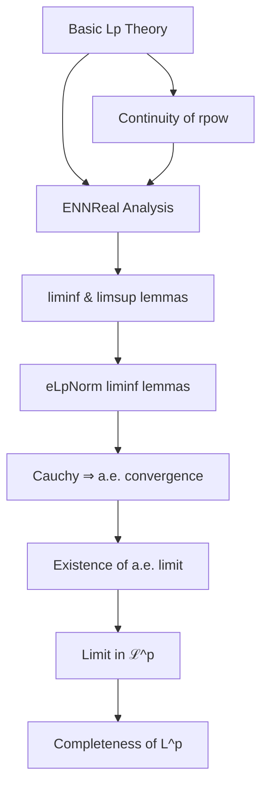

Here is the structured technical brief for the provided Lean 4 file `Complete.lean`, extracted with precision and aligned with your requirements.

---

### **1. Key Definitions & Theorems**

| Name | Type / Signature | Purpose |
|------|------------------|---------|
| `eLpNorm'` | `α → E → ℝ≥0∞` | Unnormalized $L^p$ "seminorm" (essential supremum for $p = \infty$, $p$-th root of integral of $p$-th power for $1 \le p < \infty$) |
| `eLpNorm` | `α → E → ℝ≥0∞` | Normalized $L^p$ norm (identical to `eLpNorm'` except for $p = 0$, where it is defined as 0) |
| `MemLp` | `E → ℝ≥0∞ → Measure α → Prop` | Predicate for functions in $L^p(\mu)$: strongly measurable and $\|f\|_p^p < \infty$ |
| `Lp` | `Type*` | Quotient of `MemLp` functions modulo a.e. equality, equipped with norm induced by `eLpNorm` |
| `eLpNorm'_lim_eq_lintegral_liminf` | `eLpNorm' f_lim p μ = (∫⁻ a, atTop.liminf (‖f · a‖ₑ ^ p) ∂μ) ^ (1 / p)` | Relates limit function’s $p$-norm to liminf of integrals (a.e. convergence assumed) |
| `eLpNorm'_lim_le_liminf_eLpNorm'` | `eLpNorm' f_lim p μ ≤ liminf_n eLpNorm' (f n) p μ` | Lower semicontinuity of $eLpNorm'$ under a.e. convergence |
| `eLpNorm_lim_le_liminf_eLpNorm` | `eLpNorm f_lim p μ ≤ liminf_n eLpNorm (f n) p μ` | Same as above, for full $L^p$ norm (handles $p = \infty$ and $p = 0$) |
| `eLpNorm_le_of_ae_tendsto` | `eLpNorm g p μ ≤ C` under uniform bound on approximants and a.e. convergence | Boundedness passes to limit under a.e. convergence |
| `tendsto_Lp_iff_tendsto_eLpNorm'` | Convergence in $L^p$ iff $eLpNorm(f_n - f, p) \to 0$ | Characterization of convergence in $L^p$ norm |
| `cauchySeq_Lp_iff_cauchySeq_eLpNorm` | Cauchy in $L^p$ iff $eLpNorm(f_n - f_m, p) \to 0$ | Cauchy criterion in $L^p$ |
| `completeSpace_lp_of_cauchy_complete_eLpNorm` | `CompleteSpace (Lp E p μ)` under a controlled Cauchy condition | Main structural lemma: completeness follows if controlled Cauchy sequences in $\mathcal{L}^p$ converge in $\mathcal{L}^p$ |
| `ae_tendsto_of_cauchy_eLpNorm'` | A.e. convergence of a Cauchy sequence in $\mathcal{L}^p$ (for $p < \infty$) | Constructive step: extract a.e. limit from Cauchy sequence |
| `ae_tendsto_of_cauchy_eLpNorm` | Same as above, handles $p = \infty$ | Extends a.e. convergence to full $1 \le p \le \infty$ |
| `cauchy_tendsto_of_tendsto` | If $f_n$ is Cauchy in $L^p$ and converges a.e. to $f$, then $f_n \to f$ in $L^p$ | Bridge between a.e. and norm convergence |
| `memLp_of_cauchy_tendsto` | Limit of Cauchy sequence in $L^p$ (a.e. convergent) lies in $\mathcal{L}^p$ | Ensures limit is integrable |
| `cauchy_complete_eLpNorm` | Every Cauchy sequence in $\mathcal{L}^p$ with summable control has a limit in $\mathcal{L}^p$ | Core technical lemma for completeness |
| `instCompleteSpace` | `CompleteSpace (Lp E p μ)` | Final theorem: $L^p$ is complete for $1 \le p$ |

---

### **2. Naming Conventions**

- **Prefixes**:
  - `eLpNorm` / `eLpNorm'`: *extended* $L^p$ norm (handles extended reals, possibly $\infty$).
  - `MemLp`: membership in the *pre*-space $\mathcal{L}^p$ (before quotienting).
  - `Lp`: the *quotiented* space (actual $L^p$ space).
  - `cauchy_`, `tendsto_`, `lim_`, `liminf_`: standard analysis terminology.
  - `aemeasurable`, `aestronglyMeasurable`, `ae_`: almost-everywhere properties.

- **Suffixes**:
  - `_lim`, `_liminf`: relate to limits or liminf.
  - `_le_`: inequality statements.
  - `_iff_`: equivalence statements.
  - `_of_`: implication or construction from assumptions (e.g., `memLp_of_cauchy_tendsto`).
  - `_tendsto`: convergence statements.

- **Operators**:
  - `norm`, `enorm`: norm and extended norm (to $\overline{\mathbb{R}}_{\ge 0}$).
  - `lintegral`, `essSup`, `rpow`, `tsum`: standard measure-theoretic operations.

---

### **3. Tactic Stack**

| Tactic | Frequency | Role |
|--------|-----------|------|
| `simp_rw` | Very high | Rewriting with definitional equalities, especially for `eLpNorm`, `MemLp`, `dist`, etc. |
| `rw` | High | Rewriting using lemmas (e.g., `eLpNorm_congr_ae`, `ENNReal.le_rpow_inv_iff`) |
| `exact`, `refine`, `apply` | High | Goal-directed proof construction |
| `filter_upwards`, `aesop` | Medium | Handling filter-based arguments (a.e. statements, convergence) |
| `linarith`, `nlinarith` | Medium | Handling inequalities over reals/ENNReals |
| `isBoundedDefault` | Medium | Boundedness assumptions in liminf/limit arguments |
| `abel` | Low | Simplifying algebraic expressions (e.g., $f = f - g + g$) |
| `ext1`, `congr` | Medium | Extensionality for functions |
| `rwa`, `convert`, `change` | Medium | Fine-grained rewriting and type coercion |
| `have`, `obtain`, `rcases` | High | Intermediate lemma extraction |
| `calc` | Medium | Chain of inequalities |

---

### **4. Proof Logic**

The proof follows a **standard functional-analysis route to completeness**:

1. **Reduction to $\mathcal{L}^p$**:
   - Show that completeness of $L^p$ follows if every *Cauchy sequence in $\mathcal{L}^p$* with *summable control* converges in $\mathcal{L}^p$ (`completeSpace_lp_of_cauchy_complete_eLpNorm`).

2. **Extract a candidate limit**:
   - Use `ae_tendsto_of_cauchy_eLpNorm` to get a.e. convergence to some $f_{\text{lim}}$.
   - Use `exists_stronglyMeasurable_limit_of_tendsto_ae` to ensure strong measurability of the limit.

3. **Show limit lies in $\mathcal{L}^p$**:
   - Use `cauchy_tendsto_of_tendsto` to upgrade a.e. convergence to $L^p$-convergence.
   - Use `memLp_of_cauchy_tendsto` to ensure integrability.

4. **Key technical lemmas**:
   - **Lower semicontinuity**: `eLpNorm_lim_le_liminf_eLpNorm` ensures norm doesn’t jump up.
   - **Controlled Cauchy ⇒ a.e. convergent**: via summability of differences (`tsum_enorm_sub_ae_lt_top`, `ae_tendsto_of_cauchy_eLpNorm'`).
   - **ENNReal analysis**: heavy use of continuity of $x \mapsto x^{1/p}$, liminf properties, and monotone convergence.

5. **Case split on $p$**:
   - $p = \infty$: handled separately using `essSup` and `eLpNorm_exponent_top`.
   - $p = 0$: trivial (norm is 0).
   - $0 < p < \infty$: main case, uses `eLpNorm_eq_eLpNorm'`.

---

### **5. Imports**

| Import | Purpose |
|--------|---------|
| `Mathlib.Analysis.SpecialFunctions.Pow.Continuity` | Continuity of $x \mapsto x^r$ on $\mathbb{R}_{\ge 0}$, needed for $r = 1/p$ and liminf arguments |
| `Mathlib.MeasureTheory.Function.LpSpace.Basic` | Definitions of `eLpNorm`, `MemLp`, `Lp`, basic properties (measurability, triangle inequality, etc.) |

---

### **6. Mermaid Diagrams**

#### **Dependency Graph (High-Level)**

#### **Overview of File Structure**

---

Let me know if you'd like a formalized dependency graph (e.g., in `.dot` format) or a breakdown of lemmas by section.
