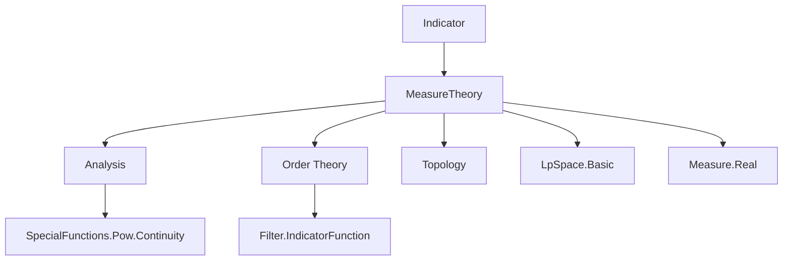

**Technical Brief: `Indicator.lean` — Indicator Functions in $L^p$ Spaces**

---

### 1. KEY DEFINITIONS & THEOREMS

| Name | Type / Signature | Purpose |
|------|------------------|---------|
| `indicatorConstLp` | `Π p hs hμs c, Lp E p μ` | Embeds the indicator function `s.indicator (fun _ ↦ c)` into $L^p(\mu)$, assuming $s$ is measurable and $\mu(s) < \infty$. |
| `Lp.const` | `E →+ Lp E p μ` | Embeds a constant function into $L^p(\mu)$ when $\mu$ is finite. |
| `Lp.constₗ` | `E →ₗ[𝕜] Lp E p μ` | Linear map version of `Lp.const`. |
| `Lp.constL` | `E →L[𝕜] Lp E p μ` | Continuous linear map version of `Lp.const`, with operator norm bounded by $\mu(\alpha)^{1/p}$. |
| `exists_eLpNorm_indicator_le` | `p ≠ ∞ → ε ≠ 0 → ∃ η > 0, μ s ≤ η → ‖s.indicator c‖_p ≤ ε` | Uniform smallness of $L^p$-norm of indicators when the set has small measure. |
| `norm_indicatorConstLp` | `p ≠ 0, p ≠ ∞ ⇒ ‖indicatorConstLp p c‖ = ‖c‖·μ.real s^{1/p}` | Exact norm formula for `indicatorConstLp`. |
| `norm_indicatorConstLp_top` | `μ s ≠ 0 ⇒ ‖indicatorConstLp ∞ c‖ = ‖c‖` | Norm in $L^\infty$ case. |
| `tendsto_indicatorConstLp_set` | `Tendsto (μ (t b ∆ s)) l 0 ⇒ Tendsto (indicatorConstLp (t b) c) l (indicatorConstLp s c)` | Continuity of `indicatorConstLp` w.r.t. symmetric-difference convergence of sets. |
| `continuous_indicatorConstLp_set` | Under continuity of $y \mapsto \mu(s_y \Delta s_x)$, $x \mapsto \texttt{indicatorConstLp}(s_x, c)$ is continuous. | |
| `indicatorConstLp_inj` | `c ≠ 0 ⇒ indicatorConstLp s c = indicatorConstLp t c ↔ s =ᵐ[μ] t` | Injectivity up to a.e. equality. |
| `indicatorConstLp_disjoint_union` | `Disjoint s t ⇒ indicatorConstLp (s ∪ t) c = indicatorConstLp s c + indicatorConstLp t c` | Additivity over disjoint unions. |
| `Lp.norm_const` / `Lp.norm_const'` | Norm of constant function in $L^p$. | |
| `Lp.norm_constL_le` | Operator norm bound for `Lp.constL`. | |

---

### 2. NAMING CONVENTIONS

- **Prefixes**:
  - `indicatorConstLp_`: for properties of the indicator embedding.
  - `Lp.const_`, `Lp.constL_`, `Lp.constₗ_`: for constant function embeddings.
  - `norm_`, `enorm_`, `nnnorm_`: for norm variants (`‖·‖`, `‖·‖ₑ`, `‖·‖₊`).
  - `tendsto_`, `continuous_`: for topological continuity properties.
- **Suffixes**:
  - `_le`, `_eq`, `_inj`, `_add`, `_sub`, `_disjoint_union`: indicate algebraic or order-theoretic behavior.
  - `_top`: for $p = \infty$ case.
  - `_compMeasurePreserving`: for behavior under measure-preserving maps.

---

### 3. TACTIC STACK

Frequently used tactics in proofs:
- `simp_rw`, `simp`, `rw`: for rewriting using definitions and lemmas.
- `grw`: guarded rewriting (used in `norm_indicatorConstLp`, etc.).
- `exact`, `refine`, `apply`: for constructing proofs.
- `by_cases`, `rcases`, `obtain`: for case analysis and destructuring.
- `convert`, `congr'`: for equational reasoning with congruence.
- `finiteness`: custom tactic (likely from `MeasureTheory.Measure.Real`) to discharge finiteness goals.
- `aesop`, `ring`, `linarith`: for algebraic simplifications (not heavily used here, but implied by `finiteness` and `simp` usage).
- `eventually_congr`, `EventuallyEq.trans`: for reasoning up to almost-everywhere equivalence.

---

### 4. PROOF LOGIC

The logical flow in most proofs follows this pattern:

1. **Reduction to representative functions**:
   - Use `MemLp.coeFn_toLp`, `Lp.norm_toLp`, `eLpNorm_congr_ae`, etc., to reduce statements about $L^p$ elements to statements about their a.e. representatives.

2. **Algebraic simplification**:
   - Apply lemmas like `indicator_add`, `indicator_sub`, `indicator_union_of_disjoint`, etc., to decompose or combine indicators.

3. **Norm computation**:
   - Use `eLpNorm_indicator_const`, `eLpNorm_const`, `measureReal_def`, `ENNReal.toReal_*` lemmas to compute or bound norms.

4. **Continuity arguments**:
   - For convergence/continuity results, reduce to `dist` or `edist`, then apply `dist_indicatorConstLp_eq_norm` / `edist_indicatorConstLp_eq_enorm`, and use properties of symmetric difference and measure continuity.

5. **Measure-theoretic finiteness**:
   - Use `finiteness` tactic or `by finiteness` to discharge goals like `μ s ≠ ∞`, `μ s < ∞`, etc., often relying on `IsFiniteMeasure` or `IsFiniteMeasureOnCompacts`.

6. **A.e. reasoning**:
   - Use `EventuallyEq`, `∀ᵐ x ∂μ`, and `indicatorConstLp_coeFn` to lift pointwise behavior to $L^p$-level.

---

### 5. IMPORTS

| Import | Purpose |
|--------|---------|
| `Mathlib.Analysis.SpecialFunctions.Pow.Continuity` | For continuity of $x \mapsto x^r$, needed for $p$-power estimates. |
| `Mathlib.MeasureTheory.Function.LpSpace.Basic` | Core $L^p$ theory: `Lp`, `MemLp`, `eLpNorm`, `norm_def`, etc. |
| `Mathlib.MeasureTheory.Measure.Real` | Real-valued measures, `μ.real s`, `measureReal_def`, `ENNReal.toReal_*`. |
| `Mathlib.Order.Filter.IndicatorFunction` | Basic properties of `Set.indicator`, `support`, symmetric difference, etc. |

---

### 6. DEPENDENCY & THEORY OVERVIEW

#### Mermaid Diagram: Module Dependencies



#### Mermaid Diagram: Theory Flow in `Indicator.lean`

```mermaid
graph TD
  A[MeasurableSet s, μ s < ∞] --> B[Define s.indicator (const c)]
  B --> C[Show s.indicator c ∈ MemLp p μ]
  C --> D[Define indicatorConstLp p hs hμs c := MemLp.toLp ...]

  D --> E[Norm formulas: norm_indicatorConstLp]
  D --> F[Algebraic properties: add, sub, disjoint_union]
  D --> G[Continuity: tendsto_indicatorConstLp_set]
  D --> H[Injectivity: indicatorConstLp_inj]

  I[Finite measure μ] --> J[Define Lp.const]
  J --> K[Norm of constant function]
  K --> L[Continuous linear embedding Lp.constL]

  D --> M[Behavior under compMeasurePreserving]
  D --> N[Relation to toSpanSingleton in L²]
```

---

### 7. DOMAIN & APPLICATION CONTEXT

- **Domain**: Measure theory, functional analysis, especially $L^p$-spaces.
- **Key objects**: Indicator functions, constant functions, symmetric difference of sets, $L^p$-norms.
- **Applications**:
  - Approximation arguments (e.g., simple functions dense in $L^p$).
  - Continuity of set-parameterized functions in $L^p$.
  - Construction of linear/continuous embeddings of $E$ into $L^p$.
  - Technical tool for proving density, separability, or continuity of operators.

---

### 8. NOTES

- The file uses `NNReal`, `ENNReal`, and `Real` carefully, especially in handling $1/p$ and $p \to \infty$.
- `μ.real s` is used for the finite part of $\mu(s)$ when $\mu(s) < \infty$.
- `indicatorConstLp` is a *noncomputable* definition (as expected for $L^p$-elements), but all properties are provable.
- The `backward.proofsInPublic true` setting indicates that proofs are made public for readability (e.g., in `edist_indicatorConstLp_eq_enorm`).

--- 

Let me know if you'd like a formalized dependency graph (e.g., `.lean` file-level), or a summary of how this module fits into the broader `Mathlib` hierarchy (e.g., `Mathlib.MeasureTheory.Function.LpSpace`).
