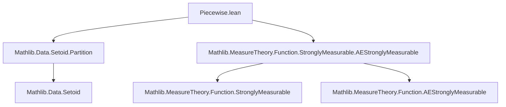
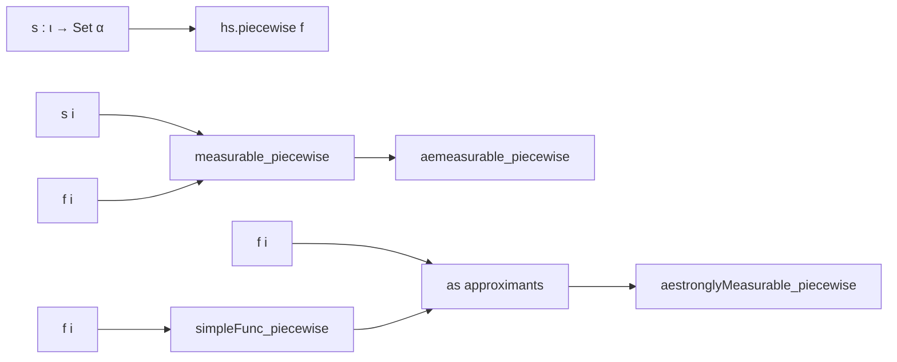

**Technical Brief: `Piecewise.lean` — Measurability of Piecewise Functions via `IndexedPartition.piecewise`**

---

### 1. **Key Definitions & Theorems**

| Name | Type / Signature | Purpose |
|------|------------------|---------|
| `measurable_piecewise` | `∀ (hs : IndexedPartition s), (∀ i, MeasurableSet (s i)) → (∀ i, Measurable (f i)) → Measurable (hs.piecewise f)` | Proves that a piecewise function defined over a *countable* indexed partition is measurable if each piece is measurable and the partition sets are measurable. |
| `aemeasurable_piecewise` | `∀ μ, (∀ i, MeasurableSet (s i)) → (∀ i, AEMeasurable (f i) μ) → AEMeasurable (hs.piecewise f) μ` | Extends `measurable_piecewise` to almost-everywhere measurability w.r.t. a measure `μ`. |
| `simpleFunc_piecewise` | `[Finite ι] → IndexedPartition s → (∀ i, MeasurableSet (s i)) → (ι → SimpleFunc α β) → SimpleFunc α β` | Constructs a simple function from a finite indexed partition and a family of simple functions on each piece. |
| `stronglyMeasurable_piecewise` | `[Countable ι] → IndexedPartition s → (∀ i, MeasurableSet (s i)) → [TopologicalSpace β] → (∀ i, StronglyMeasurable (f i)) → StronglyMeasurable (hs.piecewise f)` | Proves strong measurability of piecewise functions (for Banach-space-valued functions, typically). Handles both finite and countably infinite partitions via approximation. |
| `aestrengthenlyMeasurable_piecewise` | `{μ : Measure α} → (∀ i, MeasurableSet (s i)) → [TopologicalSpace β] → (∀ i, AEStronglyMeasurable (f i) μ) → AEStronglyMeasurable (hs.piecewise f) μ` | Almost-everywhere version of strong measurability for piecewise functions. |

> **Note**: All theorems rely on `hs.piecewise f`, the canonical function defined by `IndexedPartition.piecewise`, which picks value `f i x` when `x ∈ s i`.

---

### 2. **Naming Conventions**

- **Prefixes**:
  - `measurable_`, `aemeasurable_`, `stronglyMeasurable_`, `aestrengthenlyMeasurable_`: indicate the type of measurability being proved.
  - `piecewise`: core operation name; used in `piecewise`, `piecewise_apply`, `piecewise_preimage`.
- **Suffixes**:
  - `_piecewise`: applied to constructions/lemmas about `piecewise` (e.g., `simpleFunc_piecewise`, `measurable_piecewise`).
- **Helper notation**:
  - `hs.piecewise f`: function defined by `hs : IndexedPartition s`, mapping `x` to `f (hs.index x) x`.
  - `piecewise_apply`: lemma stating `piecewise f x = f (hs.index x) x` when `x ∈ ⋃ i, s i`.
  - `piecewise_preimage`: used in `measurable_piecewise` proof to express preimage under `piecewise`.

---

### 3. **Tactic Stack**

| Tactic | Usage Frequency | Role |
|--------|-----------------|------|
| `simp` / `simp_rw` | High | Simplify using `piecewise_apply`, `piecewise_preimage`, `finite_iUnion`, etc. |
| `filter_upwards` | Medium | For AE arguments: lift pointwise AE facts to filter-level. |
| `aesop` / `grind` | Medium | Used in `stronglyMeasurable_piecewise` for automation in finite/finite-indexed cases. |
| `choose` | Medium | Eliminate `∀ i, AEMeasurable (f i) μ` to get representatives `p i` that are measurable. |
| `refine` | High | Construct witnesses for existence goals (e.g., constructing approximating sequences). |
| `by_cases` / `obtain` | Medium | Split on finiteness of index type (`Fi : Finite ι`) or extract bijections from countability. |
| `rw`, `convert`, `congr'` | Low–Medium | For rewriting equalities involving `e`, `G n`, `index`, etc. |

---

### 4. **Proof Logic**

- **General pattern**:
  1. **Finite case** (`Finite ι`):
     - Use `simpleFunc_piecewise` to build approximating simple functions.
     - Show strong measurability via convergence of simple functions (via `StronglyMeasurable.tendsto_approx`).
  2. **Countably infinite case** (`Countable ι` but not finite):
     - Use a bijection `e : ℕ ≃ ι` (from `Countable ι`).
     - Define a *coarser partition* `G n = hs.coarserPartition (g n)` where `g n` maps indices to `Fin (n+1)` to truncate the partition at level `n`.
     - Approximate using `simpleFunc_piecewise` on `G n`.
     - Prove pointwise convergence using that eventually `e ((G n).index x) = hs.index x`, i.e., the index stabilizes.
  3. **AE versions**:
     - Reduce to measurable/strongly measurable case via choice of versions `p i` that agree a.e., then apply the corresponding non-AE theorem and use `filter_upwards`.

- **Core logical flow**:
  - *Induction on index structure* (finite vs countably infinite).
  - *Approximation by simple functions* for strong measurability.
  - *Stabilization of index* under coarsening partitions for convergence.

---

### 5. **Imports & Dependencies**

| Import | Role |
|--------|------|
| `Mathlib.Data.Setoid.Partition` | Provides `IndexedPartition`, `piecewise`, `index`, `range_piecewise_subset`, `coarserPartition`, etc. |
| `Mathlib.MeasureTheory.Function.StronglyMeasurable.AEStronglyMeasurable` | Supplies `StronglyMeasurable`, `AEStronglyMeasurable`, `approx`, `tendsto_approx`, etc. |

> **Domain scope**: Measure theory on type-theoretic measurable spaces, with emphasis on Banach-space-valued (or more general topological space-valued) functions.

---

### 6. **Mermaid Diagrams**

#### **Dependency Graph (Module-Level)**



#### **Overview of Theoretical Flow**



#### **Proof Strategy for `stronglyMeasurable_piecewise` (Infinite Case)**

```mermaid
flowchart TD
  Countable ι --> e[N ≃ ι]
  e --> g[n ↦ truncation to Fin (n+1)]
  g --> G[coarserPartition (g n)]
  G --> simpleFunc_piecewise_n[SimpleFunc on G n]
  simpleFunc_piecewise_n --> approx_seq[Sequence of simple functions]
  approx_seq --> convergence[e((G n).index x) stabilizes]
  convergence --> tendsto_approx[→ StronglyMeasurable]
```

---

### 7. **Summary**

This file formalizes foundational measurability results for functions defined piecewise over an `IndexedPartition`. It bridges set-theoretic partitions with measure-theoretic function classes (`measurable`, `aemeasurable`, `stronglyMeasurable`, `aestrengthenlyMeasurable`). The proofs are carefully structured to handle both finite and countably infinite partitions, using approximation by simple functions and stabilization arguments in the infinite case. The module is a key component in building a theory of integration and conditional expectation for piecewise-defined functions.
